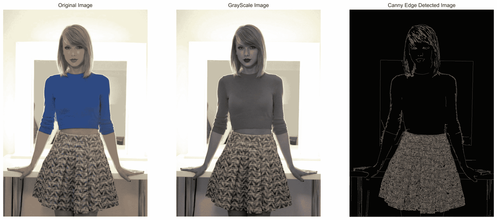
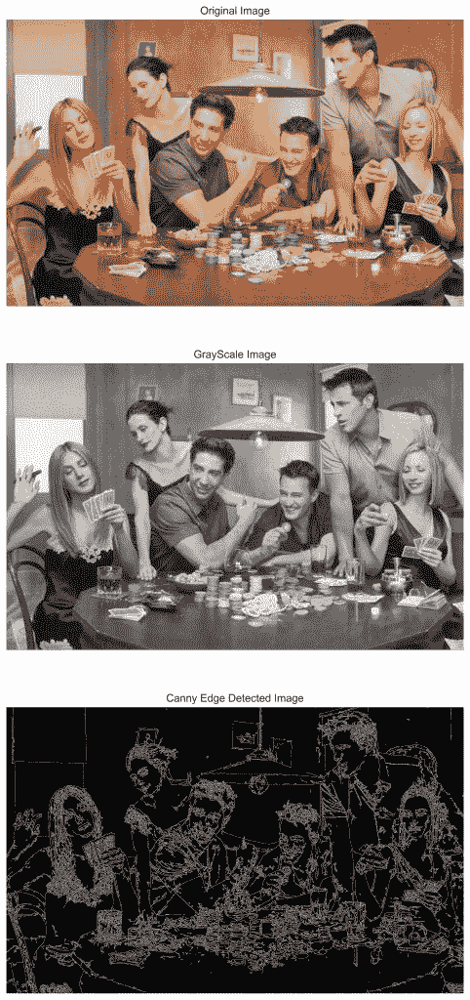

# 使用 Python 进行图像边缘检测

> 原文：<https://www.askpython.com/python/examples/edge-detection-in-images>

你好，学习伙伴！今天我们将学习图像中的边缘检测，并在屏幕上显示检测到的边缘。

## 我们所说的边缘检测是什么意思？

在我们开始之前，让我们了解什么是边缘检测。

**边缘检测**用于在单幅图像中找到各种物体的各种边界/边缘。

有多种边缘检测算法和技术可用，但最流行和最广泛使用的算法之一是`Canny edge detector`。

## 导入必要的模块

第一步是导入所有需要的模块，即 OpenCV、numpy 和 [matplotlib](https://www.askpython.com/python-modules/matplotlib/python-matplotlib) 。我们也将根据我们的喜好设置风格。

```py
import cv2
import numpy as np
import matplotlib.pyplot as plt
plt.style.use('seaborn')

```

## 加载和绘制图像

在我们检测图像之前，我们必须在程序中使用`imread`方法[读取图像](https://www.askpython.com/python-modules/read-images-in-python-opencv)，该方法将图像的路径作为参数。

为了获得原始颜色，我们需要使用`cvtColor`函数将颜色转换为`RGB`格式，并将其应用于加载的图像。

只要确保图像与项目代码文件在同一个文件夹中。

```py
loaded_image = cv2.imread("image.jpg")
loaded_image = cv2.cvtColor(loaded_image,cv2.COLOR_BGR2RGB)

```

为了加载图像，我们使用了 matplotlib 库。下面提到了相同的代码。

我们首先设置图形大小以便更好地可视化，然后使用`imshow`方法绘制图像。除此之外，我们将关闭轴以获得清晰的绘图。

相同的代码如下所示。

```py
plt.figure(figsize=(10,10))
plt.imshow(loaded_image,cmap="gray")
plt.axis("off")
plt.show()

```

## 将图像转换为灰度

在我们对图像应用 Canny 边缘检测器之前，我们需要使用`cvtColor`函数[将图像转换为灰度](https://www.askpython.com/python/examples/image-processing-in-python)。然后像绘制原始图像一样绘制图像。

```py
gray_image = cv2.cvtColor(loaded_image,cv2.COLOR_BGR2GRAY)
plt.figure(figsize=(10,10))
plt.imshow(gray_image,cmap="gray")
plt.axis("off")
plt.show()

```

## 在 Python 中应用 Canny 算法进行边缘检测

最后一步是对上一步获得的灰度图像应用 Canny 算法。相同的代码如下所示。

```py
edged_image = cv2.Canny(gray_image, threshold1=30, threshold2=100)

```

`canny`函数需要三样东西:灰度图像、要考虑的较低和较高像素阈值。

接下来我们需要做的是绘制边缘检测图像。相同的代码如下所示。

```py
plt.figure(figsize=(10,10))
plt.imshow(edged_image,cmap="gray")
plt.axis("off")
plt.show()

```

下面显示了三个图，供您参考。



Edge Detected Output 1

## 边缘检测的最终代码

```py
import cv2
import numpy as np
import matplotlib.pyplot as plt
plt.style.use('seaborn')

loaded_image = cv2.imread("image.jpg")
loaded_image = cv2.cvtColor(loaded_image,cv2.COLOR_BGR2RGB)

gray_image = cv2.cvtColor(loaded_image,cv2.COLOR_BGR2GRAY)

edged_image = cv2.Canny(gray_image, threshold1=30, threshold2=100)

plt.figure(figsize=(20,20))
plt.subplot(1,3,1)
plt.imshow(loaded_image,cmap="gray")
plt.title("Original Image")
plt.axis("off")
plt.subplot(1,3,2)
plt.imshow(gray_image,cmap="gray")
plt.axis("off")
plt.title("GrayScale Image")
plt.subplot(1,3,3)
plt.imshow(edged_image,cmap="gray")
plt.axis("off")
plt.title("Canny Edge Detected Image")
plt.show()

```

另一个图像的输出显示如下。



Edge Detected Output 2

## 结论

恭喜你！在今天的教程中，我们学习了如何在 python 中检测边缘。您可以使用不同的图像尝试相同的功能。

编码快乐！感谢您的阅读！