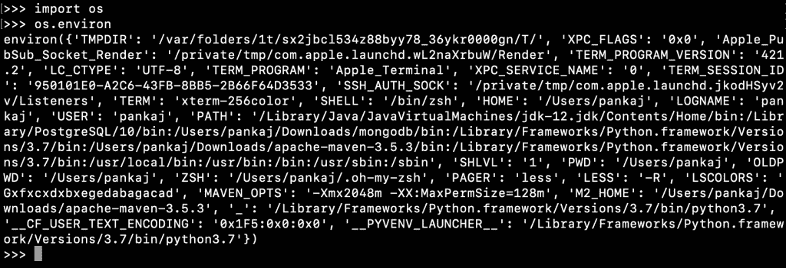

# Python 中的环境变量–读取、打印、设置

> 原文：<https://www.askpython.com/python/environment-variables-in-python>

环境变量是当前用户环境的一组键值对。它们通常由操作系统和当前用户特定的配置来设置。例如，在 Unix 环境中，使用用户配置文件设置环境变量，即。bash_profile，。巴沙尔或者。配置文件。

* * *

## Python 中的环境变量

你可以把环境变量想象成一个[字典](https://www.askpython.com/python/dictionary/python-dictionary-dict-tutorial)，其中键是环境变量名，值是环境变量值。

* * *

## 如何在 Python 中读取环境变量

我们可以使用 Python os 模块的“environ”属性来获取所有环境变量的字典。当 Python 解释器加载 os 模块时，设置环境值。通过外部程序对环境变量的任何进一步更改都不会反映在已经运行的 Python 程序中。

* * *

## 用 Python 打印所有环境变量

`os.environ`变量是一个类似字典的对象。如果我们打印它，所有的环境变量名称和值都会被打印出来。

```py
import os

# printing environment variables
print(os.environ)

```

**输出:**

```py
environ({'PATH': '/Users/pankaj/Documents/PyCharmProjects/PythonTutorialPro/venv/bin:/Library/Java/JavaVirtualMachines/jdk-12.jdk/Contents/Home/bin:/Library/PostgreSQL/10/bin:/Users/pankaj/Downloads/mongodb/bin:/Library/Frameworks/Python.framework/Versions/3.7/bin:/Users/pankaj/Downloads/apache-maven-3.5.3/bin:/Library/Frameworks/Python.framework/Versions/3.7/bin:/usr/local/bin:/usr/bin:/bin:/usr/sbin:/sbin', 'PS1': '(venv) ', 'MAVEN_OPTS': '-Xmx2048m -XX:MaxPermSize=128m', 'VERSIONER_PYTHON_VERSION': '2.7', 'LOGNAME': 'pankaj', 'XPC_SERVICE_NAME': 'com.jetbrains.pycharm.40096', 'PWD': '/Users/pankaj/Documents/PycharmProjects/AskPython/hello-world', 'PYCHARM_HOSTED': '1', 'PYTHONPATH': '/Users/pankaj/Documents/PycharmProjects/AskPython', 'SHELL': '/bin/zsh', 'PAGER': 'less', 'LSCOLORS': 'Gxfxcxdxbxegedabagacad', 'PYTHONIOENCODING': 'UTF-8', 'OLDPWD': '/Applications/PyCharm CE.app/Contents/bin', 'VERSIONER_PYTHON_PREFER_32_BIT': 'no', 'USER': 'pankaj', 'ZSH': '/Users/pankaj/.oh-my-zsh', 'TMPDIR': '/var/folders/1t/sx2jbcl534z88byy78_36ykr0000gn/T/', 'SSH_AUTH_SOCK': '/private/tmp/com.apple.launchd.jkodHSyv2v/Listeners', 'VIRTUAL_ENV': '/Users/pankaj/Documents/PyCharmProjects/PythonTutorialPro/venv', 'XPC_FLAGS': '0x0', 'PYTHONUNBUFFERED': '1', 'M2_HOME': '/Users/pankaj/Downloads/apache-maven-3.5.3', '__CF_USER_TEXT_ENCODING': '0x1F5:0x0:0x0', 'Apple_PubSub_Socket_Render': '/private/tmp/com.apple.launchd.wL2naXrbuW/Render', 'LESS': '-R', 'LC_CTYPE': 'UTF-8', 'HOME': '/Users/pankaj', '__PYVENV_LAUNCHER__': '/Users/pankaj/Documents/PycharmProjects/AskPython/venv/bin/python'})

```



Environment Variable in Python

如果你想以一种更易读的方式打印环境变量，你可以在循环的[中打印它们。](https://www.askpython.com/python/python-for-loop)

```py
import os

for k, v in os.environ.items():
    print(f'{k}={v}')

```

**输出:**

```py
PATH=/Users/pankaj/Documents/PyCharmProjects/PythonTutorialPro/venv/bin:/Library/Java/JavaVirtualMachines/jdk-12.jdk/Contents/Home/bin:/Library/PostgreSQL/10/bin:/Users/pankaj/Downloads/mongodb/bin:/Library/Frameworks/Python.framework/Versions/3.7/bin:/Users/pankaj/Downloads/apache-maven-3.5.3/bin:/Library/Frameworks/Python.framework/Versions/3.7/bin:/usr/local/bin:/usr/bin:/bin:/usr/sbin:/sbin
PS1=(venv) 
MAVEN_OPTS=-Xmx2048m -XX:MaxPermSize=128m
VERSIONER_PYTHON_VERSION=2.7
LOGNAME=pankaj
XPC_SERVICE_NAME=com.jetbrains.pycharm.40096
PWD=/Users/pankaj/Documents/PycharmProjects/AskPython/hello-world
PYCHARM_HOSTED=1
PYTHONPATH=/Users/pankaj/Documents/PycharmProjects/AskPython
SHELL=/bin/zsh
PAGER=less
LSCOLORS=Gxfxcxdxbxegedabagacad
PYTHONIOENCODING=UTF-8
OLDPWD=/Applications/PyCharm CE.app/Contents/bin
VERSIONER_PYTHON_PREFER_32_BIT=no
USER=pankaj
ZSH=/Users/pankaj/.oh-my-zsh
TMPDIR=/var/folders/1t/sx2jbcl534z88byy78_36ykr0000gn/T/
SSH_AUTH_SOCK=/private/tmp/com.apple.launchd.jkodHSyv2v/Listeners
VIRTUAL_ENV=/Users/pankaj/Documents/PyCharmProjects/PythonTutorialPro/venv
XPC_FLAGS=0x0
PYTHONUNBUFFERED=1
M2_HOME=/Users/pankaj/Downloads/apache-maven-3.5.3
__CF_USER_TEXT_ENCODING=0x1F5:0x0:0x0
Apple_PubSub_Socket_Render=/private/tmp/com.apple.launchd.wL2naXrbuW/Render
LESS=-R
LC_CTYPE=UTF-8

```

* * *

## 获取特定的环境变量值

因为 os.environ 是一个字典对象，所以我们可以使用键来获取特定的环境变量值。

```py
import os

home_dir =os.environ['HOME']
username = os.environ['USER']
print(f'{username} home directory is {home_dir}')

```

**输出** : `pankaj home directory is /Users/pankaj`

但是，如果环境变量不存在，这种获取环境变量的方法将会引发 KeyError。

```py
>>> import os
>>> env_var = input('Please enter the environment variable name:\n')
Please enter the environment variable name:
data
>>> print(os.environ[env_var])
Traceback (most recent call last):
  File "<stdin>", line 1, in <module>
  File "/Library/Frameworks/Python.framework/Versions/3.7/lib/python3.7/os.py", line 678, in __getitem__
    raise KeyError(key) from None
KeyError: 'data'
>>>

```

获取环境变量的一个更好的方法是使用字典 get()函数。如果环境变量不存在，我们也可以指定默认值。

```py
>>> import os
>>> env_var = input('Please enter the environment variable name:\n')
Please enter the environment variable name:
data
>>> print(os.environ.get(env_var))
None
>>> print(os.environ.get(env_var, 'CSV'))
CSV

```

* * *

## 如何检查环境变量是否存在？

我们可以使用“in”操作符来检查环境变量是否存在。

```py
import os

env_var = input('Please enter the environment variable name:\n')

if env_var in os.environ:
    print(f'{env_var} value is {os.environ[env_var]}')
else:
    print(f'{env_var} does not exist')

```

**输出:**

```py
# Run 1
Please enter the environment variable name:
datatype
datatype does not exist

# Run 2
Please enter the environment variable name:
USER
USER value is pankaj

```

* * *

## 如何在 Python 中设置环境变量

我们可以使用语法设置环境变量值:**OS . environ[env _ var]= env _ var _ value**

```py
import os

env_var = input('Please enter environment variable name:\n')

env_var_value = input('Please enter environment variable value:\n')

os.environ[env_var] = env_var_value

print(f'{env_var}={os.environ[env_var]} environment variable has been set.')

```

**输出:**

```py
Please enter environment variable name:
datatype
Please enter environment variable value:
CSV
datatype=CSV environment variable has been set.

```

如果环境变量已经存在，它将被新值覆盖。**环境变量将只为 Python 解释器**的当前会话设置。如果要将更改为永久性的，则必须在 Python 程序中编辑用户配置文件。

* * *

## 结论

在 Python 中使用环境变量非常容易。我们可以读取、添加和更新当前执行的环境变量。

* * *

## 参考资料:

*   [os .大约可变 API Doc](https://docs.python.org/3.7/library/os.html#os.environ)