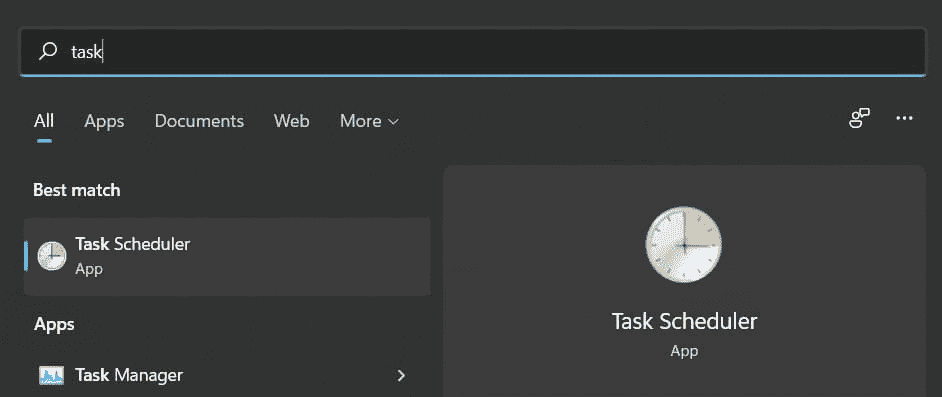
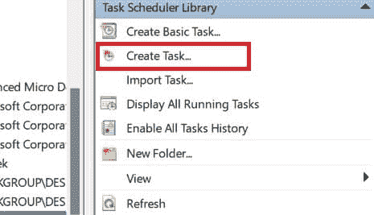
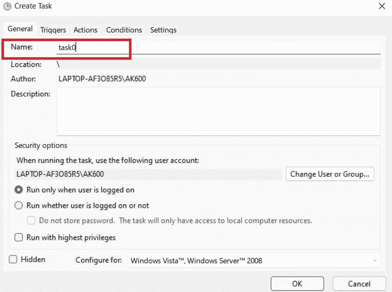
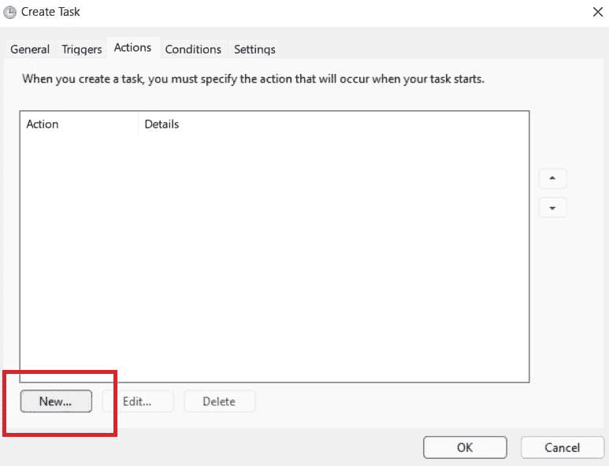
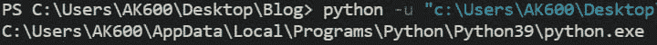
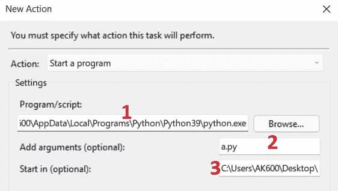
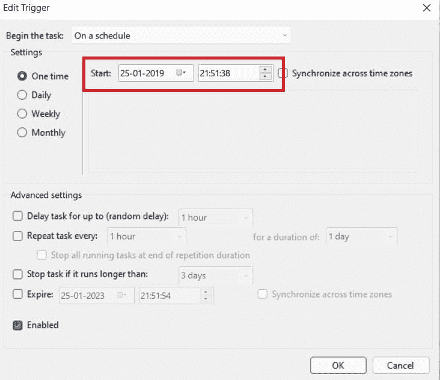
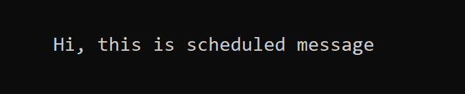

# 按计划执行 Python 脚本–Windows 任务计划程序

> 原文：<https://www.askpython.com/python/examples/execute-python-windows-task-scheduler>

有时我们希望我们的脚本在特定的时间或特定的次数运行。我们可以自动执行这项任务，这样就不需要手动运行脚本。Windows 提供了一个软件相关的任务调度程序，它将在给定的时间运行我们的脚本。

**限制:**

1.  仅适用于 Microsoft Windows 操作系统
2.  你的电脑需要在预定的时间开机
3.  不要模仿服务器-特定时间执行。因此，为了在任何时候运行代码而没有自己动手(打开计算机)的麻烦，你需要使用服务器(在服务器上执行脚本)

## 使用 Windows 任务计划程序的步骤

让我们马上进入计划 Python 脚本执行的步骤。坚持到底，如果你以后有任何问题，请告诉我们！为了简化设置，我们将使用 Windows 任务计划程序。

### 1.打开任务计划程序

通过在“开始”菜单中搜索任务计划程序，打开计算机上的任务计划程序应用程序。



Task Scheduler

### 2.创建新任务

接下来，通过右键单击任务调度器(本地)，在任务调度器中创建一个任务。



Create A New Task In Scheduler

### 3.命名任务

添加一个名称，以便您以后可以识别它。



Name The Task

### 4.为我们的脚本创建一个新动作

切换到“Actions”选项卡并添加一个新操作。这是真正的事情发生的地方。



Create New Action

### 5.运行 python 脚本

要使用 Windows 调度程序自动运行 python 脚本，我们需要在代码中遵循以下步骤:

*   我们需要 python 安装的**路径，我们可以通过运行下面的 python 代码找到它。**

```py
import sys
print(sys.executable)

```



Python Installation Path

*   我们将把这个位置粘贴到 Windows 调度器动作的框号 **1** 中
*   在编号为 **2** 的框中，我们将传递脚本文件 (python 文件)
    的**名称，例如:python_sample_file.py 或 a.py**
*   在编号为 **3** 的框中，我们将传递 Python 可执行文件 (python 文件)的**路径**



Entries In Action Of Windows Task Scheduler

### 6.为脚本创建触发器

触发器是指导致脚本运行的事件。例如，我们可以指定脚本执行的时间。它提供了诸如哪天、什么时间、多少次、我们的脚本应该执行多长时间等选项。

因此，您需要输入所有必需的详细信息。



Trigger In Scheduler

对于我们的程序，我们将设置一个特定的时间来触发下面的脚本执行:

```py
print("Hi, this is scheduled message")

```

成功创建 Windows 任务计划程序并触发 python 脚本文件后，将执行脚本并在 Windows 命令提示符中显示如下输出:



The output of Task Scheduler

## 结论

希望你已经很好地学习了如何在任何需要的时候运行你的 python 脚本文件。调度任务，这对于实现脚本文件的自动化非常有用。