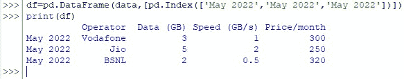

# 如何用熊猫导出到 Excel？

> 原文：<https://www.askpython.com/python-modules/pandas/export-to-excel-using-pandas>

Python 可以带你分析输入其中的大量数据，但是当要将数据呈现给大量观众时，这不是它的强项。有其他专用工具可以更好地满足这一目的。一个这样的工具是 MS Excel！

本文旨在探索如何将 Python 中的数据导出到 MS Excel 的电子表格中。

## 使用 Pandas 导出到 Excel 的步骤

为此，我们将尝试在 Python 中创建一个样本列表，然后将其导出到 MS Excel 所需工作表中的所需位置。所以，让我们继续吧！

### 导入熊猫图书馆

首先通过键入以下代码导入 Pandas 库，

```py
import pandas as pd

```


Pandas Library Loaded

### 创建要导出的示例数据

现在让我们使用索引选项创建一些数据。索引的作用是在创建数据时为每列数据提供一个标题。在这个例子中，我们将列出一些互联网服务提供商的名称，他们的数据速度以及他们的每月价格和数据限制。

如果我们将上述所有规定翻译成 Python 代码，看起来就是这样。

```py
data = {'Operator':['Vodafone', 'Jio', 'BSNL'],'Data (GB)':[3, 5, 2],'Speed (GB/s)':[1,2,0.5],'Price/month':[300,250,320]}

```


Input Data Indexed

### 将数据添加到数据帧

现在，我们将通过键入以下命令将这些数据分配给数据框:

```py
df=pd.DataFrame(data)

```

完成后，现在让我们尝试使用 print()命令查看 Python 中输入的数据，如下所示。

```py
print (df)

```


Viewing the Dataset

在上图中，可以看到第一列的数字从“0”开始，一直到“2”。有点奇怪，不是吗？把这些数字换成一些有意义的数据怎么样？

### 手动设置索引

可以通过调用用于为每行分配行标题的 *Index* 命令来实现。就说这些吧(假想！)数据来自每个服务提供商 2022 年 5 月的计划&我们就想要这个。这可以通过使用以下语法来完成。

```py
df=pd.DataFrame(data,[pd.Index(['row_1_header',' row_1_header ',…])])

```

应用上述语法引入 May 2022 代替数字作为行标题，

```py
df=pd.DataFrame(data,[pd.Index(['May 2022','May 2022','May 2022'])])

```

让我们通过使用 print()命令再次查看数据来验证我们的努力是否取得了成果。



Row Headers Replaced!

干得好！

### 将熊猫数据框架导出到 Excel

现在，是时候将这些数据导出到 Excel 文件中了。为此，首先需要创建一个 Excel 文件，然后复制创建该文件的位置。在本演示中，创建了一个名为 *Data.xlsx* 的 Excel 文件，用于从 Python 导出数据。

完成后，下面给出了 to_excel()命令的语法，该命令用于传输数据。

```py
df.to_excel(“file_address”, sheet_name=’Sheet #’, startrow=0, startcol=0)

```

### 额外步骤-自定义 Shee 和要导出的起始行和列

在将数据导出到 MS Excel 时，Python 还提供了许多其他的定制，但是上面列出的特性将在本文中演示。

用户也可以通过在上述命令中给出文件地址来简单地停止，它将使用所有定制的默认值来执行数据导出。

下面是从 *Data.xlsx.* 的*表 1* 的第 9 列和第 9 行开始导出数据的代码

```py
df.to_excel("Data.xlsx",sheet_name='Sheet1',startrow=9, startcol=9)

```


Data Successfully Exported


Exported Data In MS Excel

* * *

## 摘要

现在我们已经到了这篇文章的结尾，希望它已经详细阐述了如何使用 Python 中的 Pandas 将数据导出到 MS Excel。这里有另一篇文章详细介绍了使用熊猫替换多个值的[。在](https://www.askpython.com/python-modules/pandas/replace-multiple-values-pandas) [AskPython](https://www.askpython.com/) 中还有许多其他有趣的&文章，这些文章可能对那些想提高 Python 水平的人有很大帮助。*欢呼*！