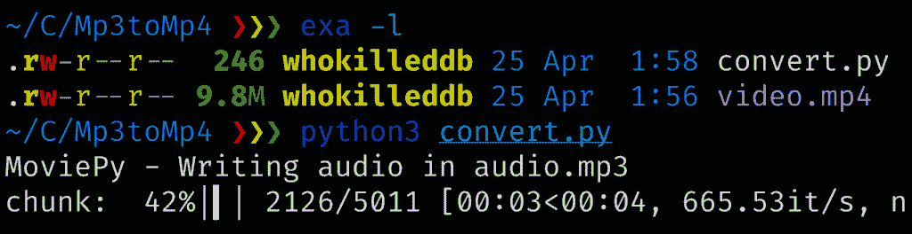
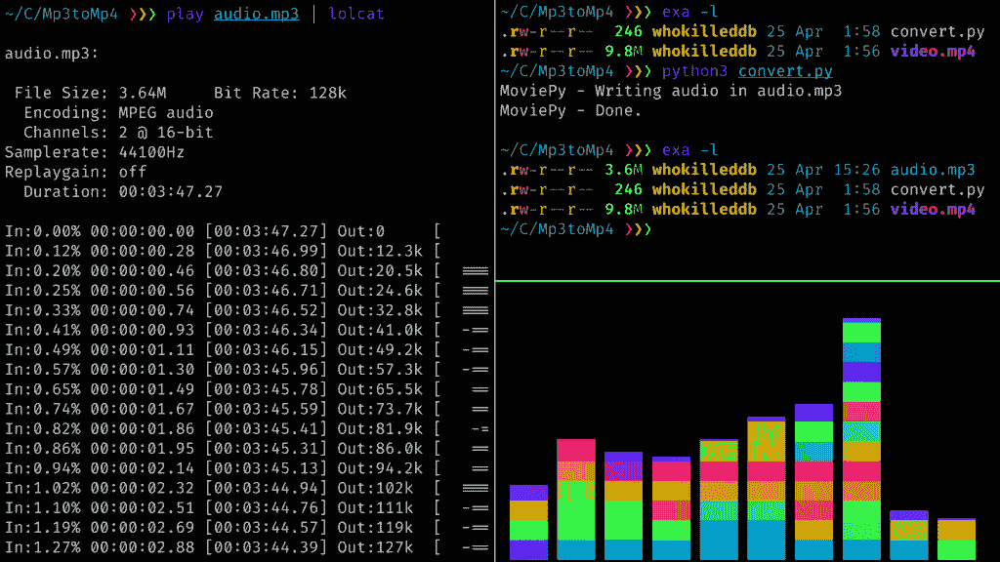

# 如何从视频文件(Mp3 和 Mp4)中提取音频

> 原文：<https://www.askpython.com/python/examples/extract-audio-from-video>

在这个模块中，我们将编写一个非常简洁而重要的程序，帮助我们从视频中提取音频，或者从 mp4 文件中提取 mp3。我们将把主要功能放在一个函数中，这样我们也可以在其他程序中使用它！

## 安装所需的软件包

在我们开始之前，我们需要安装一个从视频文件中提取音频所需的包。你可以简单地用 [pip 包管理器:](https://www.askpython.com/python-modules/python-pip)安装它

```py
$ sudo pip3 install moviepy

```

就这样，现在我们可以继续编写代码了。

## 从视频文件中提取音频的代码

```py
from moviepy.editor import *

def mp4tomp3(mp4file,mp3file):
    videoclip=VideoFileClip(mp4file)
    audioclip=videoclip.audio
    audioclip.write_audiofile(mp3file)
    audioclip.close()
    videoclip.close()

mp4tomp3("video.mp4","audio.mp3")

```

## 理解代码

### 第 1 行:导入所需的库

```py
from moviepy.editor import *

```

首先，我们需要导入`moviepy`来帮助我们完成转换过程。这是一个非常方便的视频编辑工具:剪切、拼接、标题插入、视频合成(也称为非线性编辑)、视频处理和自定义效果的创建。

### 第 3-8 行:定义我们的函数

```py
def mp4tomp3(mp4file,mp3file):
    videoclip=VideoFileClip(mp4file)
    audioclip=videoclip.audio
    audioclip.write_audiofile(mp3file)
    audioclip.close()
    videoclip.close()

```

这里我们定义一个接受两个参数的函数:

*   **mp4file** :包含我们要转换的 mp4 文件的名称
*   **mp3file** :包含从音频提取中获得的结果 mp3 文件的名称

然后在第 4 行，我们加载 MP4 文件，这样我们就可以对它执行所需的操作。接下来，我们简单地从之前创建的 **VideoClipFile** 对象中提取音频，然后按照传递的参数将它存储为一个文件。

最后，我们关闭了音频和视频对象的句柄，以防止在退出函数之前出现任何不必要的错误。

### 第 10 行:调用我们的函数

```py
mp4tomp3("video.mp4","audio.mp3")

```

最后，调用我们的函数，提供一个视频名称和我们想要保存的音频文件的名称。这应该会在我们当前的目录下创建一个文件 **audio.mp3** ！

## 从视频文件中转换和提取音频

这个库是非常可移植的，它可以跨 Windows、Linux 和 MacOS 兼容，因此它可以产生相似的结果。

在运行我们的代码时，我们应该观察到一个小小的`tqdm`进度条，它应该在提取过程完成后消失。然后，您可以使用您选择的音乐播放器来播放它！



Extracting Audio



Playing The Extracted Audio

## 结论

这段代码有时会非常有用。您可以使用它从命令行读取函数参数，并将程序添加到您的路径中，以便拥有一个方便的系统级可用工具供您使用！