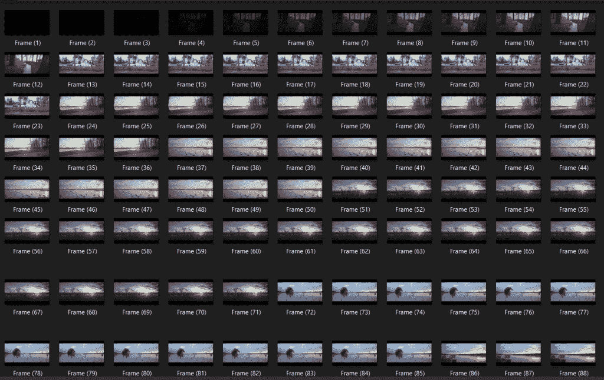

# 如何使用 Python OpenCV 从视频中提取图像？

> 原文：<https://www.askpython.com/python/examples/extract-images-from-video>

你好，学习伙伴！今天我们将学习如何使用 Python OpenCV 模块从视频中提取图像。所以让我们开始吧！

## 教程的目标

我们的目标是借助 Python 编程语言的 [OpenCV 模块](https://www.askpython.com/python-modules/read-images-in-python-opencv)从单个视频文件中提取每一帧。

## 使用 Python OpenCV 从视频中提取图像

既然我们已经意识到我们到底要做什么。让我们开始执行代码。

### 1.导入模块

与任何其他项目一样，第一步是导入模块。我们将只需要这个程序的`openCV`模块。

确保您的系统中安装了该模块。如果你不知道 OpenCV 是什么，一定要看看这个教程。本教程将使您熟悉 OpenCV 的基本概念。

### 2.捕捉视频

为了捕捉视频，我们将使用 opencv 模块的`VideoCapture`函数，并将录制的视频存储到一个变量中。

确保视频与代码文件在同一个文件夹中，或者您需要输入视频文件的确切路径。

***推荐阅读:[如何使用 moviepy 模块编辑视频？](https://www.askpython.com/python-modules/moviepy-module)***

如果你没有带视频，你可以在函数内部传递值`0`后从网络摄像头捕捉实时数据。

```py
import cv2
cam = cv2.VideoCapture("video.mp4")
currentframe = 0

```

### 3.提取每一帧并保存帧图像

让我们看一下代码，然后逐行理解它。

```py
while(True):
	ret,frame = cam.read()
	if ret:
		name = 'Video to Images\Frame(' + str(currentframe) + ').jpg'
		cv2.imwrite(name, frame)
		currentframe += 1
	else:
		break

```

**第 1 行:**创建一个循环，一直工作到视频中不再有帧为止。

**第二行:**在`read`函数的帮助下我们得到了两个东西: **rel 和 frame。**
`rel`–返回 True 或 False，表示我们是否正在接收帧。
`frame`–返回特定时刻的整个画面。

**第 3-6 行:**`if`条件，使用`rel`值检查帧是否可用。然后我们设置当前框架的路径和名称格式。

currentframe 变量保存帧数。然后我们将使用`imwrite`函数在前面提到的路径上写入帧。

**第 7-8 行:**当没有帧可用时，考虑`else`条件，以打破循环。

### 4.释放并销毁所有窗口

最后一步是释放之前使用`release`函数创建的所有 videocaptures 对象。

接下来，我们使用`destroyAllWindows`函数来销毁任何创建的窗口并退出全部代码。

```py
cam.release()
cv2.destroyAllWindows()

```

## 最终的代码和输出

完整的代码和创建的框架截图如下所示。

```py
import cv2
import os
cam = cv2.VideoCapture("video.mp4")
currentframe = 0
while(True):
	ret,frame = cam.read()
	if ret:
		name = 'Video to Images\Frame(' + str(currentframe) + ').jpg'
		cv2.imwrite(name, frame)
		currentframe += 1
	else:
		break
cam.release()
cv2.destroyAllWindows()

```



Frame By Frame OpenCV

## 结论

恭喜你！你知道可以从视频中提取图像。希望你喜欢它！敬请关注，了解更多信息！

感谢您的阅读！