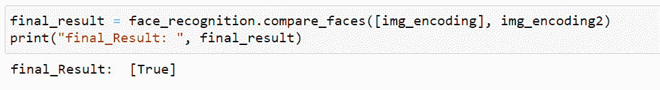
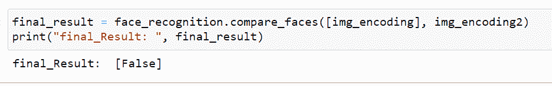

# 使用 OpenCV 在 Python 中进行人脸识别

> 原文：<https://www.askpython.com/python/examples/face-recognition-in-using-opencv>

在本文中，我们将使用 [OpenCV](https://www.askpython.com/python-modules/read-images-in-python-opencv) 来讨论 Python 中的人脸识别。我们将看看它与技术的结合，以及它如何让我们的生活变得轻松。之后，我们将跳转到 Python 并实现代码。

## 什么是面部识别？

面部识别是通过面部特征来识别个人的能力。这是一种用他们的脸来联系或证明现有身份的方式。这些系统可以用来识别人们的图像和视频，或者实时验证任何人脸。

面部识别是生物识别安全的一种。其他形式的生物识别软件包括语音识别和眼睛视网膜或虹膜识别。该技术主要用于安全实施，但在其他领域的应用也越来越多。人脸识别技术应用广泛，包括安全、人脸识别软件和市场营销。

## 理解面部识别是如何工作的

主要有两种方法被广泛用于人脸识别。

### 方法一:将人脸转换成矩阵值/像素。

想象一下在你的手机上设置面部登录。如果你以前这样做过，你知道手机试图从每个角度获取你的面部结构。一旦面部的完整结构被保存，它就作为一个矩阵存储在后端。下次你解锁手机时，这些矩阵中所做的只是一次搜索。这不是人工智能(大多数电话公司都这么说)。基于此，它提供二进制形式的输出(真/假)

### 方法二:利用深度学习进行人脸识别

深度学习算法需要大量数据，我们需要训练模型来检测人脸，但它们没有被训练来检测新主人，所以它们会失败。

但是，这项技术可以用于面部识别。最好的例子是脸书自动标签。如果你是新用户，脸书算法很难在新上传的内容中识别出你。但是一旦脸书收集了足够的数据(或者它的算法被训练来识别你的脸)，它很快就能认出我们，甚至是在集体照片中。

## OpenCV 是什么？

[OpenCV(开源计算机视觉库)](https://www.askpython.com/python-modules/read-images-in-python-opencv)是一个 Python 库，顾名思义是开源的，使用机器学习能力来解决计算机视觉问题。它旨在为基于商业产品的公司提供计算机视觉应用和机器学习洞察的通用工具。

实际上，使用 Berkeley Source Distribution (BSD)许可证对软件代码库的使用和修改施加了最小的限制，使得 OpenCV 对于这类公司来说非常方便，可以根据他们的要求使用和修改代码。所有的 OpenCV 算法都是用 C++语言实现的，但是这些算法也可以用在像 **Python** 、 **Java** 、 **Matlab** 等语言中。

OpenCV 库使用了大约 2500 种优化算法。

***这里有一个关于[用 OpenCV](https://www.askpython.com/python-modules/read-images-in-python-opencv) 读取图像的快速教程，它会让你对这个库有一个基本的了解。***

这个库的用户基数也很大，并且一直以惊人的速度增长。这个库的下载量超过 1800 万。这些算法可用于实时视觉应用、人脸识别、识别物体、图像处理、提取物体的 3D 模型，等等。

像**谷歌**、**微软**和**英特尔**这样的大公司也在他们的生产环境中依赖 OpenCV，并利用其强大的功能广泛使用该软件。各种政府组织也将 OpenCV 用于他们的项目，如监视、监控景观、导航人工智能机器人执行任务、灾害管理甚至执行救援行动。

简而言之，OpenCV 凭借其巨大的能力，在当前的技术场景中，继续作为一个顶级的软件库，与其所有的荣耀无缝合作。

## 用 OpenCV 在 Python 中实现人脸识别

在这里，我们将使用 Python 中的 OpenCV 实现人脸识别。首先，我们将安装实现面部识别所需的库。

*   **OpenCV:** OpenCV(开源计算机视觉库)是一个软件库，顾名思义是开源的，使用机器学习能力来解决前面解释的计算机视觉问题。
*   **dlib:**dlib 库包含“深度度量学习”的实现，用于创建在实际识别过程中使用的人脸嵌入。
*   人脸识别库非常容易使用，我们将在我们的代码中使用它。它能识别和操作人脸。

### 1.安装库

```py
#Install the libraries 
pip install opencv-python
conda install -c conda-forge dlib
pip install face_recognition

```

### 2.第一图像人脸编码

值得注意的是，OpenCV 使用 BGR(蓝、绿、红)图像格式。因此，当它使用`cv2.imread()`读取图像时，默认情况下，它总是以 BGR 格式解释它。我们也可以使用`cvtColor()`方法将 BGR 图像转换为 RGB 图像，反之亦然。

提取图像(本例中为 **Elon_musk.png** )并使用普通 OpenCV 程序将其转换为 RGB 颜色格式。然后使用面部识别库的特征进行“面部编码”。

```py
#defing the variable and reading the file
image_1 = cv2.imread("Elon_musk.png")
#it is interpreting the image in BGR format 
rgb_img = cv2.cvtColor(img, cv2.COLOR_BGR2RGB)
img_encoding = face_recognition.face_encodings(rgb_img)[0]

```

### 3.第二图像人脸编码

对第二个图像执行相同的步骤，只改变变量的名称，当然还有第二个图像的路径。在本例中为 images/Elon_musk.png。

```py
#accessing the image in the file from we have to match 
image_2 = cv2.imread("images/Elon_musk.png")
rgb_img2 = cv2.cvtColor(img2, cv2.COLOR_BGR2RGB)
img_encoding2 = face_recognition.face_encodings(rgb_img2)[0]

```

### 4.检查 img_encoding_1 和 img_encoding_2 是否是同一个人

**为了匹配，我们将制作两个案例**:

在第一种情况下，我们将把 image_1 放在我们正在寻找图像的已定义文件夹中，而在第二种情况下，我们不会把 image_1 放在该文件夹中。因此，基于此，我们将在第一种情况下将**真**作为输出，在第二种情况下将**假**作为输出。

**为了匹配图像，我们必须在图像之间进行比较**

**第一例**

```py
final_result = face_recognition.compare_faces([img_encoding], img_encoding2)
print("final_result: ", final_result)

```

输出



我附上我的文件夹截图，以便更好地理解。


image of the folder(Images)

在上面的例子中，你可以看到这个文件夹中有 Elon_musk 的图片，这就是为什么我们得到的输出为 **True**

**第二种情况**



我附上我的文件夹截图，以便更好地理解。


image of the folder(Images)

在上面的例子中，你不能在这个文件夹中看到 Elon_musk 的图像，这就是为什么我们得到的输出为 **False** 。

### 使用 Python OpenCV 实现人脸识别的完整代码

```py
#Install the libraries 
pip install opencv-python
conda install -c conda-forge dlib
pip install face_recognition

#defing the variable and reading the file
image_1 = cv2.imread("Elon_musk.png")
#it is interpreting the image in BGR format 
rgb_img = cv2.cvtColor(img, cv2.COLOR_BGR2RGB)
img_encoding = face_recognition.face_encodings(rgb_img)[0]

#accessing the image in the file from we have to match 
image_2 = cv2.imread("images/Elon_musk.png")
rgb_img2 = cv2.cvtColor(img2, cv2.COLOR_BGR2RGB)
img_encoding2 = face_recognition.face_encodings(rgb_img2)[0]

#For Matching the images for cases 
final_result = face_recognition.compare_faces([img_encoding], img_encoding2)
print("final_result: ", final_result)

```

### 结论

在本文中，我们介绍了如何使用 [OpenCV 库](https://www.askpython.com/python-modules/detecting-corners-in-python-opencv)在 python 中进行人脸识别，以及不同行业如何使用这项技术来获得更好的体验。

### 参考

[https://pypi.org/project/opencv-python/](https://pypi.org/project/opencv-python/)