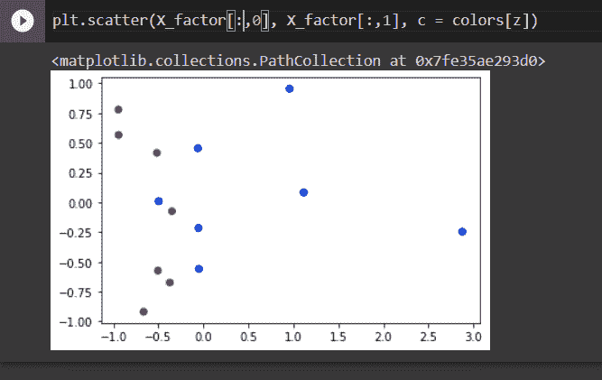

# 使用 Python 进行因子分析

> 原文：<https://www.askpython.com/python/examples/factor-analysis-using-python>

今天我们将讨论 python 中的因子分析，这对于现在的大多数学生来说可能是新的。但我向你保证，这也将是非常令人兴奋的。让我们开始吧，不要迟到。

## 因子分析导论

因子分析是统计学中常用的一种降维技术。这是一种无监督的机器学习技术。它使用 Pydataset 模块中的生物化学家数据集，并执行创建两个组件的 FA。基本上，它的目的是用变化来描述测量特征之间的相关性。它确定了共同特征的变量或项目。

**有两种类型的因素分析**

*   探索性因素分析
*   验证性因素分析

***也读:[如何使用 sklearn 在 Python 中将数据拆分成训练集和测试集？](https://www.askpython.com/python/examples/split-data-training-and-testing-set)***

### 探索性因素分析

它用于在一组属性中寻找结构。因素/成分的数量不是由研究人员或科学家指定的。还需要导出总体值。

### 验证性因素分析

它用于基础假设，并基于现有的理论或概念。在这里，研究人员已经有了一个预期的(假设的)数据结构。所以 CFA 的目的是确定已证实的数据与预期数据的吻合程度。

### 因子分析的应用

1.  减少用于分析数据的变量数量
2.  检测变量之间的结构关系。

## 在 Python 中实现因子分析

让我们快速浏览一下我们将要使用的一些模块。

```py
impost pandas as pd
from pydataset import data
from sklearn.decomposition import FactorAnalysis
import matplotlib.pyplot as plt
import numpy as np

```

有时它会抛出一个错误“**没有名为‘py dataset**’的模块”，要解决这个问题，你需要在你的命令提示符下使用你的 [pip 安装程序](https://www.askpython.com/python/pyinstaller-executable-files)来安装它，如下所示。

```py
pip install pydatset

```

该模块将按如下方式安装:

```py
Looking in indexes: https://pypi.org/simple, https://us-python.pkg.dev/colab-wheels/public/simple/
Collecting pydataset
  Downloading pydataset-0.2.0.tar.gz (15.9 MB)
     |████████████████████████████████| 15.9 MB 9.5 MB/s 
Requirement already satisfied: pandas in /usr/local/lib/python3.7/dist-packages (from pydataset) (1.3.5)
Requirement already satisfied: python-dateutil>=2.7.3 in /usr/local/lib/python3.7/dist-packages (from pandas->pydataset) (2.8.2)
Requirement already satisfied: pytz>=2017.3 in /usr/local/lib/python3.7/dist-packages (from pandas->pydataset) (2022.5)
Requirement already satisfied: numpy>=1.17.3 in /usr/local/lib/python3.7/dist-packages (from pandas->pydataset) (1.21.6)
Requirement already satisfied: six>=1.5 in /usr/local/lib/python3.7/dist-packages (from python-dateutil>=2.7.3->pandas->pydataset) (1.15.0)
Building wheels for collected packages: pydataset
  Building wheel for pydataset (setup.py) ... done
  Created wheel for pydataset: filename=pydataset-0.2.0-py3-none-any.whl size=15939432 sha256=c1e17d06778dfdf2cc48266bf5d59c8172dcc2eb57b97a928eeaa85e0fe65573
  Stored in directory: /root/.cache/pip/wheels/32/26/30/d71562a19eed948eaada9a61b4d722fa358657a3bfb5d151e2
Successfully built pydataset
Installing collected packages: pydataset
Successfully installed pydataset-0.2.0

```

### 数据准备

首先，我们将创建由`bioChemist`数据集组成的名为`df`的数据帧。我们将把数据帧减少到 15 行。

```py
df = data('bioChemists')
df = df.iloc[1:15]
X = df[['art', 'kid5', 'phd', 'ment']]
df

```

上面的代码片段将给出如下输出。

| 指数 | 艺术 | 女子 | 瑕疵 | kid5 | 博士学位 | 名词后缀，表示“...的行为” |
| --- | --- | --- | --- | --- | --- | --- |
| Two | Zero | 女人 | 单一的 | Zero | 2.04999995231628 | six |
| three | Zero | 女人 | 单一的 | Zero | Three point seven five | six |
| four | Zero | 男人 | 已婚的 | one | 1.17999994754791 | three |
| five | Zero | 女人 | 单一的 | Zero | Three point seven five | Twenty-six |
| six | Zero | 女人 | 已婚的 | Two | 3.58999991416931 | Two |
| seven | Zero | 女人 | 单一的 | Zero | 3.19000005722046 | three |
| eight | Zero | 男人 | 已婚的 | Two | 2.96000003814697 | four |
| nine | Zero | 男人 | 单一的 | Zero | 4.61999988555908 | six |
| Ten | Zero | 女人 | 已婚的 | Zero | One point two five | Zero |
| Eleven | Zero | 男人 | 单一的 | Zero | 2.96000003814697 | Fourteen |
| Twelve | Zero | 女人 | 单一的 | Zero | 0.754999995231628 | Thirteen |
| Thirteen | Zero | 女人 | 已婚的 | one | 3.69000005722046 | three |
| Fourteen | Zero | 女人 | 已婚的 | Zero | 3.40000009536743 | four |
| Fifteen | Zero | 女人 | 已婚的 | Zero | 1.78999996185303 | Zero |

最后一行提取了我们要用于分析的变量。我们可以通过打印同样的内容来观察。

| 指数 | 艺术 | kid5 | 博士学位 | 名词后缀，表示“...的行为” |
| --- | --- | --- | --- | --- |
| Two | Zero | Zero | 2.04999995231628 | six |
| three | Zero | Zero | Three point seven five | six |
| four | Zero | one | 1.17999994754791 | three |
| five | Zero | Zero | Three point seven five | Twenty-six |
| six | Zero | Two | 3.58999991416931 | Two |
| seven | Zero | Zero | 3.19000005722046 | three |
| eight | Zero | Two | 2.96000003814697 | four |
| nine | Zero | Zero | 4.61999988555908 | six |
| Ten | Zero | Zero | One point two five | Zero |
| Eleven | Zero | Zero | 2.96000003814697 | Fourteen |
| Twelve | Zero | Zero | 0.754999995231628 | Thirteen |
| Thirteen | Zero | one | 3.69000005722046 | three |
| Fourteen | Zero | Zero | 3.40000009536743 | four |
| Fifteen | Zero | Zero | 1.78999996185303 | Zero |

### 模型开发

```py
fact_2c = FactorAnalysis(n_components = 2)
X_factor = fact_2c.fit_transform(X)
X_factor

```

第一行告诉 python 我们需要多少个因子。第二行将这些信息与修改后的数据集 X 一起用于创建我们想要的实际因子。上面代码片段的输出是，

```py
array([[-0.06116534,  0.45436164],
       [-0.05368177, -0.21586197],
       [-0.51588955,  0.41579685],
       [ 2.87683951, -0.2463228 ],
       [-0.66312275, -0.91895129],
       [-0.49572513,  0.00948667],
       [-0.37284394, -0.67362045],
       [-0.04985194, -0.5588587 ],
       [-0.9438434 ,  0.7788992 ],
       [ 1.11504909,  0.08341052],
       [ 0.95881639,  0.954253  ],
       [-0.50484028, -0.57376861],
       [-0.34827463, -0.07482872],
       [-0.94146627,  0.56600467]])

```

### 形象化

可视化也需要几个步骤。我们想确定这两个部分在多大程度上将已婚学生和未婚学生区分开来。首先，我们需要创建一个字典，可以用来将单身或已婚状态转换为数字。

```py
thisdict = {"Single" : "0" , "Married" : "1"}
thisdict

z = np.array(df.mar.map(thisdict), dtype = int)
colors = np.array(["blue", "purple"])
z

```

以上代码的输出:

```py
array([0, 0, 1, 0, 1, 0, 1, 0, 1, 0, 0, 1, 1, 1])

```

现在也是如此。

```py
plt.scatter(X_factor[:,0], X_factor[:,1], c = colors[z])

```



通过将字典映射到已婚变量，它自动将 df 数据集中的每个单个和已婚条目分别更改为 0 和 1。c 参数需要一个数字来设置颜色，这就是创建字典的原因。

## 摘要

今天，我们讲述了使用 python 进行因子分析的一点知识。希望你已经拿到了。我们必须再次访问一些更令人兴奋的话题。