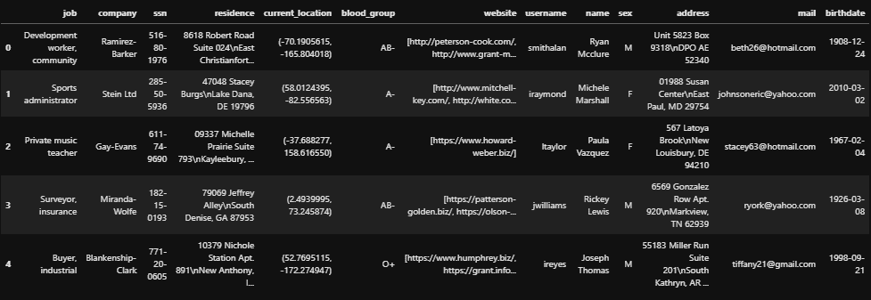

# Python: Faker 模块

> 原文：<https://www.askpython.com/python-modules/faker-module>

你好。今天我们将学习 Faker 模块，学习起来会非常有趣。所以让我们开始吧！

## faker 模块简介

Faker 模块用于生成随机数据，包括姓名、年龄、位置等随机属性。

现在的问题是为什么需要假数据？我们可能需要假数据，或者用一些假数据来填充数据库中缺失的值，或者简单地测试一个算法。

## 导入 faker 模块

为了探索 faker 库的不同功能和方法，我们首先要导入它。

如果导入 faker 库抛出错误，我们将使用`pip`命令安装该库。

我们可以导入库，我们必须使用下面给出的代码。

```py
from faker import Faker

```

## 制造假数据

要创建一些假数据，我们需要先创建一个 Faker 库的`faker`对象，并在该对象上应用各种函数来获得假随机数据。

下面的代码使用`faker.name`函数打印一个随机的名字。

```py
faker = Faker()
print(faker.name())

```

为了更容易理解，让我们使用同一个函数打印 5 个随机的名字。同样的代码和输出如下所示。

```py
faker = Faker()
for i in range(5):
    print(faker.name())

```

上面代码的输出如下所示。

```py
Stephanie Rivera
Gina Morgan
Elizabeth Garcia
Joanne Collier
Jessica Berry

```

## 用不同的语言创建假数据

我们也可以通过在创建的`Faker`对象中定义来生成不同语言的假数据。让我们用印地语生成一些数据。相同的代码如下所示。

```py
faker1 = Faker('hi_IN')
for i in range(5):
    print(faker1.name())

```

我们在这里声明的对象是印地语的。因此，如果创建这个对象来打印虚拟名称，那么结果看起来就像下面这样。

```py
पाटिल, इशान
लाला, जयदेव
ऐश्वर्या लाला
ललित गणेश
चेतना मल्लिक

```

## 生成假文本

在`text`功能的帮助下，相同的对象可用于生成文本和句子。相同的代码如下所示。

```py
faker = Faker()
print(faker.text())

```

同样的输出如下所示。

```py
Big thought American. Per red plan hundred language test. Language early bill citizen total if officer because. Example practice other street newspaper kid level.

```

## 生成虚假的表格数据

现在让我们尝试以 python 中的`pandas`库的`dataframes`的形式创建一大堆数据点。为了收集多种类型的数据，我们使用了创建的 faker 对象的`profile`函数。

相同的代码如下所示。

```py
import pandas as pd
faker = Faker()
data = [faker.profile() for i in range(10)]
df = pd.DataFrame(data)

```

打印创建的数据帧的前五个数据点。我们得到的结果显示如下。



Faker Module Generated Dataframe

## 结论

在本教程中，我们看到了如何使用 Faker 库来生成假数据，不仅是英文的，还有其他语言的。

相同的模块可用于生成完整的数据集，然后将数据集用于多种目的，包括将模型应用于 ML 模型。

感谢您的阅读。