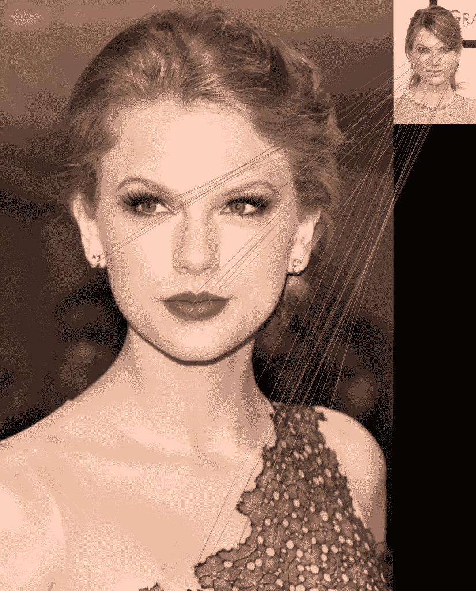
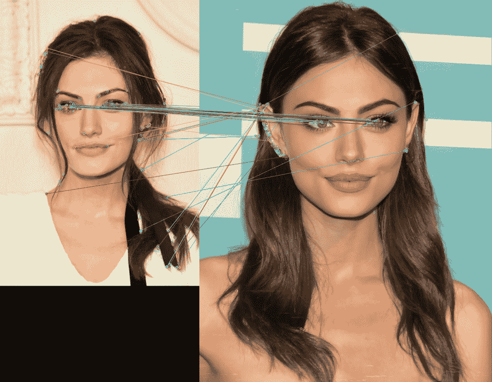

# 使用 Python 进行影像中的特征匹配简介

> 原文：<https://www.askpython.com/python-modules/feature-matching-in-images-opencv>

特征匹配是检测和测量两幅或多幅图像中特征之间相似性的过程。该过程可用于比较图像，以识别它们之间的变化或差异。特征匹配还可以用于在不同的图像中找到对应点，这可以用于全景拼接和对象跟踪等任务。

有许多不同的算法可用于特征匹配。一些最流行的算法包括哈里斯边角侦测、苏珊算法和快速算法。每种算法都有自己的优点和缺点，因此选择最适合当前特定任务的算法非常重要。

我们将在本文中使用的 ORB 算法的工作原理是检测图像中的特征，然后将它们与其他图像中的相应特征进行匹配。这是通过为每个检测到的特征构造特征描述符来实现的。特征描述符是一个向量，包含关于特征的信息，例如其位置、大小和方向。

在本文中，我们将使用 OpenCV 的 ORB 算法在我们的应用程序上进行特征匹配和显示。

## 在 Python OpenCV 中实现特征匹配算法

OpenCV 是一个计算机视觉算法库，可用于执行多种任务，包括特征匹配。OpenCV 对 Python 和 C++都可用，这使得它成为跨平台开发的流行选择。

***也读作:[使用 Python OpenCV](https://www.askpython.com/python/examples/identifying-keypoints-in-images-opencv)*** 识别图像中的关键点

现在你知道特征匹配是比较两幅图像的特征，这两幅图像可能在方向、透视、亮度上不同，甚至在大小和颜色上不同。现在让我们看看它的**实现**。

```py
import cv2
from google.colab.patches import cv2_imshow

img1 = cv2.imread('sample.jpg')
img2 = cv2.imread('sample2.jpg')

orb = cv2.ORB_create(nfeatures=500)
kp1, des1 = orb.detectAndCompute(img1, None)
kp2, des2 = orb.detectAndCompute(img2, None)

bf = cv2.BFMatcher(cv2.NORM_HAMMING, crossCheck=True)
matches = bf.match(des1, des2)

matches = sorted(matches, key=lambda x: x.distance)

match_img = cv2.drawMatches(img1, kp1, img2, kp2, matches[:50], None)

cv2_imshow(match_img)
cv2.waitKey()

```

我知道代码现在有点不清楚。不用担心，我们会一行一行地检查整个代码。

1.  **第 1 行和第 2 行**–将必要的库导入程序。
2.  **第 4 行和第 5 行**–使用`imread`功能将图像载入程序。
3.  **第 7 行**–创建特征匹配器 ORB 对象，它将检测大约 500 个特征
4.  **第 8 行和第 9 行**–帮助检测两幅图像特征的功能`detectAndCompute`
5.  **第 11 行和第 12 行**–函数`BFMatcher`和`match`返回特征匹配的最佳结果。
6.  **第 14 行**–接下来，我们根据距离对结果进行升序排序，使较好的结果排在最前面。
7.  **第 16 行**–使用函数`drawMatches`我们将绘制前 50 个结果，然后使用`im_show`函数显示输出图像。

***也读作:[宝珠特征检测用 Python](https://www.askpython.com/python/examples/orb-feature-detection)***

看看对一些图像运行代码时的输出。



Feature Matching Sample Output 1



Feature Matching Sample Output 2

## 结论

在本教程中，我们探讨了特征匹配的概念，并探讨了实现特征匹配概念的基本方法。

您可以尝试各种图像，并对结果感到惊讶！感谢您的阅读！

编码快乐！😁