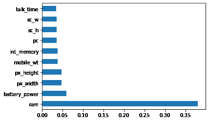
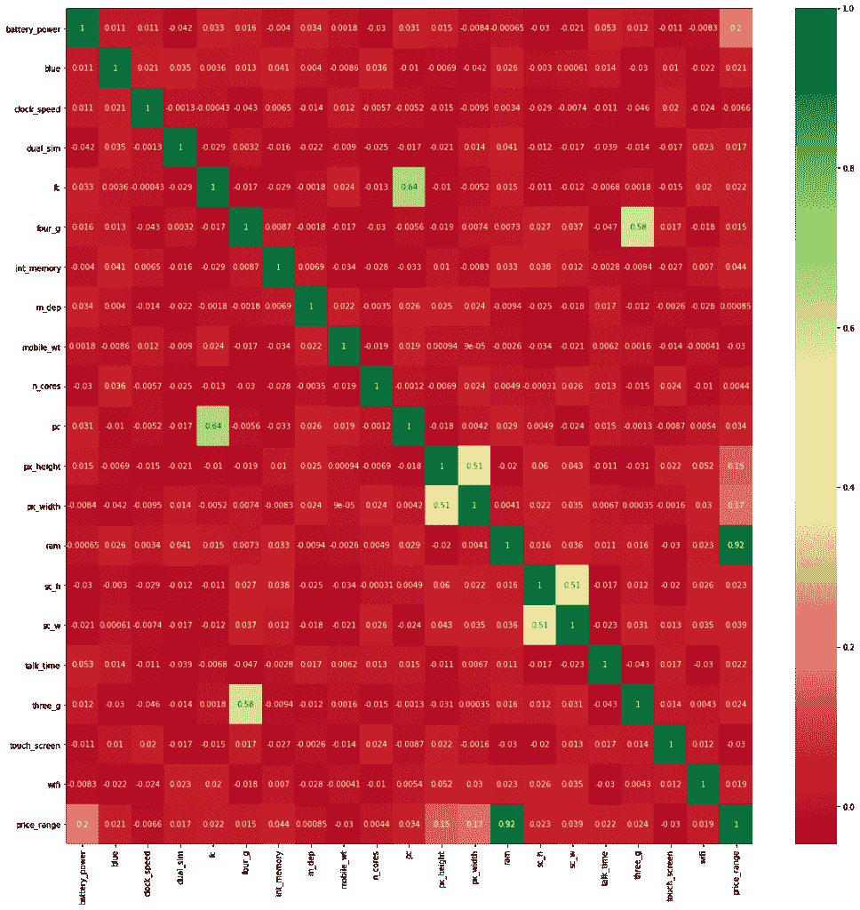

# Python 中的特征选择——初学者参考

> 原文：<https://www.askpython.com/python/examples/feature-selection-in-python>

这篇文章有点超前。我们将讨论 Python 中用于训练机器学习模型的特征选择。从数据集中识别出重要的要素并排除那些不会提高模型精度的不太重要的要素非常重要。

不相关或仅部分相关的特征会损害模型性能。模型设计的第一个也是最关键的阶段应该是特征选择和数据清理。

特征选择是机器学习中的一个基本概念，对模型的性能有重大影响。在本文中，您将学习如何在机器学习中使用特征选择策略。

***也可阅读:[Python 中的机器学习——初学者简易指南](https://www.askpython.com/python/machine-learning-introduction)***

我们开始吧！

首先让我们了解一下什么是特征选择。

## 什么是特征选择？

数据中存在不相关的要素会降低模型的准确性，并导致模型基于不相关的要素进行训练。要素选择是自动或手动选择对您感兴趣的预测变量或输出贡献最大的要素的过程。

### 为什么我们应该在模型上执行特征选择？

以下是在机器学习模型上执行特征选择的一些好处:

*   **模型精度提高:**模型精度提高是因为误导性数据减少了。
*   **减少过拟合**:冗余数据越少，基于噪声做出结论的机会就越小。
*   **减少训练时间**:由于数据点减少，算法复杂度降低，算法训练更快。

当您在模型上进行特征选择时，其准确性会显著提高。

***也读:[如何使用 sklearn 在 Python 中将数据拆分成训练集和测试集？](https://www.askpython.com/python/examples/split-data-training-and-testing-set)***

## 执行特征选择的方法

有三种常用的特征选择方法，它们易于执行并产生良好的结果。

1.  单变量选择
2.  特征重要性
3.  热图相关矩阵

让我们用一个例子来仔细看看这些方法。

**链接下载数据集**:[https://www . ka ggle . com/iabhishekofficial/mobile-price-class ification # train . CSV](https://www.kaggle.com/iabhishekofficial/mobile-price-classification#train.csv)

### 1.单变量选择

可以执行统计测试来识别哪些属性与输出变量的关联最强。scikit-learn 库中的 SelectKBest 类可用于各种统计测试，以选择一定数量的特性。

在下面的示例中，使用非负特征的卡方(chi2)统计测试从移动价格范围预测数据集中选择 10 个最佳特征。

```py
import pandas as pd
import numpy as np
from sklearn.feature_selection import SelectKBest
from sklearn.feature_selection import chi2
data = pd.read_csv("C://Users//Intel//Documents//mobile_price_train.csv")
X = data.iloc[:,0:20]  #independent variable columns
y = data.iloc[:,-1]    #target variable column (price range)

#extracting top 10 best features by applying SelectKBest class
bestfeatures = SelectKBest(score_func=chi2, k=10)
fit = bestfeatures.fit(X,y)
dfscores = pd.DataFrame(fit.scores_)
dfcolumns = pd.DataFrame(X.columns)

#concat two dataframes
featureScores = pd.concat([dfcolumns,dfscores],axis=1)
featureScores.columns = ['Specs','Score']  #naming the dataframe columns
print(featureScores.nlargest(10,'Score'))  #printing 10 best features

```

输出:

```py
Specs          Score
13            ram  931267.519053
11      px_height   17363.569536
0   battery_power   14129.866576
12       px_width    9810.586750
8       mobile_wt      95.972863
6      int_memory      89.839124
15           sc_w      16.480319
16      talk_time      13.236400
4              fc      10.135166
14           sc_h       9.614878
```

### 2.特征重要性

模型的要素重要性属性可用于获取数据集中每个要素的要素重要性。

要素重要性为数据的每个要素分配一个分数；分数越高，该特性对您的输出变量越重要或越相关。我们将在下面的示例中使用额外的树分类器来提取数据集的前 10 个特征，因为特征重要性是基于树的分类器自带的内置类。

```py
import pandas as pd
import numpy as np
data = pd.read_csv("C://Users//Intel//Documents//mobile_price_train.csv")
X = data.iloc[:,0:20]  #independent variable columns
y = data.iloc[:,-1]    #target variable column (price range)
from sklearn.ensemble import ExtraTreesClassifier
import matplotlib.pyplot as plt
model = ExtraTreesClassifier()
model.fit(X,y)
print(model.feature_importances_) 

#plot the graph of feature importances 
feat_importances = pd.Series(model.feature_importances_, index=X.columns)
feat_importances.nlargest(10).plot(kind='barh')
plt.show()

```

输出:

```py
[0.05945479 0.02001093 0.03442302 0.0202319  0.03345326 0.01807593
 0.03747275 0.03450839 0.03801611 0.0335925  0.03590059 0.04702123
 0.04795976 0.38014236 0.03565894 0.03548119 0.03506038 0.01391338
 0.01895962 0.02066298]
```



### 3.热图相关统计

相关性描述了特征和目标变量之间的关系。
关联可以是:

*   **正**:一个特性值的增加提高了目标变量的值，或者
*   **负值:**一个特性值的增加会降低目标变量的值。

我们将使用 Seaborn 库绘制相关要素的热图，以找出哪些要素与目标变量最相关。

```py
import pandas as pd
import numpy as np
import seaborn as sns
data = pd.read_csv("C://Users//Intel//Documents//mobile_price_train.csv")
X = data.iloc[:,0:20]  #independent variable columns
y = data.iloc[:,-1]    #targetvariable column (price range)

#obtain the correlations of each features in dataset
corrmat = data.corr()
top_corr_features = corrmat.index
plt.figure(figsize=(20,20))
#plot heat map
g=sns.heatmap(data[top_corr_features].corr(),annot=True,cmap="RdYlGn")

```

输出:



转到最后一行，看看价格范围。您将看到与价格范围相关的所有功能。“ram”是与价格范围高度相关的功能，其次是电池电量、像素高度和宽度等功能。m_dep、clock_speed 和 n_cores 是与价格范围最不相关的功能。

## **结论**

在本文中，我们学习了如何使用单变量选择方法、特征重要性和相关性矩阵从数据中选择相关特征。选择最适合您的情况的方法，并使用它来提高模型的准确性。