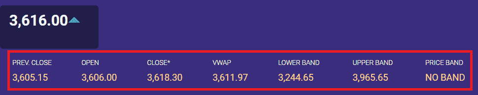
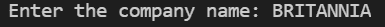
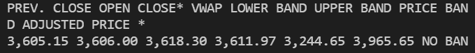

# 如何使用 Selenium Python 获取股票市场数据

> 原文：<https://www.askpython.com/python-modules/fetch-stock-market-data-selenium>

使用 Python 获取最新的股票市场数据为分析和价格分析提供了一个很好的用例场景。在本教程中，我们将学习如何使用 python selenium 获取股票市场数据。

对于这个特定的教程，我们将从 [NSE](https://www.nseindia.com/) (印度国家股票交易所)获取 BRITANNIA industries 的数据，但是我们的代码可以将任何其他公司的名称作为输入，也可以获取它的数据。

***你可能还喜欢:[使用 Selenium 从网页中获取数据【完全指南】](https://www.askpython.com/python-modules/fetch-website-data-selenium)***

## 使用 Python 获取股票市场数据

让我们从使用 Python selenium 获取股票市场数据的步骤开始。您可以循环读取数据的步骤，以便在 Python 应用程序上访问实时市场数据。

### 第一步。导入模块

首先，我们需要将 selenium 和 webdriver (chrome)导入到代码中。

```py
import selenium 
from selenium import webdriver

```

### 第二步。接受输入

我们将把公司的交易符号(股票代码或股票名称)作为输入，并将其存储在来自用户的变量中。

```py
company_name = input("Enter the company name: ")

```

### 第三步。正在初始化 web 驱动程序

首先，我们需要下载想要自动化的 web 浏览器的 web 驱动程序。

就我而言，我下载了与谷歌 chrome 相同版本的 chrome WebDriver。我们还将检查用户是否输入了公司名称。如果我们有一个公司名称，那么我们将初始化网络驱动程序。

```py
if(company_name != ''):
    driver = webdriver.Chrome('C://software/chromedriver.exe')

```

为了初始化 web 驱动程序，我们需要传递我们下载的 web 驱动程序的路径，就像在我们的计算机系统中一样，如上所示。

### 第四步。访问网站

在我们开始抓取网站之前，我们首先需要访问网站。我们可以在 **get()** 方法的帮助下做到这一点。通过使用[字符串连接](https://www.askpython.com/python/string/string-concatenation-in-python)，我们将 company_name 变量的值添加到 NSE 网站上股票数据的基本 URL 中。

我们这样做是为了根据输入符号获取股票数据。公司名称可以是 INFY、TCS、ITC、RELIANCE、BRITANNIA 等。，前提是它应该是有效的股票代码。

```py
driver.get('https://www.nseindia.com/get-quotes/equity?symbol='+ company_name)

```

在本教程中，我们将访问包含大不列颠股票数据的网页。

### 第五步。找到我们想要刮取的特定元素

以下是我们想要收集的 Britannia 的当前股票价值。因此，我们将使用浏览器的 inspect 工具检查这些值，以找到它的 HTML 元素。



Real-time data of Stock, which we need to scrape

我们在 NSE 网站上找到了下面的英国符号的 HTML 代码。

```py
<table id="priceInfoTable">                                         
<td>Open</td> 
<td>Close*</td>                                                                
<td>title="Volume Weighted Average Price">VWAP</td>                                                                    
<td>Lower Band</td>                                                                    
<td>Upper Band</td>                                                                    
<td>Price Band</td>                                                                    
<tr><td style="">3,605.15</td>
<td>3,606.00</td>
<td>3,618.30</td>
<td>3,611.97</td>
<td>3,244.65</td>
<td>3,965.65</td>
<td>No Band</td>
</table>

```

经过检查，我们发现所有需要的值都在名为–**price infotable 的 id 中。**所以我们将通过使用 **get_element_by_id()** 方法来访问这些值。我们需要传递 id 名称 priceInfoTable。

```py
britania_stock = driver.find_elements_by_id('priceInfoTable')

```

### 第六步。将抓取的信息存储在列表中

当我们从网页中抓取任何数据时，你在处理代码时并不总是能理解它。为了使它可用和可读，我们将把这些数据存储在一个列表中。

```py
britania_list = []
for p in range(len(britania_stock)):
    britania_list.append(britania_stock[p].text)

```

当我们打印这个列表时，它会将所有值作为一个列表元素返回。因此，我们将编写另一个 for 循环，并在新的一行中打印这些值。

最后，我们使用 driver . quit()——这是一种关闭所有浏览器窗口的方法。

完整的工作代码如下:

```py
from selenium import webdriver
import time

company_name = input("Enter the stock name: ")

if(company_name != ''):

    driver = webdriver.Chrome('C://software/chromedriver.exe')
    driver.get('https://www.nseindia.com/get-quotes/equity?symbol='+ company_name)

    #to let the webpage load completely
    time.sleep(5) 

    britania_stock = driver.find_elements_by_id('priceInfoTable')

    britania_list = []
    for p in range(len(britania_stock)):
        britania_list.append(britania_stock[p].text)

    for i in britania_list:
        print(i,end="\n")

driver.quit()

```

这段代码的输出将是:



Output as per the inputted ticker symbol

## 结论

继续在其他网站上进行同样的实验，甚至可以在加密货币网站上为你的应用程序获取实时价格。请注意，出于商业目的的抓取可能违反许多网站的政策，您需要确保您仅将这些数据用于个人用途。