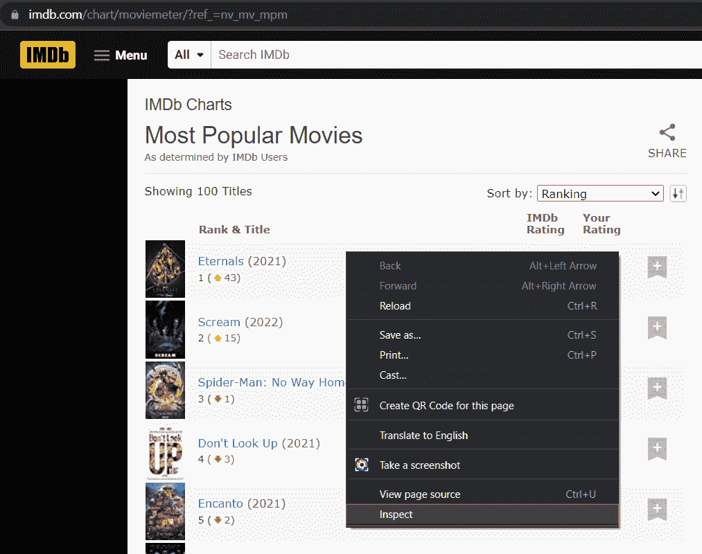
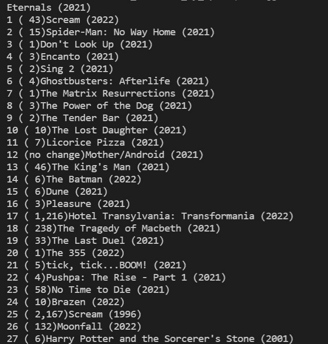

# 使用 Selenium 从网页获取数据[完整指南]

> 原文：<https://www.askpython.com/python-modules/fetch-website-data-selenium>

在本教程中，我们将使用 Selenium 制作一个 web scraper 来从任何网站获取数据。Selenium 是一个开源项目，用于自动化浏览器。它为自动化提供了广泛的工具和库。我们可以用各种语言编写脚本来自动化浏览器，如 java、python、c#、Kotlin 等。

## 实现 Web Scraper 来获取数据

在我们的示例中，我们将通过从 IMDB 获取最受欢迎的电影列表来演示 python web scraping。

### 第一步。导入模块

从我们的 web scrapper 开始，我们导入 Selenium 和相关模块

```py
from selenium import webdriver
from selenium.webdriver.common.keys import Keys

```

### 第二步。正在初始化 web 驱动程序

为了使浏览器自动化，我们需要下载我们打算使用的 web 浏览器的 web 驱动程序。在我们的例子中，我使用的是 Google Chrome，所以我下载了 chrome WebDriver。

确保 Chrome 版本和 WebDriver 版本相同。我们需要在 Chrome 方法中传递 WebDriver 的路径，如下所示:

```py
driver = webdriver.Chrome('C://software/chromedriver.exe')

```

### 第三步。通过 Python 访问网站

为了访问网站数据，我们需要打开我们将要抓取的网站 URL。

为此，我们使用 **get** 方法，并将网站 URL 作为该方法的参数传递。在我们的例子中，它是 IMDB 的最受欢迎电影的网页。

```py
driver.get("https://www.imdb.com/chart/moviemeter/?ref_=nv_mv_mpm")

```

当我们运行这段代码时，它将在我们的计算机系统中打开带有传递地址(URL)网站的网络浏览器。

### 第四步。找到你要废弃的特定信息

在我们的例子中，我们从 IMDB 中寻找收视率最高的电影的名字，所以我们将找到 HTML 元素的 XPath。

XPath 可以理解为 HTML 文档中某个特定事件(对象)的路径位置，用于查找或定位网页上的元素。

要获得一个元素的 XPath，必须使用浏览器的 **Inspect** 工具，然后使用选择器工具选择那个特定的工具(我们需要获得它的路径),右键单击 HTML 代码，然后选择 Copy XPath。



Inspect Element In Webpage

在我们的示例中，在检查了电影的名称元素后，似乎每个名称都在 class-title 列中，所以我们可以在代码中将它作为 xpath 传递并访问电影名称。

```py
<td class="titleColumn">
      <a href="" title="Chloé Zhao (dir.), Gemma Chan, Richard Madden">Eternals</a>        
</td>

```

我们将使用方法 **find_elements_by_xpath()** 来查找每个 titleColumn 类。

```py
movies = driver.find_elements_by_xpath('//td[@class="titleColumn"]')

```

注意:每个 xpath 前面都有双斜杠。—'//TD[**@ class =**" title column "]'

### 第五步。将数据存储在 Python 列表中

既然我们可以成功地获取所需的信息，我们需要将它存储在一个变量或数据结构中，以便在代码的后面部分进行检索和处理。我们可以将抓取的数据存储在各种数据结构中，如数组、列表、元组、字典。

这里，在一个列表中存储我们收集的数据(顶级电影名)。为此，我们可以编写一个循环来遍历每个电影名称，并将其存储在一个列表中。

movies_list 是一个空列表，包含从网站获取的所有信息。

```py
movies_list = []
for p in range(len(movies)):
    movies_list.append(movies[p].text)

```

web 抓取网站数据的最终 python 代码是:

```py
from selenium import webdriver
from selenium.webdriver.common.keys import Keys

driver = webdriver.Chrome('C://software/chromedriver.exe')
driver.get('https://www.imdb.com/chart/moviemeter/?ref_=nv_mv_mpm')
movies = driver.find_elements_by_xpath('//td[@class="titleColumn"]')

movies_list = []
for p in range(len(movies)):
    movies_list.append(movies[p].text)

```

如果我们在一行中打印 movies_list 列表，那么:

```py
print(*movies_list, sep = "\n")

```

我们得到如下输出:



Scraped Web Data Output

## 结论

这就是你如何使用 Selenium 和 Python 从几乎任何网站上抓取网站数据。只要找到正确的 XPath 并能识别网站使用的模式，访问任何网站上的所有数据都会变得非常容易。

继续做同样的实验，并让我们知道！我希望你喜欢这个教程。关注 AskPython.com 获得更多有趣的教程。