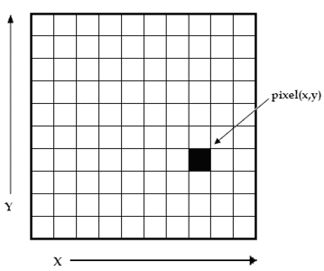
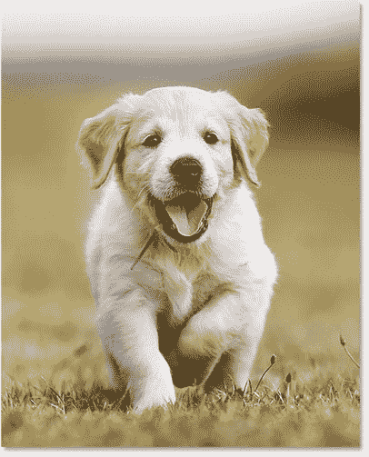

# 使用 Python OpenCV 获取图像大小

> 原文：<https://www.askpython.com/python-modules/fetching-image-size-using-python-opencv>

我们都必须将鼠标光标移动到一个图像文件上，不到一秒钟就会出现一个显示图像尺寸的小框。这多容易啊！但是我们能通过编程和编码得到图像的大小吗？

嗯，是的，我们可以通过编程获得图像的大小，这就是 Python 编程语言发挥作用的地方。

因为 Python 被广泛用于现实生活中的应用，如 Web 开发、机器学习、人工智能、数据科学等，所以毫不奇怪，我们可以使用 Python OpenCV 获得任何图像的大小(尺寸)。

我们将通过一个例子来学习如何使用 OpenCV Python 获取图像的大小。让我们开始吧。

***也读作:[Python 中的图像处理——边缘检测、大小调整、腐蚀、膨胀](https://www.askpython.com/python/examples/image-processing-in-python)***

## **简介**

在[图像处理](https://www.askpython.com/python/examples/image-processing-in-python)期间，了解我们正在处理的图像的大小是至关重要的，它正在通过各个阶段进行转换。

图像是二维像素阵列。图像的尺寸是指图像的高度、宽度和通道数。使用 **[OpenCV](https://www.askpython.com/python-modules/opencv-imwrite)** 时，图像存储在 **NumPy ndarray** (N 维数组)中。



**Image as a 2-D array**

## **先决条件**

*   最新版本的 Python **必须**安装在你们各自的系统上，可以从 https://www.python.org/downloads/[安装](https://www.python.org/downloads/)

*   通过在终端中执行以下命令来安装 OpenCV:

```py
pip install opencv-contrib-python

```

## **读取图像**

可以使用 OpenCV 的 [**imread** 函数加载图像。](https://www.askpython.com/python-modules/python-imread-opencv)

### 代码片段

```py
# Importing the OpenCV Module
import cv2 as cv

# Reading the image using imread() function
img = cv.imread('IMAGES/Puppy.jpg')

```

在上面的代码片段中，`**imread**`函数将图像的路径作为参数。

## **示例–使用 OpenCV** 获取图像尺寸

在这个例子中，我使用了下面的图片，图片的尺寸为 **406×503** ，其中**宽度**为 406px，**高度**为 503px。



为了获得图像的大小，使用了`ndarray.shape`，其中`**ndarray**`是使用`**imread**`函数读取的图像。`**shape**`返回一个有 3 个值的元组——高度、宽度和通道数。高度为索引 0，宽度为索引 1，通道数为索引 2。

### 代码片段

```py
# Importing the OpenCV Module
import cv2 as cv

# Reading the image using imread() function
img = cv.imread('IMAGES/Puppy.jpg')

dimensions = img.shape

#Accessing height, width and channels

# Height of the image
height = img.shape[0]

# Width of the image
width = img.shape[1]

# Number of Channels in the Image
channels = img.shape[2]

# Displaying the dimensions of the Image
print("Dimension are :",dimensions)

print("Height :",height,"px")

print("Width :",width,"px")

print("Number of Channels : ",channels)

```

### 输出

```py
Dimension are : (503, 406, 3)
Height : 503 px
Width : 406 px
Number of Channels :  3

```

这真的很有趣，我们的代码产生了图像的精确尺寸。

## **结论**

这是关于使用 OpenCV 获取图像的大小(尺寸)。请确保给出要读取的图像的完整路径。感谢阅读和快乐编码！