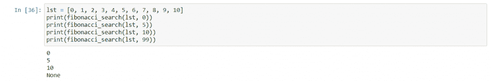

# Python 中的斐波那契搜索[简单的例子]

> 原文：<https://www.askpython.com/python/examples/fibonacci-search>

斐波那契搜索是另一种分治算法，用于在给定列表中查找元素。在本教程中，我们将看到它是如何工作的，它与二分搜索法有何不同，我们将用 python 实现它。

## 先决条件

在进行斐波那契搜索之前，我们需要先了解两个主题。

### 1。二进位检索

[二分搜索法](https://www.askpython.com/python/examples/binary-search-algorithm-in-python)是一个分而治之的算法，意思是我们为了找到答案而划分我们的列表。应该对给定的列表进行排序，以便我们可以执行该算法。

我们查看列表的中间元素，因为列表是排序的，所以我们将知道目标相对于中间元素的位置。我们要么在列表的中间找到目标，要么根据项目是小于还是大于中间的元素，从中间去掉一边。消除一侧后，我们对另一侧重复这个过程。

这样，在每次迭代中，我们减少了一半的列表，所以要找到 n 个元素，我们只需要 log [2] n 次迭代。

### 2。斐波那契数

斐波纳契数列是构成[斐波纳契数列](https://www.askpython.com/python/python-recursion-function)的数字。所以让我们先定义斐波纳契数列。我们可以将该系列递归定义为:

```py
F(n) = F(n-1) + F(n-2)
F(1) = 1
F(0) = 0

```

我们确实有一种直接的方法通过一个包含指数和黄金分割率的公式来得到斐波那契数列，但是这种方法就是数列应该被理解的方式。

在上面的定义中，F(n)表示“第 n 个斐波那契数”。

因此，第 0 个斐波那契数列是 0，第 1 个斐波那契数列是 1，第 2 个斐波那契数列是第 1 个和第 0 个斐波那契数列的和，第 3 个斐波那契数列是第 2 个和第 1 个斐波那契数列的和，依此类推。

最后，第 n 个斐波那契数是它前面两个斐波那契数的和，即第(n-1)个和第(n-2)个斐波那契数的和。

这是前 10 个斐波那契数列的计算。

```py
F(0) = 0
F(1) = 1
F(2) = F(1) + F(0) = 1 + 0 = 1
F(3) = F(2) + F(1) = 1 + 1 = 2
F(4) = F(3) + F(2) = 2 + 1 = 3
F(5) = 3 + 2 = 5
F(6) = 5 + 3 = 8
F(7) = 8 + 5 = 13
F(8) = 21
F(9) = 34
F(10) = 55
...

```

所以，斐波那契数列，从 0 开始是:

F = 0，1，1，2，3，5，8，13，21，34，55，89，144，…

## 在 Python 中实现斐波那契搜索

与二分搜索法类似，斐波那契搜索也是一种分治算法，需要一个排序列表。它还将列表分为两部分，检查两部分中间项目的目标，并根据比较结果排除一边。那么它和二分搜索法到底有什么不同呢？

在斐波纳契搜索中，我们使用斐波纳契数将列表分为两部分，因此它将列表分为不同长度的两部分。此外，它不是执行除法，而是执行加法，这对 CPU 来说负担较轻。现在让我们深入细节。

首先，我们需要给定列表的长度。然后我们找到大于或等于列表大小的最小斐波那契数。这意味着如果列表的大小是 100，那么大于 100 的最小斐波纳契数是 144。假设这是第 n 个斐波那契数。在上面的例子中，144 是第 12 个斐波那契数。

在这之后，我们在斐波纳契数列中从这个数字向后移动两次。本质上，我们找到第(n-2)个斐波那契数。在上面的例子中，我们已经找到了第 12 个斐波纳契数 144，所以我们需要第 10 个斐波纳契数 55。

我们以此为索引，将列表分为两部分。也就是说，我们在列表中查看这个索引，假设列表按升序排序，如果这个索引处的项小于目标，那么我们就剔除左侧，否则，我们就剔除右侧。我们这样做，直到我们找到我们正在寻找的项目，这将发生在计算索引的项目将匹配目标。

现在让我们深入研究这个算法的代码:

```py
def fibonacci_search(lst, target):
    size = len(lst)

    start = -1

    f0 = 0
    f1 = 1
    f2 = 1
    while(f2 < size):
        f0 = f1
        f1 = f2
        f2 = f1 + f0

    while(f2 > 1):
        index = min(start + f0, size - 1)
        if lst[index] < target:
            f2 = f1
            f1 = f0
            f0 = f2 - f1
            start = index
        elif lst[index] > target:
            f2 = f0
            f1 = f1 - f0
            f0 = f2 - f1
        else:
            return index
    if (f1) and (lst[size - 1] == target):
        return size - 1
    return None

```

现在让我们试着运行它，看看它的输出:



Fibonacci Search Example

## 结论

在本教程中，我们讨论了什么是斐波那契数，如何在斐波那契搜索算法中使用它们，算法本身是如何工作的，我们用 python 实现了该算法。希望你学得愉快，下节课再见。