# 14 种筛选熊猫数据帧的方法

> 原文：<https://www.askpython.com/python-modules/pandas/filter-pandas-dataframe>

每当我们处理任何类型的数据时，我们都需要对我们正在处理的数据类型有一个清晰的了解。对于大部分数据来说，它们可能包含数千甚至数百万个条目，包含各种各样的信息，如果没有任何工具来以简短易读的格式呈现数据，就很难理解这些数据。

***也读作:[获得熊猫头尾数据帧或系列](https://www.askpython.com/python-modules/pandas/head-and-tail-of-dataframe-series)***

大多数时候，我们需要浏览数据，操作数据，并将其可视化以获得洞察力。嗯，有一个很棒的名为熊猫的图书馆为我们提供了这种能力。最常见的数据操作是数据过滤。它非常类似于 SQL 中的 WHERE 子句，或者您必须在 MS Excel 中使用过滤器来根据某些条件选择特定的行。

***[pandas](https://www.askpython.com/python-modules/pandas/python-pandas-module-tutorial)*** 是一个强大、灵活的开源数据分析/操作工具，本质上是一个 **python 包**，它提供了速度、灵活性和富有表现力的数据结构，以直观和简单的方式处理“**关系型**或“**标签为**的数据。它是用 Python 执行真实世界数据分析的最流行的库之一**。**

***熊猫*** 是建立在 NumPy 库之上的**，NumPy 库旨在与科学计算环境和许多其他第三方库很好地集成。它有两个主要的数据结构，即**系列(1D)** 和**数据框架(2D)** ，在大多数真实世界的用例中，这是金融、科学计算、工程和统计等许多领域正在处理的数据类型。**

## 让我们在熊猫数据框架的帮助下开始过滤数据

**安装熊猫**

```py
!pip install pandas

```

**导入熊猫库，读取我们的样本数据文件并将其分配给“df”****数据帧**

```py
import pandas as pd
df = pd.read_csv(r"C:\Users\rajam\Desktop\sample_data.csv")

```

**让我们看看我们的[数据框](https://www.askpython.com/python/pandas-dataframe-vs-numpy-arrays)** :

```py
print(df.head())

```

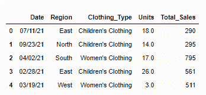

Sample_data

现在我们有了数据框架，我们将应用各种方法来过滤它。

### **方法–1**:根据列值过滤数据帧

我们的数据框架中有一个名为“Total_Sales”的列，我们希望过滤掉所有大于 300 的销售额。

```py
#Filter a DataFrame for a single column value with a given condition

greater_than = df[df['Total_Sales'] > 300]
print(greater_than.head())

```

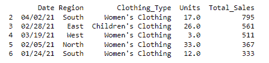

Sales with Greater than 300

### **方法–2**:基于多个条件过滤数据帧

这里我们过滤了所有“总销售额”大于 300 的值，以及“单位”大于 20 的值。我们将不得不使用 python 操作符“&”来显示相应的结果，该操作符执行按位 AND 操作。

```py
#Filter a DataFrame with multiple conditions

filter_sales_units = df[(df['Total_Sales'] > 300) & (df["Units"] > 20)]
print(Filter_sales_units.head())

```

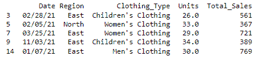

Filter on Sales and Units

### **方法–3**:根据日期值过滤数据帧

例如，如果我们希望根据特定日期值过滤数据框，我们将尝试根据特定日期获取所有结果，在我们的示例中，结果在日期“03/10/21”之后。

```py
#Filter a DataFrame based on specific date

date_filter = df[df['Date'] > '03/10/21']
print(date_filter.head())

```

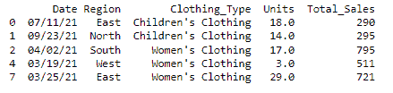

Filter on Date

### **方法—**4:基于日期值的多条件数据帧过滤

在这里，我们得到了我们的日期操作评估多个日期的所有结果。

```py
#Filter a DataFrame with multiple conditions our Date value

date_filter2 = df[(df['Date'] >= '3/25/2021') & (df['Date'] <'8/17/2021')]
print(date_filter2.head())

```

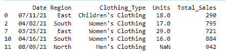

Filter on a date with multiple conditions

### **方法—**5:根据特定字符串过滤数据帧

在这里，我们选择了一个名为“Region”的列，并获取了来自“East”区域的所有行，从而基于特定的字符串值进行过滤。

```py
#Filter a DataFrame to a specific string

east = df[df['Region'] == 'East']
print(east.head())

```

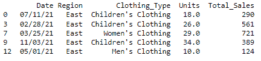

Filter based on a specific string

### **方法—**6:根据字符串中的特定索引值过滤数据帧

在这里，我们选择了一个名为“Region”的列，并获取了所有以**字母“E”作为第一个字符的行，即指定列结果中的索引 0** 。

```py
#Filter a DataFrame to show rows starting with a specfic letter

starting_with_e = df[df['Region'].str[0]== 'E']
print(starting_with_e.head())

```

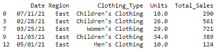

Filter based on a specific letter

### **方法—**7:根据值列表过滤数据帧

在这里，我们对包含值“West”和“East”的列“Region”中的行进行过滤，并显示合并后的结果。可以使用两种方法来执行该过滤，即使用一个**管道|操作符**和具有以下语法的一组相应的期望值，或者我们可以使用**。isin()** 函数过滤给定列中的值，在我们的例子中是“Region ”,并以列表的形式提供所需的一组值。

```py
#Filter a DataFrame rows based on list of values

#Method 1:
east_west = df[(df['Region'] == 'West') | (df['Region'] == 'East')]
print(east_west)

#Method 2:
east_west_1 = df[df['Region'].isin(['West', 'East'])]
print(east_west_1.head())

```

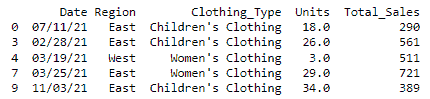

Output of Method -1

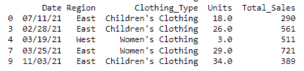

Output of Method -2

### **方法—**8:使用正则表达式根据特定值过滤数据帧行

在这里，我们希望所有列' Region' **中的值，在它们的字符串值中以' th'** 结尾，并显示它们。换句话说，我们希望我们的结果显示‘Nor**th**和‘Sou**th**和*的值，忽略‘East’和‘West’*。具有指定值的方法 **.str.contains()** 和 **$** RegEx 模式可用于获得所需的结果。

更多信息请查看[正则表达式文档](https://docs.python.org/3/library/re.html)

```py
#Filtering the DataFrame rows using regular expressions(REGEX)

regex_df = df[df['Region'].str.contains('th$')]
print(regex_df.head())

```

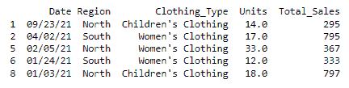

Filter based on REGEX

### **方法-**9:过滤数据帧，检查**是否为空**

这里，我们将借助于 [isnull()函数](https://www.askpython.com/python/examples/impute-missing-data-values)检查所有列中的 null 和 not null 值。

```py
#Filtering to check for null and not null values in all columns

df_null = df[df.isnull().any(axis=1)]
print(df_null.head())

```


Filter based on NULL or NOT null values

### **方法-**10:过滤数据帧，检查特定列中的**空值**。

```py
#Filtering to check for null values if any in the 'Units' column

units_df = df[df['Units'].isnull()]
print(units_df.head())

```

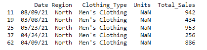

Finding null values on specific columns

### **方法-**11:过滤数据帧，检查特定列中的**非** **空值**

```py
#Filtering to check for not null values in the 'Units' column

df_not_null = df[df['Units'].notnull()]
print(df_not_null.head())

```

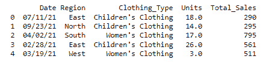

Finding not-null values on specific columns

### **方法—**12:使用带有条件的 **`query()`** 过滤数据帧

```py
#Using query function in pandas

df_query = df.query('Total_Sales > 300')
print(df_query.head())

```

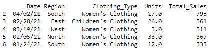

Filtering values with `Query` Function

### **方法—**13:使用多条件 **`query()`** 过滤数据帧

```py
#Using query function with multiple conditions in pandas

df_query_1 = df.query('Total_Sales > 300 and Units <18')
print(df_query_1.head())

```

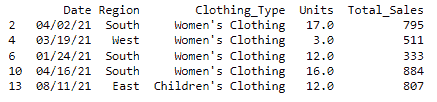

Filtering multiple columns with `Query` Function

### **方法—**14:使用 **`loc`** 和 **`iloc`** 函数过滤我们的数据帧。

```py
#Creating a sample DataFrame for illustrations

import numpy as np
data = pd.DataFrame({"col1" : np.arange(1, 20 ,2)}, index=[19, 18 ,8, 6, 0, 1, 2, 3, 4, 5])
print(data)

```

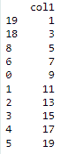

sample_data

*解释* : **`iloc`** 根据给定索引的位置考虑行，所以只取整数作为值。

更多信息请查看[熊猫文档](https://pandas.pydata.org/docs/reference/api/pandas.DataFrame.iloc.html)

```py
#Filter with iloc

data.iloc[0 : 5]

```

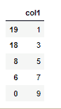

Filter using `iloc`

*解释* : **`loc`** 根据索引标签考虑行

```py
#Filter with loc

data.loc[0 : 5]

```

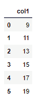

Filter using `loc`

你可能会想为什么 [`**loc**`函数](https://www.askpython.com/python-modules/pandas/python-loc-function)返回 6 行而不是 5 行。这是因为 ***`loc`*** 不产生基于索引位置的输出。它只考虑索引的标签，该标签也可以是字母表，并且包括起点和终点。

## 结论

这些是熊猫最常用的过滤方法。有许多其他过滤方法可以使用，但这些是最常用的一些。选择过滤方法时，考虑您要过滤的数据、数据类型以及您要进行的过滤类型非常重要。希望你喜欢这篇文章。要了解更多，别忘了阅读熊猫教程。

## 附加参考

[Python 文档](https://docs.python.org/3/)