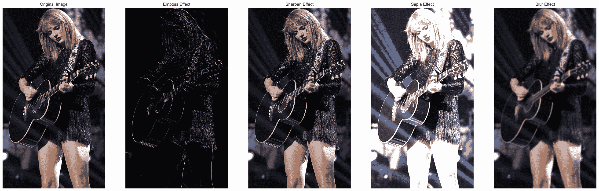
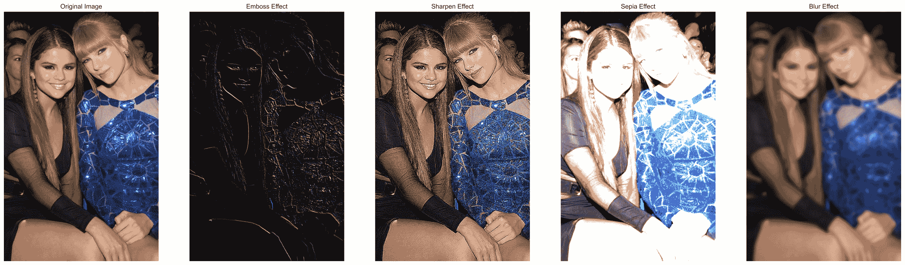

# Python 和 OpenCV:对图像应用滤镜

> 原文：<https://www.askpython.com/python/examples/filters-to-images>

我很确定你已经在社交平台和你的相机上试用了各种滤镜。

今天在本教程中，我们将应用一些过滤器的图像。激动人心吧？

我们开始吧！

## 1.导入模块

第一步是导入需要的模块，包括 [OpenCV](https://www.askpython.com/python-modules/read-images-in-python-opencv) 、 [matplotlib](https://www.askpython.com/python-modules/matplotlib/python-matplotlib) 和 [numpy 模块](https://www.askpython.com/python-modules/numpy/python-numpy-module)。为了更好的可视化，我们还将把绘图风格改为 seaborn。

```py
import cv2
import matplotlib.pyplot as plt
import numpy as np
plt.style.use('seaborn')

```

## 2.加载初始图像

我们将在`imread`函数的帮助下[读取并存储图像](https://www.askpython.com/python-modules/read-images-in-python-opencv)，然后使用`cvtColor`函数将颜色转换为 RGB 格式，然后使用`imshow`函数绘制图像。

```py
loaded_img = cv2.imread("image1.jpg")
loaded_img = cv2.cvtColor(loaded_img,cv2.COLOR_BGR2RGB)
plt.figure(figsize=(8,8))
plt.imshow(loaded_img,cmap="gray")
plt.axis("off")
plt.show()

```

确保图像保存在与代码文件相同的目录中。

## 2.创建过滤器

现在，我们的图像已经加载并准备好工作，我们将创建自己的过滤器，首先为每个过滤器创建一个内核，然后将内核值转换为 2D 过滤器。

1.  **内核是什么？**

使用 numpy 数组来定义内核，这些数组基本上是二维矩阵，定义了图像锐化、模糊和浮雕的准确值。

2.  **创建 2D 滤波器**

通过将内核值和加载的图像放入卷积网络来创建 2D 滤波器。

### 2.1 浮雕过滤器

在图像上获得浮雕滤镜的代码如下所示。首先，我们为浮雕效果创建了一个浮雕内核和过滤器。

```py
Emboss_Kernel = np.array([[0,-1,-1],[1,0,-1],[1,1,0]])
Emboss_Effect_Img = cv2.filter2D(src=loaded_img, kernel=Emboss_Kernel, ddepth=-1)
plt.figure(figsize=(8,8))
plt.imshow(Emboss_Effect_Img,cmap="gray")
plt.axis("off")
plt.show()

```

### 2.2 锐化滤波器

获取图像锐化滤镜的代码如下所示。首先，我们为锐化效果创建了一个锐化内核和过滤器。

```py
Sharpen_Kernel = np.array([[-1, -1, -1], [-1, 9, -1], [-1, -1, -1]])
Sharpen_Effect_Img = cv2.filter2D(src=loaded_img, kernel=Sharpen_Kernel, ddepth=-1)
plt.figure(figsize=(8,8))
plt.imshow(Sharpen_Effect_Img,cmap="gray")
plt.axis("off")
plt.show()

```

### 2.3 棕褐色滤镜

在图像上获得棕褐色滤镜的代码如下所示。首先，我们创建了一个棕褐色内核和棕褐色效果的过滤器。

```py
Sepia_Kernel = np.array([[0.272, 0.534, 0.131],[0.349, 0.686, 0.168],[0.393, 0.769, 0.189]])
Sepia_Effect_Img = cv2.filter2D(src=loaded_img, kernel=Sepia_Kernel, ddepth=-1)
plt.figure(figsize=(8,8))
plt.imshow(Sepia_Effect_Img,cmap="gray")
plt.axis("off")
plt.show()

```

### 2.4 模糊滤镜

获取图像模糊滤镜的代码如下所示。首先，我们为模糊效果创建了一个模糊内核和滤镜。

```py
Blur_Effect_Img = cv2.GaussianBlur(loaded_img, (35, 35), 0)
plt.figure(figsize=(8,8))
plt.imshow(Blur_Effect_Img,cmap="gray")
plt.axis("off")
plt.show()

```

## 最终输出

下图依次显示了图像的所有滤镜。



Filters Using OpenCV Output

对另一个图像测试了相同的过滤器，输出如下所示。



Filters Using OpenCV Output2

## 结论

恭喜你！今天，我们学习了如何建立自己的过滤器，并将其应用到图像。

自己尝试一下吧！编码快乐！