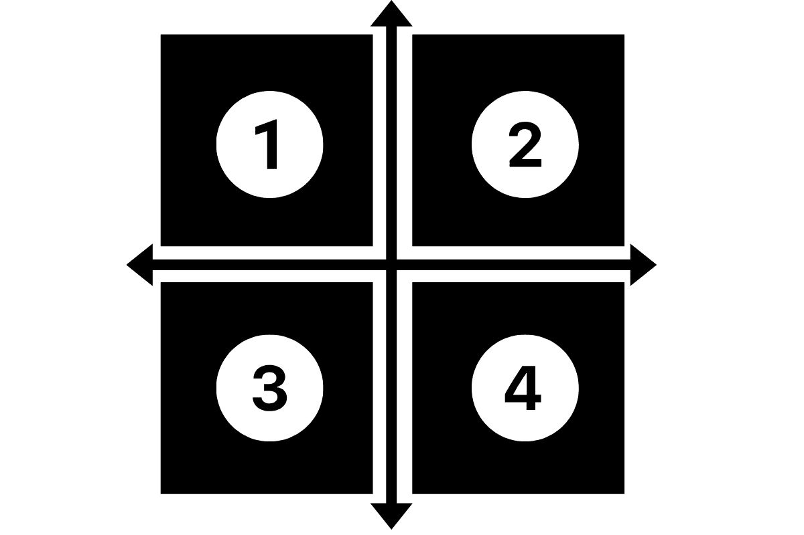

# 在 Python 中从 x 和 y 值中找到象限

> 原文：<https://www.askpython.com/python/examples/find-quadrant-using-x-y>

嘿编码器！今天，在本教程中，我们将使用 Python 编程进行简单的基本编码，以确定特定点属于空间中的哪个象限。

* * *

我们都知道在 2D 空间总共有 4 个坐标，如下图所示。



Quadrants

这里每个象限的条件如下:

1.  象限 1: x 为负，y 为正
2.  象限 2:x 和 y 都是正的
3.  象限 3:x 和 y 都是负的
4.  象限 4: x 为正，y 为负

现在让我们看看象限确定的代码实现，其中我们只需要检查空间中一个点的 x 和 y 值。

* * *

## 基于 X，Y 位置求平方

```py
x = int(input())
y = int(input())

print("(",x,",",y,")",end="")
if(x<0 and y<0):
    print(" belongs to 3rd Quadrant.")
elif(x<0 and y>0):
    print(" belongs to 1st Quadrant.")
elif(x>0 and y>0):
    print(" belongs to 2nd Quadrant.")
else:
    print(" belongs to 4th Quadrant.")

```

下面显示了代码的一些示例输出。如果需要，可以查看并交叉检查输出。

```py
( 2 , -3 ) belongs to 4th Quadrant.

```

```py
( 2 , 4 ) belongs to 2nd Quadrant.

```

* * *

我希望象限的逻辑和象限到空间点的分配。感谢您阅读教程！

快乐学习！😇

* * *