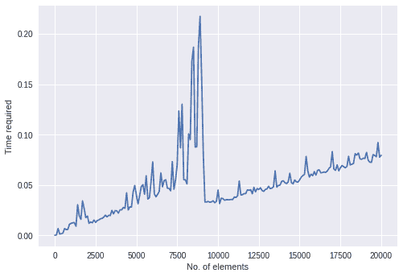

# 寻找算法的时间复杂度

> 原文：<https://www.askpython.com/python/examples/find-time-complexity-of-algorithms>

今天我们将分析 Python 中算法的时间复杂度。为此，我们必须确定对各种输入执行所需算法所需的总时间。

我们使用的方法是快速排序，但是您可以用一种算法来试验，以确定 Python 中算法的时间复杂度。

* * *

## 导入模块/库

需要时间模块来确定命令执行之间经过的时间。然后，random 模块用于为我们要排序的原始整数集合产生随机数。

算法模块用于直接获取快速排序代码。在这种情况下，您也可以应用自己的算法。

```py
import time
from random import randint
from algorithms.sort import quick_sort

```

* * *

## 为快速排序生成列表

现在我们已经导入了所有的库，我们可以开始编写代码了。我们将从一组未排序的项目开始。为此使用了`randint()`方法。下面的代码将生成 20001 个随机数的列表，范围从 0 到 999。

```py
l = [randint(0,1000) for i in range(20000)]

```

* * *

## 计算算法的时间复杂度

我们首先创建一个空列表，在其中存储各种输入的所有时间值。

然后，我们执行一个 for 循环，每次迭代都有不同数量的输入。对于每次迭代，我们首先在运行算法之前节省时间。然后执行 quicksort 方法，元素的数量随着每次迭代而增加。

当算法完成时，我们存储结束时间，然后从开始时间中减去结束时间，得到经过的时间。经过的时间随后被添加到我们的时间集合中。

```py
times=[]
for x in range(0,20001,100):
    start_time = time.time()
    list2 = quick_sort(list1[:x])
    elapsed_time = time.time() - start_time
    times.append(elapsed_time)
print(times)

```

每次迭代消耗的时间输出如下所示。

```py
[5.9604644775390625e-06, 0.0003139972686767578, 0.00667881965637207, 0.001209259033203125, 0.0015976428985595703, 0.0021779537200927734, 0.0068056583404541016, 0.005601644515991211, 0.005861520767211914, 0.011028051376342773, 0.011818647384643555, 0.012465715408325195, 0.012626171112060547, 0.008950948715209961, 0.030421972274780273, 0.019321203231811523, 0.01583099365234375, 0.03421354293823242, 0.026609182357788086, 0.017530202865600586, 0.019039630889892578, 0.0118560791015625, 0.013288259506225586, 0.012446880340576172, 0.015150070190429688, 0.012840032577514648, 0.014685630798339844, 0.015198230743408203, 0.016430377960205078, 0.0168306827545166, 0.018042564392089844, 0.020036935806274414, 0.018283843994140625, 0.019774913787841797, 0.01965475082397461, 0.024692058563232422, 0.02126765251159668, 0.02456188201904297, 0.024203062057495117, 0.022081613540649414, 0.025351285934448242, 0.02523493766784668, 0.027686119079589844, 0.026891231536865234, 0.04227614402770996, 0.025140047073364258, 0.0282745361328125, 0.028072357177734375, 0.04300737380981445, 0.049503326416015625, 0.039911508560180664, 0.031244993209838867, 0.03950953483581543, 0.0483095645904541, 0.05027508735656738, 0.04074549674987793, 0.05907034873962402, 0.035933732986450195, 0.03742861747741699, 0.053351640701293945, 0.07302188873291016, 0.04110312461853027, 0.038227081298828125, 0.04067420959472656, 0.04362940788269043, 0.06206393241882324, 0.048111915588378906, 0.054494619369506836, 0.055097103118896484, 0.046785593032836914, 0.046590566635131836, 0.04422330856323242, 0.07317423820495605, 0.04566597938537598, 0.05501079559326172, 0.07018637657165527, 0.12341713905334473, 0.08685779571533203, 0.1301746368408203, 0.05524754524230957, 0.05509376525878906, 0.051004648208618164, 0.10072588920593262, 0.09502077102661133, 0.17278599739074707, 0.18680071830749512, 0.08754134178161621, 0.0879063606262207, 0.18670082092285156, 0.21729803085327148, 0.1556401252746582, 0.07978129386901855, 0.033004045486450195, 0.03307485580444336, 0.03363752365112305, 0.03286147117614746, 0.03313589096069336, 0.0342717170715332, 0.03235769271850586, 0.0335690975189209, 0.0449981689453125, 0.03151226043701172, 0.036780595779418945, 0.03641867637634277, 0.034799814224243164, 0.035429954528808594, 0.03528714179992676, 0.03522825241088867, 0.03563570976257324, 0.03550863265991211, 0.03803896903991699, 0.037568092346191406, 0.039276123046875, 0.05381584167480469, 0.04004693031311035, 0.040352582931518555, 0.04136157035827637, 0.041423797607421875, 0.045130014419555664, 0.04460620880126953, 0.04532432556152344, 0.04130244255065918, 0.04760575294494629, 0.04321622848510742, 0.046456336975097656, 0.04538416862487793, 0.04726004600524902, 0.04443860054016113, 0.04362082481384277, 0.04554152488708496, 0.046132802963256836, 0.0486757755279541, 0.046370744705200195, 0.04680061340332031, 0.04824686050415039, 0.06405234336853027, 0.0478060245513916, 0.04948878288269043, 0.049854278564453125, 0.05359053611755371, 0.05414247512817383, 0.05222964286804199, 0.051342010498046875, 0.05304098129272461, 0.06159520149230957, 0.0521693229675293, 0.05106377601623535, 0.054935455322265625, 0.053060054779052734, 0.052790164947509766, 0.05505990982055664, 0.057706356048583984, 0.05939984321594238, 0.060530900955200195, 0.07836294174194336, 0.06412434577941895, 0.05772709846496582, 0.060724735260009766, 0.05914807319641113, 0.0632481575012207, 0.059748172760009766, 0.06452727317810059, 0.06497621536254883, 0.06197404861450195, 0.06228804588317871, 0.06296825408935547, 0.06248354911804199, 0.06389427185058594, 0.06646037101745605, 0.06796479225158691, 0.08311891555786133, 0.065704345703125, 0.06447386741638184, 0.06992769241333008, 0.06401872634887695, 0.06702852249145508, 0.06934690475463867, 0.06805992126464844, 0.0670771598815918, 0.06830120086669922, 0.0785529613494873, 0.06986260414123535, 0.07060122489929199, 0.07129216194152832, 0.08096432685852051, 0.07953071594238281, 0.08166289329528809, 0.0758814811706543, 0.07543277740478516, 0.07652783393859863, 0.07634139060974121, 0.08227705955505371, 0.07456398010253906, 0.0725564956665039, 0.0724172592163086, 0.0800638198852539, 0.07935881614685059, 0.07793021202087402, 0.09217333793640137, 0.07755923271179199, 0.07942557334899902]

```

为了绘制图表，我们还需要每次迭代的输入数量。

```py
x=[i for i in range(0,20001,100)]

```

* * *

## 绘制计算的时间值

现在是检验我们发现的时候了。让我们画一张图，x 轴表示输入的数量，y 轴表示时间。

```py
import matplotlib.pyplot as plt
plt.style.use("seaborn")
plt.xlabel("No. of elements")
plt.ylabel("Time required")
plt.plot(x,times)
plt.show()

```



Time Complexity Plot

* * *

## 结论

恭喜你！你刚刚学会了如何计算算法的时间复杂度。希望你喜欢它！😇

喜欢这个教程吗？无论如何，我建议你看一下下面提到的教程:

1.  [用 Python 计算整数中的设定位数](https://www.askpython.com/python/examples/calculate-set-bits-integer)
2.  [Python 中的 Stooge 排序——Python 中的分步实现](https://www.askpython.com/python/examples/stooge-sort)
3.  [Python vs Scala 编程语言](https://www.askpython.com/python/python-vs-scala)
4.  [Python 中的绝对与相对导入](https://www.askpython.com/python-modules/absolute-vs-relative-importing)

感谢您抽出时间！希望你学到了新的东西！！😄

* * *