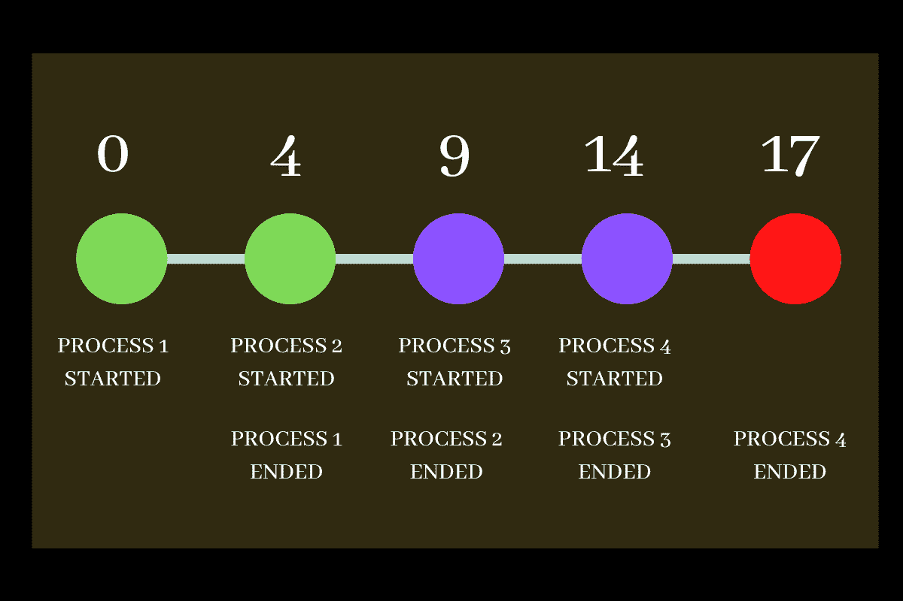

# Python 中的先来先服务调度[FCFS]

> 原文：<https://www.askpython.com/python/examples/first-come-first-serve>

什么是先来先服务调度？嘿学员们！今天我们将了解一个非常重要的主题的理论概念和代码实现，这个主题属于操作系统，称为**先来先服务 CPU 调度**。

在跳到代码实现之前，让我们先了解一下先来先服务是什么意思。

* * *

## 先来先服务介绍

**先来先服务(FCFS)** 是操作系统中最容易、最简单的 CPU 调度算法，按照进程到达的顺序自动执行进程。

在这种类型的算法中，首先请求 CPU 的进程首先获得 CPU 来完成它们的执行。这种方法**性能差，**而且一般**等待时间相当长**。

让我们来看一些**现实生活中的例子**:

1.  排队买娱乐票的人
2.  人们在公共汽车站等车

现在，在 CPU 调度中，我们需要计算一些时间值，如下所示:

1.  退出时间:进程完成执行后离开 CPU 的时间。
2.  周转时间:流程到达和退出时间之间的差异。
3.  等待时间:突发/执行时间与流程周转时间之差。

除此之外，我们还可以计算流程的平均等待时间。

* * *

## 先来先服务的说明

让我们考虑这样一种情况，我们有 4 个到达和执行时间不同的流程。数据显示在下表中:

| 流程 ID | 到达时间 | 突发/执行时间 |
| 第一亲代 | Zero | four |
| P2 | one | five |
| P3 | Two | five |
| P4 | three | three |

Arrival Time and Burst time of 4 different processes

现在我们需要计算不同的时间值，如出口时间、周转时间和等待时间。你可以看看下面提到的时间图，分析和计算各种时间值。



FCFS Timechart

这里，该过程的退出时间分别是 4、9、14 和 17。这些流程的周转时间分别为 4、8、12 和 14。

同样，进程的等待时间分别为 0，3，7，11。我们最后必须计算平均等待时间，结果是 5.25 分钟。

现在让我们转到 FCFS 流程的代码实现。

* * *

## 用 Python 实现 FCFS

```py
print("FIRST COME FIRST SERVE SCHEDULLING")
n= int(input("Enter number of processes : "))
d = dict()

for i in range(n):
    key = "P"+str(i+1)
    a = int(input("Enter arrival time of process"+str(i+1)+": "))
    b = int(input("Enter burst time of process"+str(i+1)+": "))
    l = []
    l.append(a)
    l.append(b)
    d[key] = l

d = sorted(d.items(), key=lambda item: item[1][0])

ET = []
for i in range(len(d)):
    # first process
    if(i==0):
        ET.append(d[i][1][1])

    # get prevET + newBT
    else:
        ET.append(ET[i-1] + d[i][1][1])

TAT = []
for i in range(len(d)):
    TAT.append(ET[i] - d[i][1][0])

WT = []
for i in range(len(d)):
    WT.append(TAT[i] - d[i][1][1])

avg_WT = 0
for i in WT:
    avg_WT +=i
avg_WT = (avg_WT/n)

print("Process | Arrival | Burst | Exit | Turn Around | Wait |")
for i in range(n):
      print("   ",d[i][0],"   |   ",d[i][1][0]," |    ",d[i][1][1]," |    ",ET[i],"  |    ",TAT[i],"  |   ",WT[i],"   |  ")
print("Average Waiting Time: ",avg_WT)

```

## 抽样输出

```py
FIRST COME FIRST SERVE SCHEDULLING

Enter number of processes : 4
Enter arrival time of process1: 1
Enter burst time of process1: 5
Enter arrival time of process2: 0
Enter burst time of process2: 4
Enter arrival time of process3: 3
Enter burst time of process3: 3
Enter arrival time of process4: 2
Enter burst time of process4: 5

Process | Arrival | Burst | Exit | Turn Around | Wait |
    P2    |    0  |     4  |     4   |     4   |    0    |  
    P1    |    1  |     5  |     9   |     8   |    3    |  
    P4    |    2  |     5  |     14   |     12   |    7    |  
    P3    |    3  |     3  |     17   |     14   |    11    |  
Average Waiting Time:  5.25

```

* * *

## FCFS 的优点和缺点

让我们来看看一些优势

### 先到先得的好处

1.  易于编程
2.  CPU 调度算法的最简单形式

### 先来先服务的缺点

1.  平均等待时间很长
2.  不是分时系统的理想技术
3.  FCFS 不是很有效

* * *

## 结论

我希望您现在已经清楚什么是 FCFS CPU 调度，以及如何在 python 编程语言的帮助下实现它。

希望你喜欢这个教程！感谢您的阅读！快乐学习！😇

* * *