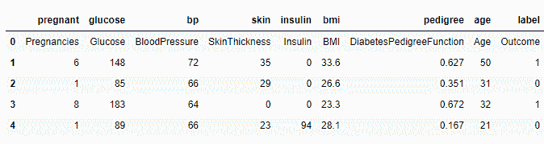

# 在 Python 中拟合逻辑回归模型

> 原文：<https://www.askpython.com/python/examples/fitting-a-logistic-regression-model>

在本文中，我们将了解更多关于在 Python 中拟合逻辑回归模型的信息。在[机器学习](https://www.askpython.com/python/machine-learning-introduction)中，我们经常不得不处理只有两种可能结果的问题——在医学领域确定肿瘤是恶性还是良性，或者在教育领域确定学生是否被某所大学录取。

二元分类问题是一种挑战，逻辑回归是解决这些问题的重要方法。在本文中，我们将看看如何在 Python 中拟合逻辑回归模型。

**[如果你知道基本知识，跳到建立和拟合逻辑回归模型](#fitting-a-logistic-regression-model)** 。

## **什么是逻辑回归？**

逻辑回归是一种机器学习技术，它基于独立变量进行预测，以对肿瘤状态(恶性或良性)、电子邮件分类(垃圾邮件或非垃圾邮件)或大学录取(录取或不录取)等问题进行分类。

例如，当对电子邮件进行分类时，该算法将利用电子邮件中的单词作为特征，并生成关于该电子邮件是否是垃圾邮件的预测。

***也读作:[用 Python 从零开始进行逻辑回归【算法讲解】](https://www.askpython.com/python/examples/logistic-regression-from-scratch)***

逻辑回归是一种[监督的机器学习](https://www.askpython.com/python/supervised-vs-unsupervised-learning)技术，这意味着用于训练的数据已经被标记，即答案已经在训练集中。该算法从实例中获取知识。

## 逻辑回归的重要性

这种技术可以在医学上用于估计给定人群中的疾病风险，从而提供预防性治疗。

通过监控购买者的行为，企业可以识别趋势，从而提高员工忠诚度或生产更有利可图的产品。这种形式的分析被数据科学家用于企业界，他们的目的是评估和理解复杂的数字数据。

用这种方法开发的预测模型可以对任何公司或组织产生积极的影响。人们可以通过使用这些模型来分析联系和预测后果，从而改进决策。

例如，制造商的分析团队可以利用作为统计软件包一部分的逻辑回归分析，找出机器零件故障与这些零件库存持续时间之间的相关性。该团队可以根据从该研究中获得的知识选择更改交付时间表或安装时间，以避免重复失败。

## 逻辑回归的类型

基于它执行的分类类型，逻辑回归可以被分类成不同的类型。记住这一点，有三种不同类型的逻辑回归。

### 1.二元逻辑回归

最常见的类型是二元逻辑回归。就是我们之前定义逻辑回归时讲过的那种。这种类型为因变量/目标变量分配两个独立的值:0 或 1，恶性或良性，通过或失败，允许或不允许。

### 2.多项式逻辑回归

当目标变量或独立变量有三个或更多值时，使用多项式逻辑回归。例如，一家公司可以进行一项调查，要求参与者从一系列选项中选择他们最喜欢的产品。人们可以建立那些最有可能对你的产品感兴趣的人的档案，并利用这些信息来定制你的广告活动。

### 3.有序逻辑回归

当目标变量本质上是序数时，利用序数逻辑回归。在这种情况下，类别以一种有意义的方式组织起来，每个类别都有一个数值。此外，目标变量中有两个以上的类别。

## 拟合逻辑回归模型

让我们从建立预测模型开始。现在我们将使用逻辑回归分类器来预测糖尿病。第一步，我们将加载 Pima Indian 糖尿病数据集，并使用 Pandas 的 read CSV 函数读取它。

下载数据链接:[https://www.kaggle.com/uciml/pima-indians-diabetes-database](https://www.kaggle.com/uciml/pima-indians-diabetes-database)

### 1.加载和读取数据

让我们导入所需的包和数据集，我们将使用逻辑回归对其进行分类。

```py
#import necessary packages
import pandas as pd
col_names = ['pregnant', 'glucose', 'bp', 'skin', 'insulin', 'bmi', 'pedigree', 'age', 'label']
# load dataset
pima = pd.read_csv("C:\\Users\Intel\Documents\diabetes.csv", header=None, names=col_names)
pima.head()

```



Pima-Diabetes-Dataset

### 2.特征选择

在[特征选择](https://www.askpython.com/python/examples/feature-selection-in-python)步骤中，我们将所有列分为两类变量:因变量或目标变量和自变量，也称为特征变量。

```py
feature_cols = ['pregnant', 'insulin', 'bmi', 'age','glucose','bp','pedigree']
#features
X = pima[feature_cols]
#target variable
y = pima.label 

```

### 3.数据分割

将数据集分成[训练集和测试集](https://www.askpython.com/python/examples/split-data-training-and-testing-set)有助于更好地理解模型的性能。我们将使用函数 train_test_split()来划分数据集。

接下来，我们将使用 random_state 随机选择记录。数据集将按 75:25 的比例分为两部分，这意味着 75%的数据将用于训练模型，25%将用于测试模型。

```py
from sklearn.cross_validation import train_test_split
X_train,X_test,y_train,y_test=train_test_split(X,y,test_size=0.25,random_state=0)

```

### 4.模型建立和预测

在这一步，我们将首先导入逻辑回归模块，然后使用逻辑回归()函数，我们将创建一个逻辑回归分类器对象。

您可以使用函数 fit()拟合您的模型，并使用 predict()函数对测试集进行预测。

```py
from sklearn.linear_model import LogisticRegression
logreg = LogisticRegression()

# fit the model with data
logreg.fit(X_train,y_train)

#predict the model
y_pred=logreg.predict(X_test)

```

### 5.用混淆矩阵评价模型

让我们从定义一个混淆矩阵开始。

[混淆矩阵](https://www.askpython.com/python/examples/confusion-matrix)是用于评估分类模型性能的表格。算法的性能也是可以看出来的。分类总结的正确和错误预测的数量是混淆矩阵的基础。

```py
from sklearn import metrics
cnf_matrix = metrics.confusion_matrix(y_test, y_pred)
cnf_matrix

```

```py
array([[119,  11],
       [ 26,  36]])

```

在上面的结果中，您可以注意到混淆矩阵是以数组对象的形式出现的。由于这个模型是二进制分类的一个例子，矩阵的维数是 2 乘 2。

对角线上的值表示实际预测，非对角线上的值表示不正确的预测。因此，119 和 36 是实际预测，26 和 11 是不正确的预测。

### 优势

*   它不需要大量的计算能力，易于实现和理解，并且由于其高效和简单而被数据分析师和科学家广泛利用。
*   它也不需要特征缩放。对于每个观察，逻辑回归生成一个概率分数。

### 不足之处

*   大量的分类特征/变量对于逻辑回归管理来说太多了。它很容易被过量摄入。
*   逻辑回归不能处理非线性问题，这就是为什么非线性期货必须被转换。与目标变量不相关但彼此非常相似或相关的自变量在逻辑回归中表现不佳。

## 结论

在本次会议中，我们介绍了许多关于拟合逻辑回归的信息。您已经学习了什么是逻辑回归，如何拟合回归模型，如何评估其性能，以及一些理论信息。现在，您应该能够对自己的数据集使用逻辑回归技术了。