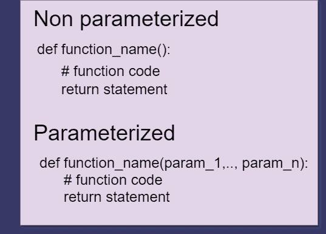

# [修复]采用“0”个位置参数，但给出了“1”

> 原文：<https://www.askpython.com/python/examples/fixed-takes-0-positional-arguments-but-1-was-given>

在本文中，我们将学习如何修复错误“接受 0 个位置参数，但给定了 1 个”。我们开始吧！

## 为什么会出现“接受“0”个位置参数，但给定了“1”的错误？

让我们定义下面的示例函数“add_numbers ”,它接受两个参数 num_1 和 num_2。

**代码示例 1:**

```py
def add_numbers(num_1, num_2):
    sum = num_1 + num_2
    print('The sum of two numbers is: ', sum)

```

现在，当我们需要将两个数字相加时，我们只需要将这些数字作为参数传递给函数。请看下面:

**输出:**

```py
>>> add_numbers(33, 23) # calling the function first time
>>> The sum of two numbers is: 56
>>> add_numbers(45, 45) # calling the function second time
>>> The sum of two numbers is: 90

```

因此，从输出中，我们可以看到多次调用该函数比执行原始加法要容易得多。让我们执行另一项任务，将两个数相乘。

**代码示例 2:**

```py
def multiply(num_1, num_2):
    product= num_1 * num_2
    print('The product of two numbers is: ', product)

```

**输出:**

```py
>>> multiply(4, 100) # calling the function first time
>>> The product of two numbers is: 400
>>> multiply(40, 60) # calling the function second time
>>> The product of two numbers is: 2400

```

## 功能类型

有两种类型的函数:

1.  **参数化:**放在括号内的值。通常用于高端应用。
2.  **非参数化:**空括号。通常用于基本过程。



Types of functions in Python

当程序员使用特定函数的参数时，他们需要记住一些事情:

1.  函数包含的参数数量。
2.  每个参数应该做什么。

当程序员没有考虑这两点时，python 解释器就会产生错误。其中之一是:

```py
Traceback (most recent call last):
  File "c:\Users\Lenovo\Desktop\sample.py", line 8, in <module> 
    function(parameter)
TypeError: function() takes 0 positional arguments but 1 was given

```

这是 Python 中最常见的**类型错误**。当指定的匹配的**数据类型**没有为特定的代码段找到时，就会发生这种情况。

### 示例:接受 0 个位置参数，但给定了 1 个。

比方说，我们定义一个函数来除两个数。它是一个非参数化的函数，在调用。

**例 1:**

```py
def divide():
    num_1 = int(input('enter num_1: ' )) # taking input for num_1
    num_2 = int(input('enter num_2: ' )) # taking input for num_2

    div = num1/num2
    print('The division is: ', div)

divide(3)

```

**输出:**

```py
Traceback (most recent call last):
  File "c:\Users\Lenovo\Desktop\sample.py", line 8, in <module>
    divide(3)
TypeError: divide() takes 0 positional arguments but 1 was given

```

**在上面的例子中，divide()函数需要两个参数。这两个参数都是强制性的，并且都不是位置性的。这就是函数抛出错误“接受 0 个位置参数，但给出了 1 个”**的原因

当我们用一个参数调用 divide()时，解释器抛出错误。

**例 2:**

```py
def add_numbers():
    num_1 = int(input('Enter number 1: '))
    num_2 = int(input('Enter number 2: '))  
    sum = num_1 + num_2
    print('The sum of two numbers is: ', sum)

add_numbers(45, 2) #  calling the function in python shell

```

**输出:**

```py
Traceback (most recent call last):
  File "c:\Users\Lenovo\Desktop\sample.py", line 7, in <module>       
    add_numbers(45, 2)
TypeError: add_numbers() takes 0 positional arguments but 2 were given

```

我们知道解释器逐行读取代码，它扫描每一行代码并抛出错误。尽管这个函数不接受任何东西，但是当我们给出两个位置参数时，我们会得到相同的错误。

## 如何修复“接受' 0 '个位置参数，但给出' 1 '的错误？

错误将显示发生错误的函数名。要修复该错误:

*   检查函数接受什么类型的参数
*   找到该函数的所有调用，并确定是否有任何函数调用是错误的
*   通过简单地改变有问题的函数调用来修复错误

## 结论

主题**采用 0 个位置参数，但给出了 1 个位置参数**到此结束。这个概念很简单。我希望您能够修复代码中的错误。如果你有任何问题，给我们写信，我们会帮你解决的。