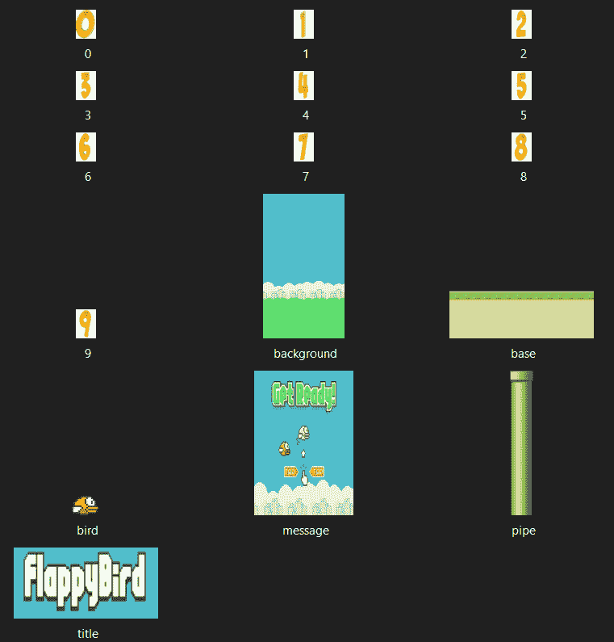
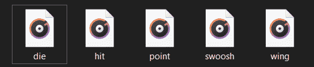

# Python 中的 Flappy Bird 游戏

> 原文：<https://www.askpython.com/python/examples/flappy-bird-game-in-python>

Flappy bird 最初是作为一款手机游戏发布的，你可以点击屏幕让小鸟飞起来。如果小鸟撞到管道或屏幕边缘，游戏就会结束，玩家需要重新开始。

在本教程中，我们制作了一个电脑版的游戏，使用向上键或空格键来控制小鸟。

我们将使用 Python 语言来编写代码。我们还将使用 [Pygame](https://www.askpython.com/python-modules/python-pygame) ，这是一组为编写视频游戏而设计的跨平台 Python 模块。

它包括设计用于 Python 编程语言的计算机图形和声音库。Pygame 适合创建客户端应用程序，这些应用程序可能被包装在一个独立的可执行文件中。

因此，这个项目需要 python 和 Pygame 的先验知识。

## 用 Python 构建 Flappy Bird 游戏

### 1.导入模块

对于这个项目，我们正在导入必要的模块。我们将使用`random`为我们的游戏生成随机数。来自`sys`模块的`sys.exit`将用于退出程序。在第 3 行和第 4 行，我们分别导入了 Pygame 和基本的 Pygame 导入。

```py
import random
import sys
import pygame
from pygame.locals import *

```

### 2.声明的全局变量

在这一步，我们为我们的游戏声明各种`global`变量。我们首先设置`fps`(每秒帧数)、screen_width 和 screen_height 的值。

我们用`screen_width`和`screen_height`创建屏幕，作为`pygame.display.set_mode()`函数的参数。然后，我们创建一个 ground-y 变量，它将给出我们的基本图像的 y 坐标，以及两个字典 game_images 和 game_sounds，它们将包含我们用于游戏的各种图像和声音。

然后，我们通过给定路径将玩家(鸟)、背景、管道和标题的图像存储在这些变量中。

```py
fps = 32
screen_width = 289
screen_height = 511
screen = pygame.display.set_mode((screen_width,screen_height))
ground_y = screen_height*0.8
game_images = {}
game_sounds = {}
player = 'galleimg/bird.png'
background = 'galleimg/background.png'
pipe = 'galleimg/pipe.png'
title = 'galleimg/title.png'

```



Images Used Flappy Bird



Audio Used Flappy Bird

### 3.正在创建“__main__”函数

现在让我们创建游戏开始的主函数，我们必须使用`pygame.init()`初始化所有 pygame 模块。我们还使用 `pygame.tick.Clock()`函数创建了`fps_clock`变量来帮助我们跟踪某一时刻的时间。

然后我们会给我们的主游戏窗口一个标题，并将所有的图片存储在一个元组中，然后我们将它分配给`game_images`字典中的“numbers”键。我们使用带有图像路径的`pygame.image.load()`和`convert_alpha()`来改变图像的像素格式，包括每个像素的 alphas。

类似地，我们使用各种键将消息、基础、管道、背景、播放器和标题的图像添加到字典中。对于管道，我们还添加了一个倒置的管道图像，方法是使用`pygame.transform.rotate()`函数并将图像旋转 180 度。然后我们使用不同的键将这些声音添加到`game_sounds`字典中。

这类似于我们对图像所做的，但是这里我们使用`pygame.mixer.Sound()`函数和各种声音的路径作为存储声音的参数。然后我们开始一个循环，调用`welcomeScreen()`和`mainGame()`函数，这将在后面的章节中定义。

```py
if __name__ == "__main__":
	pygame.init() 
	fps_clock = pygame.time.Clock()
	pygame.display.set_caption('Flappy Bird')
	game_images['numbers'] = (
		pygame.image.load('galleimg/0.png').convert_alpha(),
		pygame.image.load('galleimg/1.png').convert_alpha(),
		pygame.image.load('galleimg/2.png').convert_alpha(),
		pygame.image.load('galleimg/3.png').convert_alpha(),
		pygame.image.load('galleimg/4.png').convert_alpha(),
		pygame.image.load('galleimg/5.png').convert_alpha(),
		pygame.image.load('galleimg/6.png').convert_alpha(),
		pygame.image.load('galleimg/7.png').convert_alpha(),
		pygame.image.load('galleimg/8.png').convert_alpha(),
		pygame.image.load('galleimg/9.png').convert_alpha()
		)
	game_images['message'] = pygame.image.load('galleimg/message.png').convert_alpha()
	game_images['base'] = pygame.image.load('galleimg/base.png').convert_alpha()
	game_images['pipe'] = (
		pygame.transform.rotate(pygame.image.load(pipe).convert_alpha(), 180),
		pygame.image.load(pipe).convert_alpha()
		)
	game_images['background'] = pygame.image.load(background).convert_alpha()
	game_images['player'] = pygame.image.load(player).convert_alpha()
	game_images['title'] = pygame.image.load(title).convert_alpha()

	#Game Sounds
	game_sounds['die'] = pygame.mixer.Sound('gallery/audio/die.wav')
	game_sounds['hit'] = pygame.mixer.Sound('gallery/audio/hit.wav')
	game_sounds['point'] = pygame.mixer.Sound('gallery/audio/point.wav')
	game_sounds['swoosh'] = pygame.mixer.Sound('gallery/audio/swoosh.wav')
	game_sounds['wing'] = pygame.mixer.Sound('gallery/audio/wing.wav')

	while True:
		welcomeScreen()
		mainGame()

```

### 4.创建“欢迎屏幕”功能

现在，我们定义我们的`welcomeScreen()`函数，它将在游戏开始时显示欢迎屏幕。我们首先为播放器、消息和标题图像指定 x 坐标和 y 坐标的值。

我们通过试凑法选择了参数，您可以更改最适合您的值。这里我们也给出了 base 的 x 坐标。然后，我们开始一个 while 循环，它总是为真，因此将开始一个不会停止的循环，除非控件说退出。

这里我们利用循环的[来分析整个游戏中使用`pygame.event.get()`函数发生的所有事件。然后我们检查，每当遇到退出类型的事件，按下退出键，游戏窗口将关闭。](https://www.askpython.com/course/python-course-for-loop)

我们将检查下一个条件，即我们是否单击了向上键或空格键。如果是，我们将从函数返回并开始游戏。如果没有按下任何键或按钮，将显示欢迎屏幕。为此，我们将使用`screen.blit()`函数放置背景、消息、球员、基地和标题图像。

最后，我们将使用`pygame.display.update()`更新我们的窗口，并将使用 fps 值作为参数更新我们的时钟变量，以显示每秒 32 帧。

```py
def welcomeScreen():
	player_x = int(screen_width/8)
	player_y = int((screen_height - game_images['player'].get_height())/2)
	message_x = int((screen_width - game_images['message'].get_width())/2)
	message_y = int(screen_height*0.2)
	title_x = int((screen_width - game_images['message'].get_width())/2)
	title_y = int(screen_height*0.04)
	base_x = 0
	while True:
		for event in pygame.event.get():
			if event.type == QUIT or (event.type == KEYDOWN and event.key == K_ESCAPE):
				pygame.quit()
				sys.exit()
			elif event.type == KEYDOWN and (event.key == K_SPACE or event.key == K_UP):
				return
			else:
				screen.blit(game_images['background'],(0,0))	
				screen.blit(game_images['message'],(message_x,message_y))
				screen.blit(game_images['player'],(player_x,player_y))
				screen.blit(game_images['base'],(base_x,ground_y))
				screen.blit(game_images['title'],(title_x,title_y))
				pygame.display.update()
				fps_clock.tick(fps)

```

### 5.创建“mainGame()”函数

现在我们定义 mainGame()函数，首先用 0 初始化变量 score，并再次给出玩家图像和 base 的坐标。

然后，我们使用`getRandomPipe()`在屏幕上创建 2 个用于位块传输的管道，我们将在后面定义。然后我们用它们的 x 和 y 坐标创建一个上面管道(倒置的)和下面管道的列表。

我们再次通过试凑法来选择值。然后，我们为鸟声明不同方向的速度变量。我们还提供了一个加速度变量。

playerFlapVel 是拍动时的速度，playerflappel 设置为 false(仅当鸟拍动时才成立)。然后我们再次检查事件。

1.  首先用于退出游戏，如果为真则退出游戏。
2.  然后，我们检查是否按下了向上键或空格键。如果是，我们检查玩家是否在屏幕下方，如果是，我们做一些更新，并使用。播放()。
3.  之后，我们使用即将定义的 isCollide()函数检查我们是否崩溃了。如果为真，我们将从函数返回。

然后，我们将检查并更新分数。使用玩家的，中间的位置，和管道的位置，我们增加分数，如果我们穿过一个管道并在控制台中打印它。

此外，我们播放每个管道交叉的点声音。然后，如果 y 方向的玩家速度还没有达到最大值，我们将提供加速度。

稍后，我们更新 playerFlpped 值，然后更新鸟的位置。我们将管道移动到左边，并在第一个管道将要穿过屏幕最左边的部分时添加一个新管道。

我们还将查看管道是否在屏幕之外，如果是，我们将其移除，并将管道和乐谱放在屏幕上，稍后更新显示屏。

对于分数，我们首先访问分数的所有数字(如果分数超过 1 个数字)并放置所需的图像。我们再次更新我们的时钟。

```py
def mainGame():
	score = 0
	player_x = int(screen_width/8)
	player_y = int(screen_height/2)
	base_x = 0

	newPipe1 = getRandomPipe()
	newPipe2 = getRandomPipe()

	upperPipes = [
		{'x': screen_width+200, 'y': newPipe1[0]['y']},
		{'x': screen_width+200+(screen_width/2), 'y': newPipe2[0]['y']}
	]

	lowerPipes = [
		{'x': screen_width+200, 'y': newPipe1[1]['y']},
		{'x': screen_width+200+(screen_width/2), 'y': newPipe2[1]['y']}
	]

	pipeVelX = -4

	playerVelY = -9
	playerMaxVelY = 10
	playerMinVelY = -8
	playerAccY = 1

	playerFlapVel = -8
	playerFlapped = False

	while True:
		for event in pygame.event.get():
			if event.type == QUIT or (event.type == KEYDOWN and event.key == K_ESCAPE):
				pygame.quit()
				sys.exit()
			if event.type == KEYDOWN and (event.key == K_SPACE or event.key == K_UP):
				if player_y > 0:
					playerVelY = playerFlapVel 
					playerFlapped = True
					game_sounds['wing'].play()

		crashTest = isCollide(player_x, player_y, upperPipes, lowerPipes)
		if crashTest:
			return

		playerMidPos = player_x + game_images['player'].get_width()/2	
		for pipe in upperPipes:
			pipeMidPos = pipe['x'] + game_images['pipe'][0].get_width()/2
			if pipeMidPos<= playerMidPos < pipeMidPos + 4:
				score +=1
				print(f"Your Score is {score}")
				game_sounds['point'].play()

		if playerVelY <playerMaxVelY and not playerFlapped:
			playerVelY += playerAccY

		if playerFlapped:
			playerFlapped = False
		playerHeight = game_images['player'].get_height()
		player_y = player_y + min(playerVelY, ground_y - player_y - playerHeight)	

		for upperPipe, lowerPipe in zip(upperPipes, lowerPipes):
			upperPipe['x'] += pipeVelX
			lowerPipe['x']	+= pipeVelX

		if 0<upperPipes[0]['x']<5:
			newPipe = getRandomPipe()
			upperPipes.append(newPipe[0])
			lowerPipes.append(newPipe[1])	

		if upperPipes[0]['x'] < -game_images['pipe'][0].get_width():
			upperPipes.pop(0)
			lowerPipes.pop(0)	

		screen.blit(game_images['background'], (0, 0))
		for upperPipe, lowerPipe in zip(upperPipes, lowerPipes):
			screen.blit(game_images['pipe'][0], (upperPipe['x'], upperPipe['y']))
			screen.blit(game_images['pipe'][1], (lowerPipe['x'], lowerPipe['y']))
		screen.blit(game_images['base'], (base_x, ground_y))	
		screen.blit(game_images['player'], (player_x, player_y))

		myDigits = [int(x) for x in list(str(score))]
		width = 0
		for digit in myDigits:
			width += game_images['numbers'][digit].get_width()
		Xoffset = (screen_width - width)/2	

		for digit in myDigits:
			screen.blit(game_images['numbers'][digit], (Xoffset, screen_height*0.12))
			Xoffset += game_images['numbers'][digit].get_width()
		pygame.display.update()
		fps_clock.tick(fps)	

```

### 6.isCollide()和 getRandomPipe()函数

在 isCollide()函数中，首先，我们检查是否碰到了底部的顶部，然后通过比较鸟的位置和管道的位置来检查是否有碰撞，从而寻找与上部管道的碰撞。

我们对较低的管道重复同样的操作。如果任何碰撞条件为真，我们播放击中的声音并返回 true。

在 getRandomPipe()函数中，我们将管道的高度存储在 pipeHeight 变量中，并使用 offset 变量存储 screen_width 的三分之一。

然后，我们使用等距离的随机函数为管道指定 x 和 y 坐标值，但上下管道的尺寸不同。然后，我们将坐标存储在一个名为 pipe 的列表中，并返回它。

```py
def isCollide(player_x, player_y, upperPipes, lowerPipes):
	if player_y>ground_y-25 or player_y<0:
		game_sounds['hit'].play()
		return True 

	for pipe in upperPipes:
		pipeHeight = game_images['pipe'][0].get_height()
		if (player_y < pipeHeight + pipe['y']) and (abs(player_x - pipe['x']) < game_images['pipe'][0].get_width() - 15):
			game_sounds['hit'].play()
			return True

	for pipe in lowerPipes:
		if (player_y + game_images['player'].get_height() > pipe['y']) and (abs(player_x - pipe['x']) < game_images['pipe'][0].get_width() - 15):
			game_sounds['hit'].play()
			return True

	return False

def getRandomPipe():
	pipeHeight = game_images['pipe'][0].get_height()	
	offset = screen_height/3
	y2 = offset + random.randrange(0, int(screen_height - game_images['base'].get_height() - 1.2*offset))
	pipeX = screen_width + 10
	y1 = pipeHeight - y2 + offset
	pipe = [
		{'x': pipeX, 'y': -y1},
		{'x': pipeX, 'y': y2}
	]
	return pipe

```

## 最终输出

下面的视频演示了最终 flappy bird 游戏的最终输出！

## 结论

恭喜你！今天我们从头开始构建我们自己的 flappy bird 游戏！

希望你喜欢！感谢您的阅读！