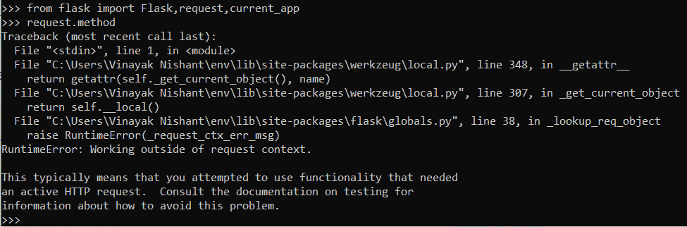
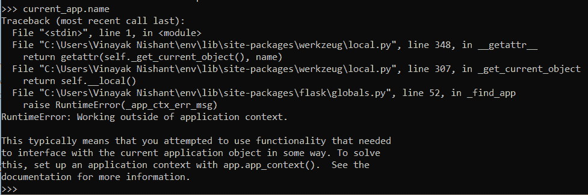
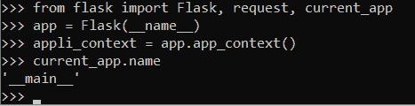
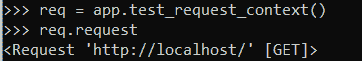

# Flask 上下文——揭开应用程序和请求上下文的神秘面纱

> 原文：<https://www.askpython.com/python-modules/flask/flask-application-request-context>

在本教程中，我们将首先介绍 Flask 上下文，然后进一步研究 Flask 中的两个上下文——应用程序上下文和请求上下文。

## 什么是烧瓶环境？

Flask 使用上下文使某些变量可以临时全局访问

在 Flask 中，您可能已经注意到 Flask 视图不将请求对象作为参数，并且仍然可以使用它们。只有当请求对象是全局对象时才有可能，对吗？

嗯，答案是**不**

如果请求对象是全局的，那么 Flask 不会区分同时到达服务器的请求。但事实并非如此；网站确实可以同时处理多个请求。那怎么可能呢？？

嗯，Flask 使用**上下文**使某些变量**暂时**对于特定的请求对象是全局的，这样视图可以访问这些变量以返回输出。

烧瓶环境有两种类型:

*   应用程序上下文
*   请求上下文

## **烧瓶中的应用环境**

应用程序上下文跟踪应用程序级别的数据。因此，这些存储特定于整个应用程序的值，如数据库连接、配置等。

应用程序上下文公开(例如，暂时使它们成为全局的)对象，例如 **current_app** 和 **g** 变量。

### 1.当前应用程序

**current_app** 指的是处理请求的实例。也就是说，它与运行 Flask 的应用程序相关。

### 2. **g 变量**

这里 **g** 代表全局，用于在请求处理过程中暂时**存储数据库细节等数据**。

一旦设置了 **current_app** 和 **g** 变量的值，应用程序中的任何视图都可以使用它们。

当一个特定的请求进来时，Flask 自动推送(或激活)应用程序上下文，并在处理完请求后删除它。

## **请求烧瓶中的上下文**

与应用程序上下文类似，请求上下文跟踪请求级数据。因此，这些存储特定于每个请求的值。

请求上下文暴露了像**请求**和**会话这样的对象。**

### 1.**请求**

请求对象包含关于当前 web 请求的信息。请求上下文使请求暂时成为全局的，因此所有视图都可以轻松地访问它们，而无需将它们作为参数。

**注意:**请求仅包含当前请求的信息。当一个新请求进来时，请求对象存储关于当前新请求的信息，以前的信息被删除。

### **2。会话**

与请求对象不同，会话是一个类似于 **[字典的对象](https://www.askpython.com/python/dictionary/python-dictionary-dict-tutorial)** ，它存储请求之间持续的信息。我们的网站上很快会有一篇关于 Flask 会议的完全不同的文章，给你更好的信息。

因此，一旦请求上下文被激活，应用程序中的任何视图都可以访问它所公开的对象(请求和会话)。

与应用程序上下文一样，Flask 也在特定请求到来时自动推送(或激活)请求上下文，并在处理完请求后删除它。

**注意:**当推送请求上下文时，如果应用上下文不存在，它也会自动创建一个应用上下文。

## **手动推动外壳中的烧瓶上下文。**

Flask 应用程序自动创建/推送应用程序和请求上下文。

因此，在视图函数中，您可以访问应用程序和请求公开的所有对象，而不用担心上下文。

但是，如果您试图在视图函数之外或 python shell 中使用对象**，如下所示:**

```py
from flask import Flask, request
request.method

```



Error

您将得到一个错误。应用程序上下文对象也是如此

```py
from flask import Flask, current_app
current_app.name

```



Error

这是因为应用程序和请求上下文不是活动的。因此，我们首先必须创建它们。

这里，我们使用 Flask 实例的 **app_context()** 方法创建应用程序上下文

运行代码:

```py
from flask import Flask, current_app
app = Flask(__name__)
appli_context = app.app_context()
current_app.name

```

这里

*   我们声明一个 Flask 对象—**app。**
*   我们使用 **app.app_context()** 推送/创建应用上下文
*   **current_app** 现在处于活动状态，并链接到 **__name__** 文件，即 **__main__** 文件本身。



App Context

现在错误已经消失了！类似地，我们使用 Flask 实例的 **test_request_context()** 方法创建请求上下文

```py
from flask import Flask, request
app = Flask(__name__)
req = app.test_request_context()
req.request

```

这里也是

*   我们声明一个 Flask 对象—**app。**
*   我们使用**app . tes _ request _ context()**推送/创建请求上下文
*   **请求**对象现在是活动的，并且链接到主机网站 ie，即“ **http://loalhost/** ”文件本身。



Request

因此我们得到了正确的无误差输出。

## **结论**

就这样，伙计们！！这就是 Flask 的全部内容。你不需要太担心，因为 Flask 会在应用程序文件中自动创建它们。