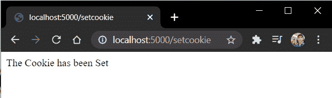
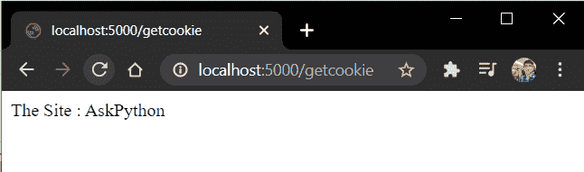

# flask cookie–在 Web 应用程序上设置 cookie

> 原文：<https://www.askpython.com/python-modules/flask/flask-cookies>

在本教程中，我们将处理 Flask cookies，并在 [Flask Web 应用程序](https://www.askpython.com/python-modules/flask/create-hello-world-in-flask)中使用它们。所以系好安全带，我们开始吧。

## 什么是饼干？

cookie 或者更好的说法，**HTTP cookie**是文本文件，存储在客户端机器上。根据客户端浏览器的 cookie 设置，每个 cookie 可以永久保存或保存特定的**到期时间**。

当 Cookie 到达到期日期和时间后，它会自动从客户端浏览器中删除。

Cookies 出现在客户端跟踪并记住用户在网络上的活动。这些信息稍后将用于改善用户的整体站点体验。

### 饼干是如何工作的？

我们知道， **HTTP 是一种无状态协议**，这意味着服务器无法区分用户是否是第一次访问网站。所以为了解决这个问题，网站使用 cookies。

因此，当客户端第一次访问某个特定的站点时，该客户端不会拥有该站点设置的任何 cookies。因此，服务器创建一个新的 cookie，并将其发送给客户机本身。

因此在接下来的访问中，客户机将把 cookie 附加到请求中并发送出去。然后，服务器从请求对象中检索 cookie，并使用该 cookie 信息来改善站点的用户体验。

### **为什么要用饼干？**

简而言之，我们使用 cookies 通过存储和跟踪用户的活动来提供更好的用户体验。此外，它们还存储诸如网站的**截止日期、路径、**和**域名等信息。**

Cookies 发挥作用的一些地方有:

*   你可能已经注意到，在脸书这样的电子商务或社交媒体网站上，当你没有注销就离开网站时，你的账户在你下次访问该网站时仍然是**登录的**。
*   在许多电子商务网站上，你会根据浏览器之前的搜索信息获得不同产品的推荐。

所有这些都是使用 cookies 完成的。

## **动手制作保温瓶饼干**

在 Flask 中，Cookies 设置在**响应**对象上。也就是说，服务器将 Cookie 和响应一起发送给用户。

我们使用 **make_response()** 函数来完成。一旦设置了响应，我们使用 **set_cookie()** 函数将 cookie 附加到它上面。

cookie 具有以下属性:

```py
response.set_cookie('<Title>','<Value>','<Expiry Time>')

```

因此，代码看起来像这样:

```py
@app.route('/setcookie')
def setcookie():
    resp = make_response(f"The Cookie has been set")
    resp.set_cookie('Name','AskPython')
    return resp

```

简单对！现在我们需要从用户那里取回 Cookie。cookie 会随请求一起发送回服务器。我们使用 **request.cookies.get()** 函数来检索它。

因此，考虑代码:

```py
@app.route('/getcookie')
def getcookie():
    name = request.cookies.get('Name', None)
    return f"The Site : {name}"

```

这里，Cookie 信息存储在 name 变量中。

因此，最终的主应用程序文件将是:

```py
from flask import Flask, make_response, request

app = Flask(__name__)

@app.route('/setcookie')
def setcookie():
    resp = make_response(f"The Cookie has been Set")
    resp.set_cookie('Name','AskPython')
    return resp

@app.route('/getcookie')
def getcookie():
    name = request.cookies.get('Name')
    return f"The Site : {name}"

app.run(host='localhost', port=5000)

```

## 守则的实施

现在让我们运行服务器并转到" **/setcookie** "



Set Cookie

和"**/get cookie**"



Get Cookie

完美！

## **结论**

就这样，伙计们。这都是因为烧瓶饼干。为了更好地理解代码，请自己尝试一下。

下次再见了！