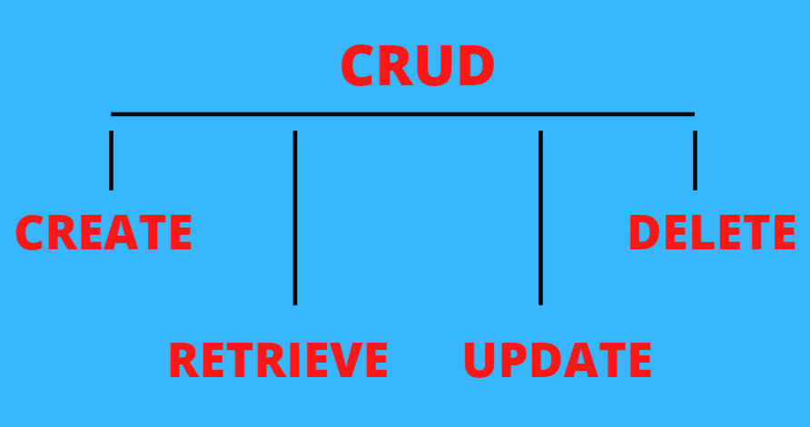
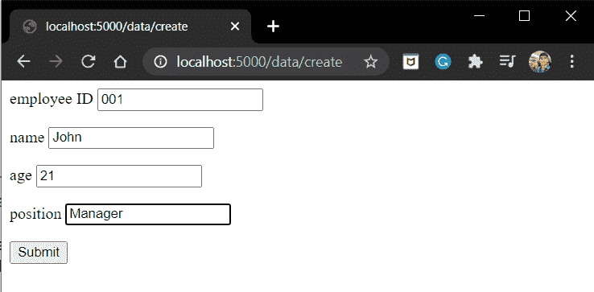
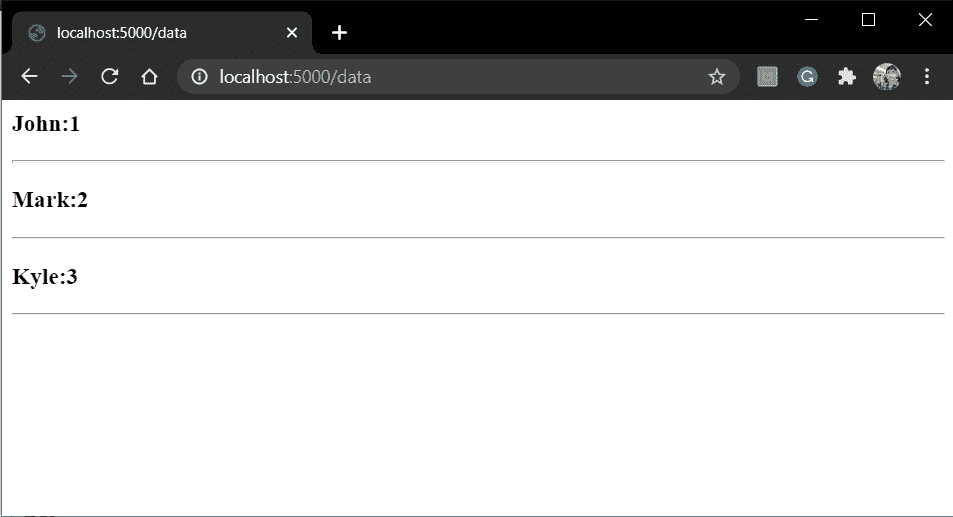
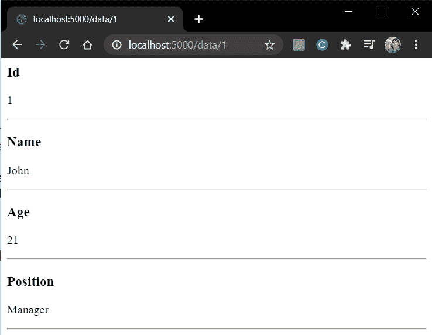
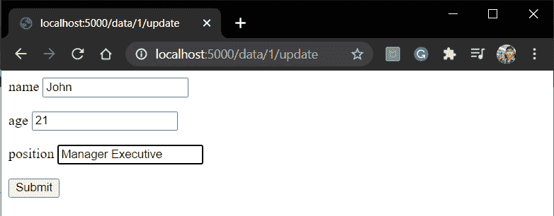
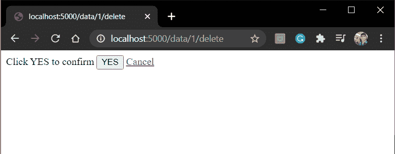

# Flask CRUD 应用程序–创建、检索、更新和删除

> 原文：<https://www.askpython.com/python-modules/flask/flask-crud-application>

在本教程中，我们将学习 CRUD，然后创建 Flask CRUD 应用程序。所以让我们开始吧！！

## 什么是 CRUD 应用程序？

处理**创建/检索/更新或删除**操作的 web 应用程序被称为 CRUD 应用程序。博客网站是 CRUD 应用程序的一个典型例子。

这里，

1.  我们可以创建一个新的博客:**创建**
2.  查看发布的博客:**检索**
3.  更新博客:**更新**
4.  删除博客:**删除**

CRUD 的定义总结如下:

| 操作 | 功能 |
| --- | --- |
| **创建** | 创建新数据并将其添加到数据库中 |
| **检索** | 从数据库中检索数据 |
| **更新** | 将现有数据更新到数据库中 |
| **删除** | 删除数据库中的现有数据 |



CRUD

## **创建一个 Flask CRUD 应用程序**

我们将创建一个简单的 Flask CRUD 应用程序，它可以创建/检索/更新/删除员工信息。

因此，在此应用程序中，您可以:

1.  创建新的员工信息
2.  查看员工名单。
3.  查看特定员工的信息。
4.  更新员工的信息
5.  删除员工信息

### **1。编码 Models.py**

在这里，我们将使用 Flask_SQLAlchemy 和 SQLite DB。

首先安装 Flask_SQLAlchemy

```py
pip install flask_sqlalchemy

```

现在创建一个 **models.py** 文件，并添加以下代码:

```py
from flask_sqlalchemy import SQLAlchemy

db = SQLAlchemy()

class EmployeeModel(db.Model):
    __tablename__ = "table"

    id = db.Column(db.Integer, primary_key=True)
    employee_id = db.Column(db.Integer(),unique = True)
    name = db.Column(db.String())
    age = db.Column(db.Integer())
    position = db.Column(db.String(80))

    def __init__(self, employee_id,name,age,position):
        self.employee_id = employee_id
        self.name = name
        self.age = age
        self.position = position

    def __repr__(self):
        return f"{self.name}:{self.employee_id}"

```

这里我们只是创建了 **EmployeeModel。如果你在理解语法上有任何困难，一定要查看一下 [SQLAlchemy](https://www.askpython.com/python-modules/flask/flask-postgresql) 教程**

### 2.**编码主应用程序**

现在，让我们编写主要的 [Flask 应用程序](https://www.askpython.com/python-modules/flask/create-hello-world-in-flask)文件。我们将从导入 flask 开始，初始化 Flask 应用程序，并设置应用程序运行时细节。

```py
from flask import Flask

app = Flask(__name__)

app.run(host='localhost', port=5000)

```

现在我们需要将 SQLite DB 与 SQLAlchemy 链接起来。因此，添加以下代码片段:

```py
from flask import Flask

app = Flask(__name__)
app.config['SQLALCHEMY_DATABASE_URI'] = 'sqlite:///<db_name>.db'
app.config['SQLALCHEMY_TRACK_MODIFICATIONS'] = False

app.run(host='localhost', port=5000)

```

将 **< db_name >** 替换为您想要的 db 文件名称。

此外，我们需要链接 db 实例(来自 **models.py** )并在用户访问服务器之前创建 DB 文件。为此:

```py
from flask import Flask

app =Flask(__name__)
app.config['SQLALCHEMY_DATABASE_URI'] = 'sqlite:///<db_name>.db'
app.config['SQLALCHEMY_TRACK_MODIFICATIONS'] = False
db.init_app(app)

@app.before_first_request
def create_table():
    db.create_all()

app.run(host='localhost', port=5000)

```

好了，既然数据库和模型已经就位，让我们编写 CRUD 视图。

### 3.编码**创建视图**

创建视图应该能够完成以下任务:

*   当客户端转到这个页面(GET 方法)时，它应该显示一个表单来获取客户端的数据。
*   在提交时(POST 方法)，它应该将客户端的数据保存在 EmployeeModel 数据库中。

因此**创建视图**将会是:

```py
@app.route('/data/create' , methods = ['GET','POST'])
def create():
    if request.method == 'GET':
        return render_template('createpage.html')

    if request.method == 'POST':
        employee_id = request.form['employee_id']
        name = request.form['name']
        age = request.form['age']
        position = request.form['position']
        employee = EmployeeModel(employee_id=employee_id, name=name, age=age, position = position)
        db.session.add(employee)
        db.session.commit()
        return redirect('/data')

```

**createpage.html**将包含 HTML 表单:

```py
<form action='' method = "POST">
  <p>employee ID <input type = "integer" name = "employee_id" /></p>
  <p>name <input type = "text" name = "name" /></p>
  <p>age <input type = "integer" name = "age" /></p>
  <p>position <input type = "text" name = "position" /></p>
  <p><input type = "submit" value = "Submit" /></p>
</form>

```

### **4。编码检索视图**

这里我们将有两个视图:

*   显示员工列表。
*   显示单个员工的信息。

因此第一个 **RetrieveDataList** 视图将是:

```py
@app.route('/data')
def RetrieveDataList():
    employees = EmployeeModel.query.all()
    return render_template('datalist.html',employees = employees)

```

**datalist.html**文件将显示员工名单:

```py

<h3>{{employee}}</h3><hr>


```

一定要看看我们的 [Flask 模板](https://www.askpython.com/python-modules/flask/flask-templates)来了解更多关于模板语言的知识。

第二个 **RetrieveSingleEmployee** 视图将是:

```py
@app.route('/data/<int:id>')
def RetrieveSingleEmployee(id):
    employee = EmployeeModel.query.filter_by(employee_id=id).first()
    if employee:
        return render_template('data.html', employee = employee)
    return f"Employee with id ={id} Doenst exist"

```

**employee model . query . filter _ by(employee _ id = id)。first()** 将返回数据库中具有**雇员 ID = id** 的第一个雇员，如果具有该 ID 的雇员不存在，则返回 **None** 。

**data.html**显示员工的信息:

```py
<h3>Id</h3>
<p>{{employee.employee_id}}</p><hr>
<h3>Name</h3>
<p>{{employee.name}}</p><hr>
<h3>Age</h3>
<p>{{employee.age}}</p><hr>
<h3>Position</h3>
<p>{{employee.position}}</p><hr>

```

### 5.编码**更新视图**

Update 视图将使用用户提交的新信息更新数据库中的员工详细信息。

因此，更新视图将是:

```py
@app.route('/data/<int:id>/update',methods = ['GET','POST'])
def update(id):
    employee = EmployeeModel.query.filter_by(employee_id=id).first()
    if request.method == 'POST':
        if employee:
            db.session.delete(employee)
            db.session.commit()

            name = request.form['name']
            age = request.form['age']
            position = request.form['position']
            employee = EmployeeModel(employee_id=id, name=name, age=age, position = position)

            db.session.add(employee)
            db.session.commit()
            return redirect(f'/data/{id}')
        return f"Employee with id = {id} Does nit exist"

    return render_template('update.html', employee = employee)

```

用户将通过表单提交新的详细信息。这里，我们首先删除数据库中的旧信息，然后添加新信息

**update.html**显示提交新细节的表格:

```py
<form action='' method = "POST">
  <p>name <input type = "text" name = "name" value="{{employee.name}}"/></p>
  <p>age <input type = "integer" name = "age"  value="{{employee.age}}"/></p>
  <p>position <input type = "text" name = "position" value="{{employee.position}}"/></p>
  <p><input type = "submit" value = "Submit" /></p>
</form>

```

### 6.编码**删除视图**

删除视图将只从数据库文件中删除雇员信息。

删除视图将是:

```py
@app.route('/data/<int:id>/delete', methods=['GET','POST'])
def delete(id):
    employee = EmployeeModel.query.filter_by(employee_id=id).first()
    if request.method == 'POST':
        if employee:
            db.session.delete(employee)
            db.session.commit()
            return redirect('/data')
        abort(404)

    return render_template('delete.html')

```

**delete.html**刚刚再次确认删除:

```py
<form action='' method="post">
    Click YES to confirm
    <input type = "submit" value="YES">
    <a href='/data'>Cancel</a>
</form>

```

如果用户按下 **Yes** ，则删除该员工。否则他会被带回去。

## **CRUD 应用程序的完整代码**

**models.py** :

```py
from flask_sqlalchemy import SQLAlchemy

db =SQLAlchemy()

class EmployeeModel(db.Model):
    __tablename__ = "table"

    id = db.Column(db.Integer, primary_key=True)
    employee_id = db.Column(db.Integer(),unique = True)
    name = db.Column(db.String())
    age = db.Column(db.Integer())
    position = db.Column(db.String(80))

    def __init__(self, employee_id,name,age,position):
        self.employee_id = employee_id
        self.name = name
        self.age = age
        self.position = position

    def __repr__(self):
        return f"{self.name}:{self.employee_id}"

```

**主烧瓶应用:**

```py
from flask import Flask,render_template,request,redirect
from models import db,EmployeeModel

app = Flask(__name__)

app.config['SQLALCHEMY_DATABASE_URI'] = 'sqlite:///data.db'
app.config['SQLALCHEMY_TRACK_MODIFICATIONS'] = False
db.init_app(app)

@app.before_first_request
def create_table():
    db.create_all()

@app.route('/data/create' , methods = ['GET','POST'])
def create():
    if request.method == 'GET':
        return render_template('createpage.html')

    if request.method == 'POST':
        employee_id = request.form['employee_id']
        name = request.form['name']
        age = request.form['age']
        position = request.form['position']
        employee = EmployeeModel(employee_id=employee_id, name=name, age=age, position = position)
        db.session.add(employee)
        db.session.commit()
        return redirect('/data')

@app.route('/data')
def RetrieveList():
    employees = EmployeeModel.query.all()
    return render_template('datalist.html',employees = employees)

@app.route('/data/<int:id>')
def RetrieveEmployee(id):
    employee = EmployeeModel.query.filter_by(employee_id=id).first()
    if employee:
        return render_template('data.html', employee = employee)
    return f"Employee with id ={id} Doenst exist"

@app.route('/data/<int:id>/update',methods = ['GET','POST'])
def update(id):
    employee = EmployeeModel.query.filter_by(employee_id=id).first()
    if request.method == 'POST':
        if employee:
            db.session.delete(employee)
            db.session.commit()
            name = request.form['name']
            age = request.form['age']
            position = request.form['position']
            employee = EmployeeModel(employee_id=id, name=name, age=age, position = position)
            db.session.add(employee)
            db.session.commit()
            return redirect(f'/data/{id}')
        return f"Employee with id = {id} Does nit exist"

    return render_template('update.html', employee = employee)

@app.route('/data/<int:id>/delete', methods=['GET','POST'])
def delete(id):
    employee = EmployeeModel.query.filter_by(employee_id=id).first()
    if request.method == 'POST':
        if employee:
            db.session.delete(employee)
            db.session.commit()
            return redirect('/data')
        abort(404)

    return render_template('delete.html')

app.run(host='localhost', port=5000)

```

## 烧瓶积垢应用程序的**实现**

运行服务器并转到“**/数据/创建**”



Create

现在输入详细信息，按**提交**。同样的，我也多加了几个。转到**/数据**



Data List

让我们检查第一个。转到“**/数据/1**



Data

现在让我们转到“ **/data/1/update** ”并更新一些细节



Update

详细信息现已更新。现在让我们删除该员工。进入**/数据/1/删除**



Delete

点击是，瞧！该员工被删除

## **结论**

就这样，伙计们！！这都是关于 Flask 中的 CRUD 操作。一定要看看我们的 [Flask REST API 教程](https://www.askpython.com/python-modules/flask/flask-rest-api)，它是 Flask REST 框架中的 CRUD 应用程序。

下一篇文章再见！！