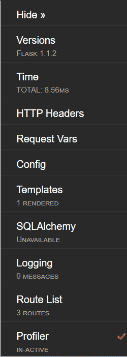
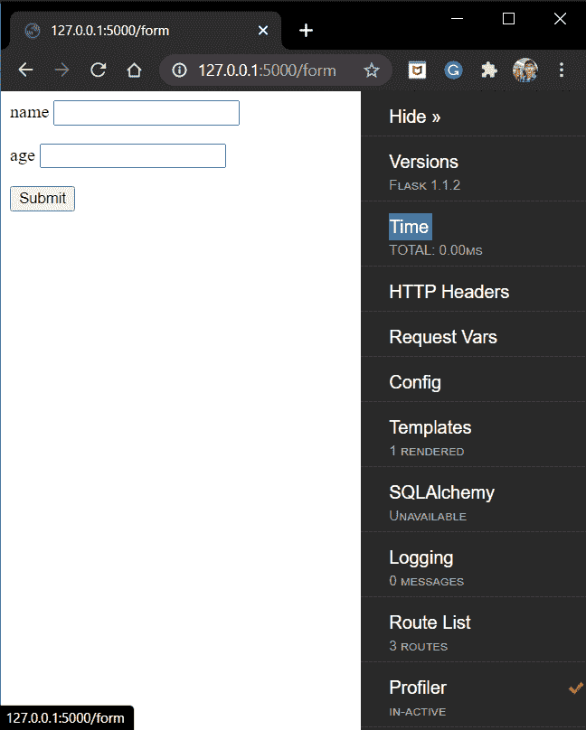

# Flask 调试模式–启用 Flask 中的调试模式和调试工具栏

> 原文：<https://www.askpython.com/python-modules/flask/flask-debug-mode>

在这种模式下，我们将了解 Flask 调试模式。稍后，我们还将实现一个调试器工具栏，用于在 Flask 中进行调试。所以让我们开始吧！

## **激活烧瓶调试模式**

考虑一个带有**调试模式** = False 的 Flask 应用程序。当您更新一些代码时，您需要重新启动服务器以使网页上的更改生效。

这可能是相当重复的，因为我们一直在改变和更新我们的代码。因此，为了简化编码，Flask 为我们提供了调试模式！

因此，随着**调试模式**的开启，所有的应用程序代码更改将在开发阶段立即得到更新，消除了重启服务器的需要。

## 烧瓶中调试模式的**实现**

让我们添加代码来启用 Flask 中的调试模式！如果你也希望[在 Flask](https://www.askpython.com/python-modules/flask/flask-logging) 中启用登录，这里有另一个教程。

```py
#Method 1
app.debug = True

#or
#Method @
app.run('host' = localhost, debug = True)

```

看，就这么简单！现在只需刷新服务器，所有的更改都在那里。

**注意** : **切勿在生产环境中启用调试模式或任何其他内置调试器。**调试器允许从浏览器执行任意 Python 代码。尽管这需要一个保护密钥，但仍然不安全。

## **将外部调试器工具栏添加到 Flask 应用程序中**

Flask 还提供了一个调试器工具栏，用于大规模调试我们的 web 应用程序。现在，为什么是工具栏？

嗯，所有的开发人员，在生命中的某个时刻，都会遇到错误。寻找并消除它们不是一件容易的事情。有时，指出错误可能需要很长时间。因此，每个开发人员都必须知道调试的艺术。

但是不出所料，有了 Flask，一切都变得简单多了。我们需要一个 Flask 调试工具栏，我们完成了！！



Flask ToolBar

好了，现在让我们看看它由什么组成:

*   **版本:**表示用于运行网页的 Flask 库的版本。
*   **时间:**表示网页的加载时间。
*   **HTTP Headers:** 给出关于 HTTP 头键值对的信息
*   **请求:**给出关于请求变量的信息——视图、会话、cookies 等
*   **配置:**告知烧瓶应用程序的各种配置
*   **模板:**给出关于模板的信息
*   **SQLAlchemy:** 给出关于网页上调用的 SQLAlchemy 查询的信息。(查看我们的 Flask Postgres SQLAlchemy 文章，了解有关 SQLAlchemy 的更多信息)
*   **日志:**给出日志记录的信息。(查看烧瓶日志以了解更多信息)
*   **路线列表:**显示我们的 web 应用程序中所有可能的 URL 路线。
*   **Profiler:** 激活时，给出所用烧瓶分析器的信息。

## **动手使用烧瓶调试工具栏**

首先我们需要安装工具栏。运行代码:

```py
pip install flask-debugtoolbar

```

就这样，工具栏安装完毕

### 1.将工具栏添加到 Flask 应用程序

要添加工具栏，语法是:

```py
from flask import Flask
from flask_debugtoolbar import DebugToolbarExtension

app = Flask(__name__)

app.debug = True
toolbar = DebugToolbarExtension(app)

```

只有在 **Debug = True** 模式下，网页才会显示调试工具栏。在生产服务器中( **Debug = False** )，web 应用程序不会显示工具栏。

因此，考虑以下[烧瓶应用](https://www.askpython.com/python-modules/flask/create-hello-world-in-flask)示例:

```py
from flask import Flask
from flask_debugtoolbar import DebugToolbarExtension

app = Flask(__name__)

app.debug = True
toolbar = DebugToolbarExtension(app)

@app.route('/form')
def form():
    return render_template('form.html')

app.run(host='localhost', port=5000)

```

还有那个**form.html**:

```py
<html>
   <body>
      <form action="/login" method = "POST">
         <p>name <input type = "text" name = "name" /></p>
         <p>age <input type = "integer" name = "age" /></p>
         <p><input type = "submit" value = "Submit" /></p>
      </form>
   </body>
</html>

```

**注意:**模板应该包含 **<主体>** 属性，工具栏才能工作。

### 2.运行烧瓶应用程序

现在让我们启动服务器并检查:



Debug Toolbar

完美！网页上就有工具栏。

## **结论**

就这样，伙计们！！这都是关于烧瓶调试模式和工具栏。请务必在网站上查看我们的其他[烧瓶文章](https://www.askpython.com/python-modules/flask)。编码快乐！