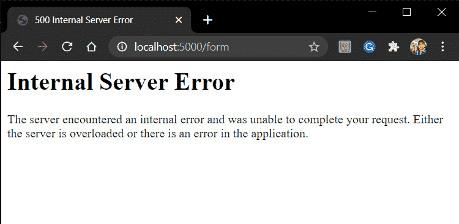
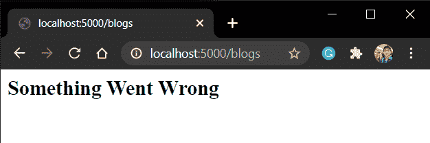

# Flask 错误处理–在 Flask 中显示自定义错误页面

> 原文：<https://www.askpython.com/python-modules/flask/flask-error-handling>

本文将处理不同类型的 HTTP 错误，然后学习如何使用 Flask 错误处理来处理这些错误。所以让我们开始吧！

## 为什么我们需要错误处理？

web 应用程序中的错误可能由于多种原因而发生。这可能是由于应用程序中的错误代码或用户的一些错误请求或服务器停机。

因此，处理这些错误至关重要。虽然浏览器默认为您处理 HTTP 错误，但是输出并不美观。

例如，在构建 Flask 应用程序时，您可能会遇到 500 个内部服务器错误。



500 Internal Server Error

一行简单的指示错误原因就足够了，而不是显示无关的数据。

这就是 Flask 错误处理程序发挥作用的地方。

使用 Flask 错误处理程序，我们可以:

1.  自定义错误页面外观。
2.  仅向用户显示相关数据。

## **常见 HTTP 错误**

一些最常见的错误是:

| HTTP 错误代码 | 意义 |
| --- | --- |
| **301** | 永久移动 |
| **302** | 临时移动 |
| **400** | 错误的请求 |
| **403** | 被禁止的 |
| **404** | 未发现 |
| **429** | 太多请求 |
| **500** | 内部服务器错误 |
| **502** | 错误网关 |
| **503** | 服务不可用 |
| **504** | 网关超时 |

HTTP Errors

## **动手操作烧瓶错误处理**

错误代码—**404**和 **500** 是我们每天处理的最常见的错误。

因此，在本节中，我们将为 404 和 500 构建一个简单的错误处理程序。其他错误的语法完全相同。

在 flask 中，我们使用内置的 **error_handler decorator** 。

语法是:

```py
@app.errorhandler(status_code)
def function_name(error):
    return render_template('xyz.html'),status_code

```

因此，考虑以下烧瓶应用示例:

```py
from flask import Flask, render_template

app = Flask(__name__)

@app.route('/blogs')
def blog():
    return render_template('blog.html')

#Handling error 404 and displaying relevant web page
@app.errorhandler(404)
def not_found_error(error):
    return render_template('404.html'),404

#Handling error 500 and displaying relevant web page
@app.errorhandler(500)
def internal_error(error):
    return render_template('500.html'),500

#app.run(host='localhost', port=5000)
app.run(host='localhost', port=5000)

```

**Blog.html:**

```py
<h2>Welcome to the Blog</h2>

```

**404.html**文件:

```py
<h2>The webpage you are trying is not found</h2>
Something Went Wrong</h2>

```

## **实施**

现在运行服务器，并转到任何不存在的 URL 端点


404

现在为了得到 500 的错误，故意把 **render_template()** 的几个字母互换成 **remder_template()**

现在重启服务器，进入 **"/blogs"** 网址。您现在将看到 500 错误页面



500 Error Page

完美！

## **结论**

就这样，伙计们！！您现在可以根据您的网页主题自定义错误页面。一定要看看我们的其他 [Flask 教程](https://www.askpython.com/flask)来了解更多关于 Flask 的知识。

下一篇文章再见！！快乐编码🙂