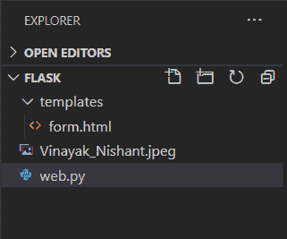

# Flask 文件上传–在 Python Flask 中创建一个表单来上传文件

> 原文：<https://www.askpython.com/python-modules/flask/flask-file-uploading>

欢迎来到本教程！在这里，我们将学习如何使用 HTML 表单在 Flask 中上传文件。好了，我的编码伙伴们，让我们开始吧！

## **如何**使用 Python Flask 上传文件？

在 Flask 中上传文件是一件轻而易举的事情。流程图如下:

1.  **HTML 表单**显示文件上传界面
2.  **使用 Flask 视图保存**上传的文件

仅此而已。这就是我们所需要的。

### **1。用于文件上传的 HTML 表单**

为了处理文件上传，我们需要在 HTML 模板的表单属性中添加**enctype = " multipart/form-data "**。

HTML 表单示例如下所示:

```py
<html>
   <body>
      <form action = "http://localhost:5000/endpoint" method = "POST" enctype = "multipart/form-data">
         <input type = "file" name = "file" />
         <input type = "submit" value = "Submit" />
      </form>
   </body>
</html>

```

### **2。保存文件**

在 Flask 中，上传的文件首先保存在服务器上的临时位置，然后永久保存在目标位置。

我们可以在 Flask 的配置设置中指定文件的目标位置和 max_size:

| 句法 | 描述 |
| --- | --- |
| app . config['**UPLOAD _ FOLDER**'] | 指定目标文件夹 |
| app . config['**MAX _ CONTENT-PATH**'] | 以**字节**指定文件的最大长度 |

我们可以通过直接硬编码或者使用**文件名**函数来保存目标**文件的名称**。

```py
f = request.files['file']
f.save(f.filename)

```

始终建议使用 **secure_filename** 函数来使用上传文件的安全版本。

```py
f = request.files['file']
f.save(secure_filename(f.filename))

```

## **编码烧瓶文件上传表**

有了这些理论，让我们直接进入主题，理解使用 Flask 上传文件所需的具体步骤。

### **1。表单模板**

用下面的代码创建一个简单的 HTML 表单"**form.html**"文件:

```py
<html>
   <body>
      <form action = "http://localhost:5000/upload" method = "POST" enctype = "multipart/form-data">
         <input type = "file" name = "File" />
         <input type = "submit" value = "Submit" />
      </form>
   </body>
</html>

```

这个简单的表单只接收用户提交的文件。一定要查看我们的 Flask Forms 文章，了解更多关于 Flask Forms 的信息

### **2** 。编码烧瓶视图**功能**

现在，在 Flask 应用程序中添加以下代码

```py
from flask import Flask,render_template,request
from werkzeug import secure_filename

@app.route('/form')
def form():
    return render_template('form.html')

@app.route('/upload', methods = ['POST', 'GET'])
def upload():
    if request.method == 'POST':
        f = request.files['file']
        f.save(secure_filename(f.filename))
        return "File saved successfully"

app.run(host='localhost', port=5000)

```

这里，

1.  **表单视图**显示表单。
2.  表单提交后，表单数据(上传的文件)通过 **POST** 方法发送到**上传视图**(作为请求对象的一部分)。
3.  然后，**上传视图**将文件临时存储在变量 **f** 中，然后用 **f.save()** 属性永久保存。

一定要看看我们的 Flask Forms 文章，了解更多关于 Flask 中的表单。

### **3。代码的实现**

运行服务器，让我们检查一下


Upload Form

选择一个文件，然后点击提交


Upload

就这样，文件保存成功。现在在你的文件夹中，你可以在你的 **Flask 申请文件旁边看到上传的文件**。****



Destination

瞧啊。您的文件已成功上传。

## **结论**

本教程到此为止，各位！为了更好地理解，请亲自尝试上面给出的例子。

下一篇文章再见！在那之前，快乐编码🙂