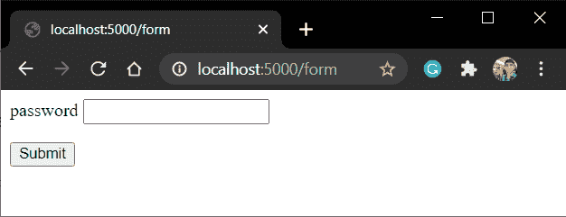
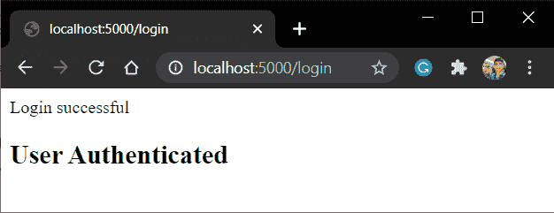

# Flask flash()方法——如何在 Flask 中刷新消息？

> 原文：<https://www.askpython.com/python-modules/flask/flask-flash-method>

在本教程中，我们将学习如何使用 Flask flash()方法刷新消息。

## **闪现消息是什么意思？**

GUI 应用程序为用户的操作提供反馈总是好的。

也就是说，例如，在 [Flask form](https://www.askpython.com/python-modules/flask/flask-forms) 中，如果用户将某个字段留空，则给他一个错误/信息消息，告诉他该字段是必填的。

[Python Tkinter GUI](https://www.askpython.com/python/tkinter-gui-widgets) 框架使用 **[消息](https://www.askpython.com/python-modules/tkinter/tkinter-messagebox-and-radiobutton)** 或**对话框**来显示消息**、**，在客户端脚本语言 JavaScript 中，使用 **alert** 函数来完成。

在 Flask 中，我们有这个 flash 方法可以做到这一点。

## **烧瓶闪光灯是如何工作的？**

Flask flash 方法向用户显示消息。

使用 flash，我们可以在一个 Flask 视图中创建一个 Flash 消息，然后在另一个视图中显示它，这个视图叫做“next”，通常是一个模板视图。

[模板](https://www.askpython.com/python-modules/flask/flask-templates)视图的典型例子是:

```py
@app.route('/template')
def blog():
    #codes...
    #codes...
    return render_template('template.html')

```

因此，Flask 视图在一个视图中创建一个 Flash 消息，然后将其传递给下一个视图(和请求一起)，后者向用户显示该消息。

Flash 的语法:

```py
flash(message,category)

```

这里，

*   **消息:**要显示的消息
*   **类别:**可选参数，可以设置为“错误”、“信息”、“警告”

为了从会话中提取存储的 flash 消息，并在模板上显示它，我们使用了**get _ flash _ messages()**函数。

```py
get_flashed_messages(with_categories, category_filter)

```

这里，

*   **with_categories:** 一个可选的参数元组，用来提及类别(错误/信息/警告)
*   **category_filter:** 可选参数，只过滤和显示特定的消息

一个简单的例子显示了模板文件中的**get _ flash _ message()**:

```py

   
      
         {{ message }}
      
   


```

## **动手用烧瓶闪光()方法**

这里我们将创建一个简单的 Flask 应用程序，如果用户输入正确的密码，它会闪烁–**登录成功**。

### 1)编写烧瓶应用程序文件

这里我们将展示一个接受密码的简单表单。如果密码正确，则闪烁消息。

```py
from flask import Flask,render_template,request,redirect,flash

app = Flask(__name__)

@app.route('/form')
def form():
    return render_template('form.html')

@app.route('/login', methods = ['POST', 'GET'])
def login():
    if request.method == 'GET':
        return "Login via the login Form"

    if request.method == 'POST':
        password = request.form['password']
        if password == '123':
            #The following flash message will be displayed on successful login
            flash('Login successful')
            return render_template('success.html')
        else:
            return redirect('/form')

app.run(host='localhost', port=5000)

```

这里的**success.html**是“下一个”模板，因为消息将出现在那里。

就是这样！！让我们现在编码模板

### 2)对模板进行编码

form.html 将是:

```py
<form action="/login" method = "POST">
   <p>password <input type = "text" name = "password" /></p>
   <p><input type = "submit" value = "Submit" /></p>
</form>

```

和 Success.html 模板文件:

```py

   
      
         {{ message }}
      
   


<h2>User Authenticated</h2>

```

注意我们在这里是如何使用**get _ flash _ messages()**的。

### **3)实施**

就是这样！！让我们现在启动服务器并检查我们的网页

点击**"/表格"**:



Form

输入 **1234** 并点击提交



Login

这就是我们的 Flash 信息，就在屏幕上。

## **结论**

本教程到此为止，各位！！我希望您获得了足够的知识，可以在您的 web 应用程序中使用 Flash 方法。一定要看看我们的 [Flask Forms](https://www.askpython.com/python-modules/flask/flask-forms) 文章，以了解更多关于表单的信息

下一篇文章再见！！编码快乐！！