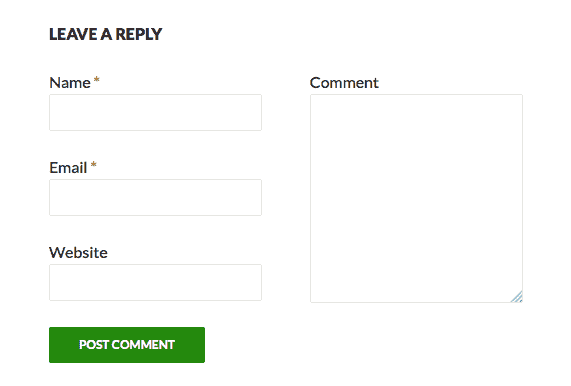
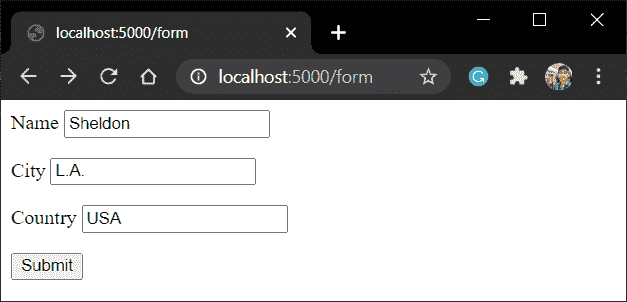
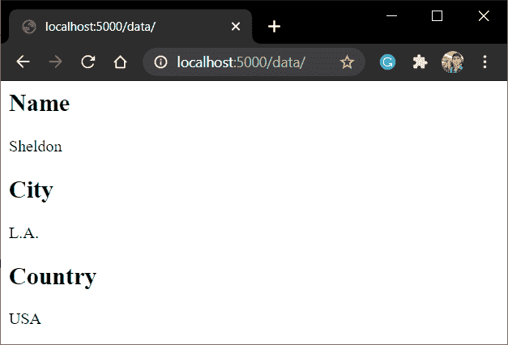
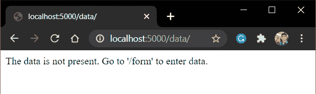

# 烧瓶表单–使用烧瓶表单接受用户输入

> 原文：<https://www.askpython.com/python-modules/flask/flask-forms>

嘿伙计们！！在本教程中，我们将研究烧瓶的形式，以及如何创建它们。所以让我们现在就开始吧！

## **瓶型基础**

表单是 web 应用程序的重要组成部分，从用户认证界面到我们网站上需要的调查表单。

表格的一个典型例子是:



Form Example

这里，当用户第一次请求页面时——他通过我们称之为" **GET 方法**接收页面

填写表单后，用户数据通过 **POST 方法**发送到服务器。

我们稍后将了解这两种方法的更多信息。

这些表单通过使用 HTML 的 **<表单>** 属性的模板显示给用户。

示例 HTML 表单如下所示:

```py
<form action="action_to_perform_after_submission" method = "POST">
    <p>Field1 <input type = "text" name = "Field1_name" /></p>
    <p>Field2 <input type = "text" name = "Field2_name" /></p>
    <p>Field3 <input type = "text" name = "Field3_name" /></p>
    <p><input type = "submit" value = "submit" /></p>
</form>

```

这里我们在**动作**属性中定义了对表单数据执行的动作。

## **获取或发布发送数据的方法**

这些方法中的每一种也称为 HTTP 方法，对服务器资源执行特定的操作。每种方法对应不同的任务。在本文中，我们将研究其中的两种方法，GET 和 POST 方法。

1.  **GET–**这个方法从 web 服务器获取特定的信息(只是为了查看)
2.  **POST–**该方法将数据从用户发送到服务器。

因此，例如，考虑 Instagram 应用程序。

默认情况下，浏览器总是使用 **GET** 方法在网页上显示资源。因此，在这里你可以看到不同的内容——帖子和迷因(通过 GET 方法)。

但是当你发布一张照片时，基本上你是把信息(**照片和标题**)发送到 Instagram 应用服务器。因此，这个动作(向服务器发送数据)是通过 POST 方法完成的。

同样，考虑一个博客网站。当你在网站上读博客的时候，是通过 **GET** 的方法。当你写和发表你的博客时，是通过**发布**的方法。

## **建造你的第一个烧瓶模型**

我们现在将在 flask 应用程序中创建一个简单的表单

### 1.**编码烧瓶文件**

考虑以下代码:

```py
from flask import Flask,render_template,request

app = Flask(__name__)

@app.route('/form')
def form():
    return render_template('form.html')

@app.route('/data/', methods = ['POST', 'GET'])
def data():
    if request.method == 'GET':
        return f"The URL /data is accessed directly. Try going to '/form' to submit form"
    if request.method == 'POST':
        form_data = request.form
        return render_template('data.html',form_data = form_data)

app.run(host='localhost', port=5000)

```

这里，

1.  **表单视图**向用户显示 HTML 表单[模板](https://www.askpython.com/python-modules/flask/flask-templates)
2.  当用户提交表单时，表单数据(作为请求对象的一部分)通过 POST 方法发送到**数据视图**。
3.  然后**数据视图**将表单数据元素重新创建到变量 **form_data** 中，并将其发送到【data.html】模板中进行显示。

**request.form** 有一个[字典](https://www.askpython.com/python/dictionary/python-dictionary-dict-tutorial)结构:

```py
form_data = {
'key1(field1_name)' : 'value1(field1_value)',
'key2(field2_name)' : 'value2(field2_value)',
.
.
}

```

在这里，一旦表单被提交，浏览器被重定向到**数据功能**网页。

**注**:当我们通过表单被定向到**/数据**时，我们基本上是通过 POST 方法访问数据网页。

### **2。模板**文件

这里的表单模板——**form.html**将会是:

```py
<form action="/data" method = "POST">
    <p>Name <input type = "text" name = "Name" /></p>
    <p>City <input type = "text" name = "City" /></p>
    <p>Country <input type = "text" name = "Country" /></p>
    <p><input type = "submit" value = "Submit" /></p>
</form>

```

**data.html**将显示表格数据:

```py

<h2> {{key}}</h2>
<p> {{value}}</p>


```

请查看我们的[烧瓶模板](https://www.askpython.com/python-modules/flask/flask-templates)文章，了解更多关于模板的信息。

### **3。代码的实现**

现在运行服务器并检查



**/form**

点击提交并查看



**/data** (POST)

此外，当您试图直接从浏览器点击 URL“/data”时，您将通过 **GET** 方法获得该网页，该方法将显示一个错误，因为没有表单数据。



**/data** (GET)

## **结论**

就这样，伙计们！！这都是关于烧瓶中的形式。我们将在接下来的文章中了解更多关于这种烧瓶的话题！！

在那之前，快乐编码🙂