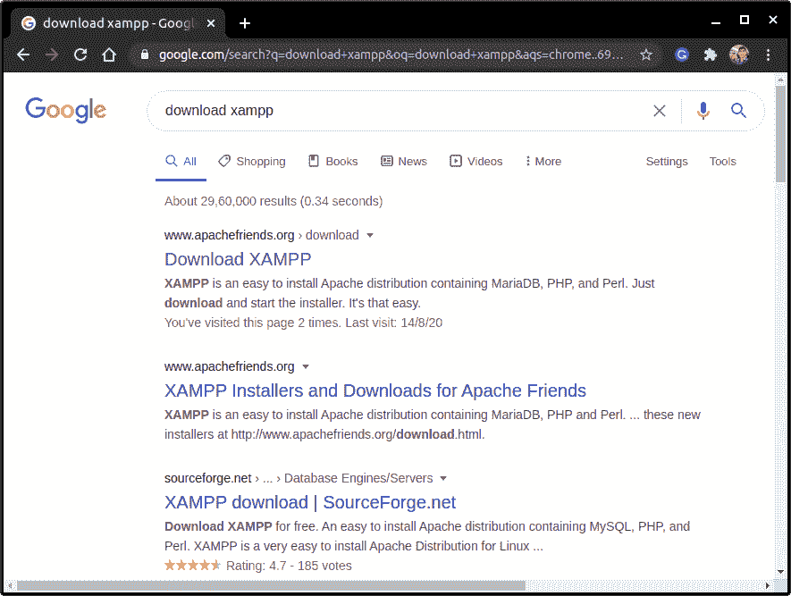
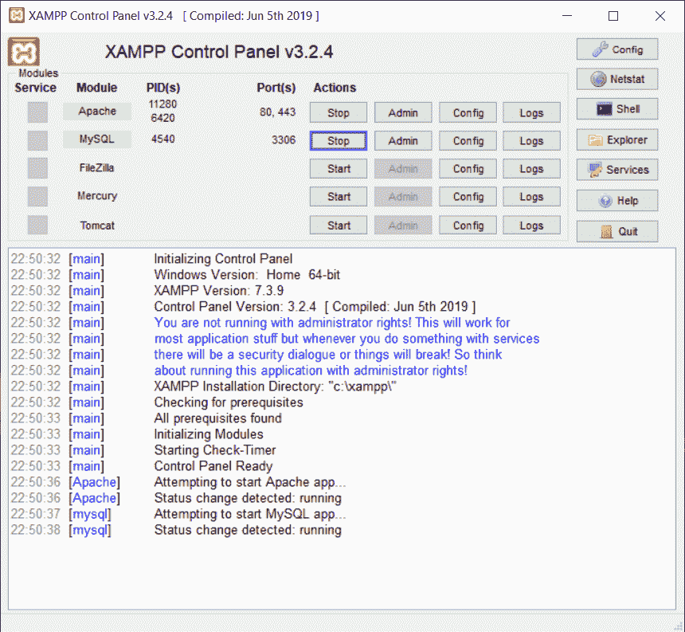
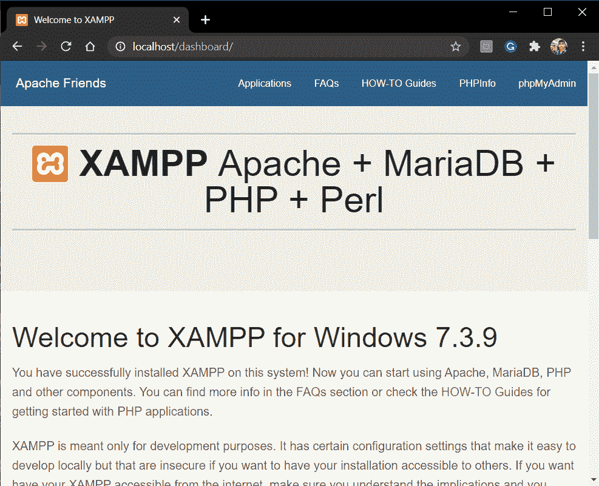
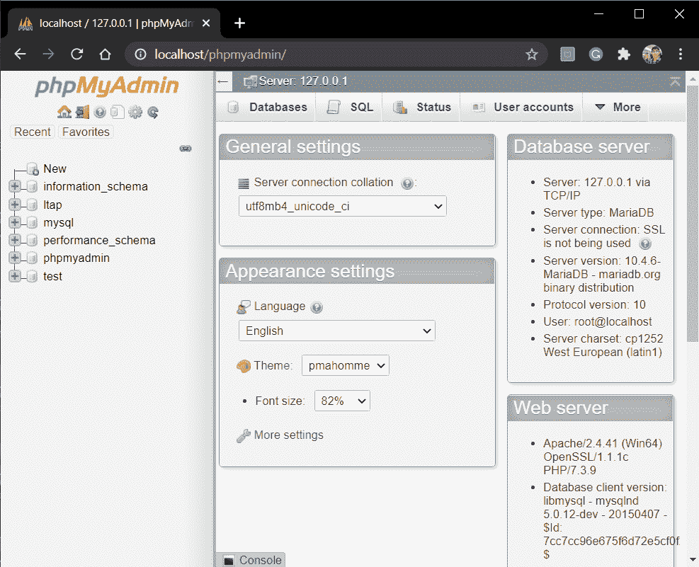
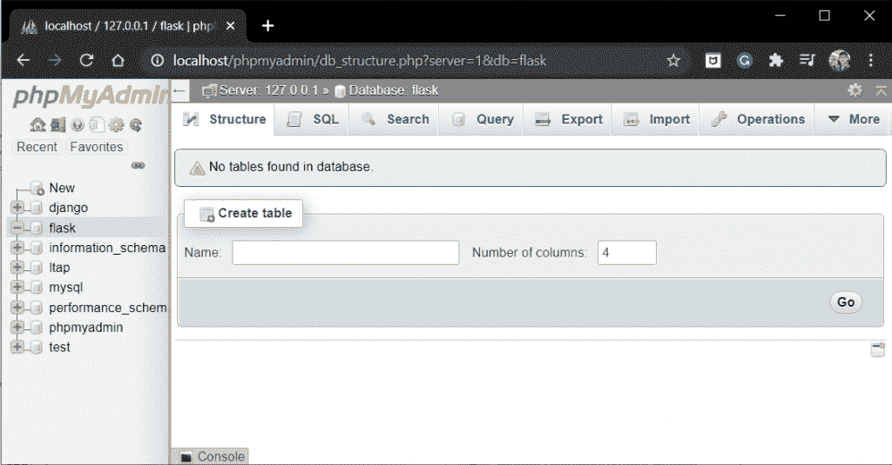
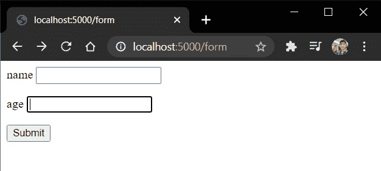
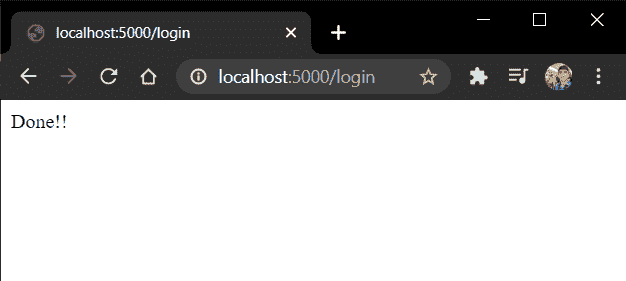
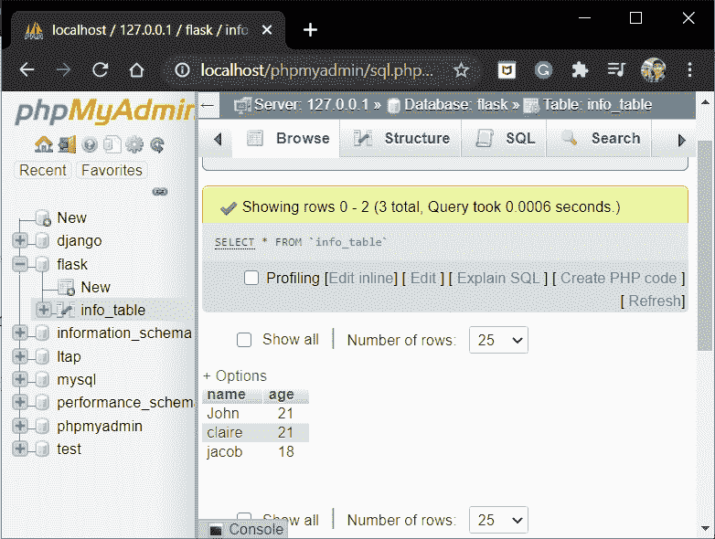

# Flask MySQL–设置 Flask 和 MySQL 数据库连接

> 原文：<https://www.askpython.com/python-modules/flask/flask-mysql-database>

在本文中，我们将学习如何建立一个 Flask MySQL 数据库连接。所以让我们开始吧！！

## 结构化查询语言

SQL 允许我们访问和操作数据库。在 SQL 中，我们可以执行各种任务，例如:

*   向数据库添加记录
*   创建表格
*   执行 CRUD(创建、读取、更新、删除)操作

SQL 是数据库系统使用的查询语言。为了建立数据库，我们需要像 MySQL，PostgreSQL 等 **RDMS** 。

一定要在 JournalDev 网站上查看我们的SQL 教程，以获得更多关于查询语言的知识。

## 关于 MySQL 数据库表的更多信息

现在让我们看一个典型的 MySQL 数据库表:

| 身份 | 名字 | 城市 | 国家 |
| --- | --- | --- | --- |
| one | 插口 | 在那里 | 美利坚合众国 |
| Two | 金姆（人名） | 加利福尼亚 | 美利坚合众国 |
| three | 瑞奇 | 芝加哥 | 美利坚合众国 |
| four | 南森(男子名) | 慕尼黑 | 德国 |
| five | 约拿单 | 巴伐利亚州 | 德国 |
| six | 麦莉（女子名） | 西雅图 | 美利坚合众国 |

DB Table

行被称为**记录**，列被称为**字段**。

因此，在上表中，我们有**六个记录**和**四个字段。**为了与表格元素进行交互，我们使用 SQL 语句。

**一些 SQL 语句是:**

*   **SELECT FROM-**该语句**从一个表中选择** s 个字段(全部或几个)。
*   **其中**–该条件语句通常与其他语句一起使用。利用这一点，我们可以选择满足某些给定条件的特定记录。
*   **UPDATE**–该语句更新一个表格
*   **编辑**–该语句编辑一个/多个记录的字段
*   **DELETE**–该语句删除一条/多条记录

## 为我们的应用程序设置 MySQL 服务器

在本节中，我们将下载并建立我们的 MySQL 服务器

### 1.在服务器上安装 XAMPP

现在要使用 MySQL，我们需要一个软件工具来处理 MySQL 的网络管理。

在本教程中，我们将使用 **phpMyAdmin** 。如果你熟悉其他软件；你也可以用这个。

Xampp 软件提供了 PHPMyAdmin web 接口。你可以从这里[下载 XAMPP](https://www.apachefriends.org/download.html) 。

或者直接去 Google 搜索**下载 Xampp。**第一个环节本身就可以完成工作！！

下载适合您的操作系统和体系结构的正确版本。



Xampp

### 2.启动 Apache 和 MySQL

安装并加载 XAMPP 后，启动以下两个过程:

*   **Apache web 服务器**–服务 HTTP 请求
*   **MySQL 服务器**–用于数据库



Xampp

请注意 MySQL 的默认端口是 **3306。**现在在浏览器中，转到 **https://localhost** 。



Xampp Host Webpage

这是 Xampp 的主机网页。点击右上角**的 phpMyAdmin**，进入 php web 界面。



Phpmyadmin

这里，

*   点击左栏中的 **new** 创建一个新的数据库。
*   为数据库保留一个合适的名称。在我的情况下，它只是简单的**瓶**



Flask DB

继续在数据库中创建一个表。在如图所示的空白处输入表格名称，并点击 **Go。**

### 3.在我们的系统中安装 Flask- MySQL 库

Flask 使用 **flask_mysqldb** 连接器来使用 MySQL。运行以下命令来安装该软件包:

```py
pip install flask_mysqldb

```

完美！！

## 设置 Flask MySQL 数据库连接

现在，我们将连接并使用 MySQL 将数据存储到我们的数据库中。如果你不确定如何创建一个 flask 应用程序，查看一下 [flask 介绍教程](https://www.askpython.com/python-modules/flask/create-hello-world-in-flask)。

### 1.用 MySQL 连接 Flask 应用程序

我们连接 Flask-MySQL 的步骤如下:

```py
from flask import Flask,render_template, request
from flask_mysqldb import MySQL

app = Flask(__name__)

app.config['MYSQL_HOST'] = 'localhost'
app.config['MYSQL_USER'] = 'root'
app.config['MYSQL_PASSWORD'] = ''
app.config['MYSQL_DB'] = 'flask'

mysql = MySQL(app)

```

### 2.设置 MySQL 连接光标

仅仅通过上面的设置，我们无法与 DB 表进行交互。为此，我们需要一个叫做**光标**的东西。

所以 **Cursor** 为 Flask 提供了一种与 DB 表交互的方式。它可以扫描数据库数据，执行不同的 SQL 查询，以及删除表记录。

光标的使用方式如下:

```py
mysql = MySQL(app)

#Creating a connection cursor
cursor = mysql.connection.cursor()

#Executing SQL Statements
cursor.execute(''' CREATE TABLE table_name(field1, field2...) ''')
cursor.execute(''' INSERT INTO table_name VALUES(v1,v2...) ''')
cursor.execute(''' DELETE FROM table_name WHERE condition ''')

#Saving the Actions performed on the DB
mysql.connection.commit()

#Closing the cursor
cursor.close()

```

由于 MySQL 不是一个**自动提交**的数据库，我们需要手动提交，即保存由数据库上的**光标执行**所执行的更改/动作。

### 3.编写烧瓶应用程序

现在我们将构建一个小 Flask 应用程序，它将用户提交的数据存储在 MySQL DB 表中。考虑以下应用程序代码:

```py
from flask import Flask,render_template, request
from flask_mysqldb import MySQL

app = Flask(__name__)

app.config['MYSQL_HOST'] = 'localhost'
app.config['MYSQL_USER'] = 'root'
app.config['MYSQL_PASSWORD'] = ''
app.config['MYSQL_DB'] = 'flask'

mysql = MySQL(app)

@app.route('/form')
def form():
    return render_template('form.html')

@app.route('/login', methods = ['POST', 'GET'])
def login():
    if request.method == 'GET':
        return "Login via the login Form"

    if request.method == 'POST':
        name = request.form['name']
        age = request.form['age']
        cursor = mysql.connection.cursor()
        cursor.execute(''' INSERT INTO info_table VALUES(%s,%s)''',(name,age))
        mysql.connection.commit()
        cursor.close()
        return f"Done!!"

app.run(host='localhost', port=5000)

```

当用户提交数据时，通过**光标将数据添加到 MySQL 数据库中。我的表名是 **info_table** 。**

**form.html**将是:

```py
<form action="/login" method = "POST">
   <p>name <input type = "text" name = "name" /></p>
   <p>age <input type = "integer" name = "age" /></p>
   <p><input type = "submit" value = "Submit" /></p>
</form>

```

### 4.实施准则

现在启动服务器，进入“**/表格**”(*见[烧瓶表格](https://www.askpython.com/python-modules/flask/flask-forms)* )



Form

输入详细信息并点击提交



Success

现在让我们在 **phpMyAdmin** web 界面中检查一下



Php

完美！！

## 结论

就这样，伙计们！！这都是关于建立 Flask MySQL 连接。在下一篇文章中，我们将研究 Flask-PostgreSQL。

下次再见🙂