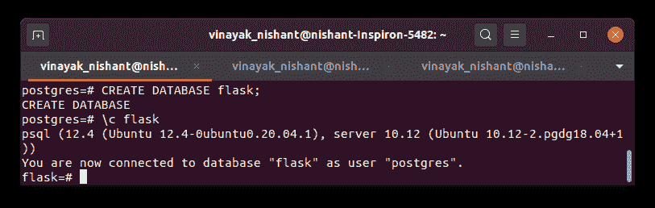
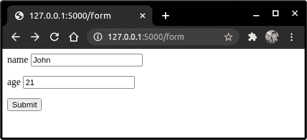
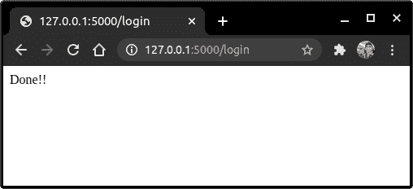
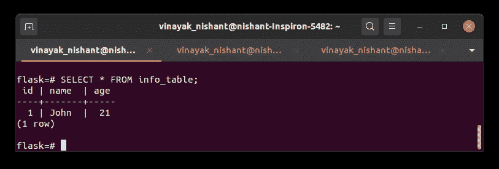

# flask PostgreSQL–SQLAlchemy

> 原文：<https://www.askpython.com/python-modules/flask/flask-postgresql>

在本文中，我们将学习使用 ORM–**对象关系映射器**(称为 Flask SQLAlchemy)将 Flask 应用程序与 PostgreSQL 数据库系统连接起来。

## PostgreSQL 是什么？

类似于 MySQL 数据库管理系统，PostgreSQL 是另一种类型的 RDBMS，用于访问、存储和处理数据库表形式的数据。

PostgreSQL 还使用 **SQL 结构化查询语言**来访问和处理数据库，并在 PostgreSQL 中执行各种任务

## PostgreSQL 的基本结构

数据以**表**的形式存储在 Postgres DB 中。典型的 Postgres 表如下所示:

| 身份 | 名字 | 班级 | 级别 |
| --- | --- | --- | --- |
| one | 艾丽娅 | 离子交换 | B |
| Two | 言语唐突的 | X | A |
| three | 光线 | 八 | D |
| four | 金姆（人名） | 我们吗 | A |
| five | 詹尼弗 | 罗马数字 12 | B |
| six | 杜松子酒的 | X | A |

PostgreSQL Table

行被称为**记录**，列被称为**字段**。因此，在上表中，我们有 **6 个记录**和 **4 个字段。**

## 【MySQL 和 Postgre 的区别 SQL

虽然 MySQL 和 PostgreSQL 都属于 RDBMS，但是两者之间有一些关键的区别。

*   MySQL 和 PostgreSQL 的一个基本区别是，PostgreSQL 是一个 ORDBMS(对象关系数据库管理系统)，而 MySQL 是一个社区驱动的 RDBMS。
*   PostgreSQL 相对于 MySQL 的另一个优势是它可以支持现代应用程序特性，如 JSON、XML 等。而 MySQL 只能支持 JSON。

## 为什么 SQLAlchemy 要将 PostgreSQL 连接到 Flask 应用程序？

SQLAlchemy 是一个用 Python 写的 ORM-Objects 关系映射器。它提供了不使用 SQL 语句与数据库交互的机会。

它在 SQL 之上提供了一个额外的层，允许我们像 Python 类对象一样使用数据库和表。我们只需要创建一个类对象，SQLAlchemy 会处理剩下的事情！

在 Flask 中，不像 Django 以 Django 模型的形式提供了一个预构建的 orm，它没有预构建的 ORM。

因此，我们需要安装 **Flask-SQLAlchemy** ORM 库来使用这个 web 框架中的模型

## 在系统中设置 PostgreSQL

在本节中，我们将下载并设置 Flask- SQLAlchemy-Postgres 项目所需的所有包。

### 1.安装 PostgreSQL shell

要安装 PostgreSQL，请访问此处的[链接](https://www.postgresql.org/download/) **。**安装 PostgreSQL 后，打开 SQL shell 并设置您的数据库连接用户名和密码。

运行以下命令在终端中打开 shell:

```py
sudo su postgres pqsl

```

如果是 Windows，直接在搜索菜单中搜索 **SQL shell** 。

我保留了我的连接详细信息默认值(括号中显示的**)。**

*   **服务器:**本地主机
*   **数据库:** postgres
*   **端口:** 5433
*   **用户名:** postgres

输入密码后，默认情况下会提示您进入 PostgreSQL 数据库。

现在让我们创建一个名为 **Flask** 的新 DB 来存储我们的数据。

```py
CREATE DATABASE <db_name>;

```

这里我们只使用 SQL 语法。一定要在 JournalDev 网站上查看我们的 SQL 教程，以获得更多关于查询语言的知识。

要将当前数据库更改为 **Flask** 数据库，请使用以下命令:

```py
\c <db_name>;

```

就这样，现在你在新的 Flask DB 中。



Postgres

### 2.安装 psycopg2 适配器工具

我们还需要 **pyscopg2，**，这是 Python 的 PostgreSQL 数据库适配器。让我们运行 [pip 命令](https://www.askpython.com/python-modules/python-pip):

```py
pip install psycopg2-binary

```

### 3.为烧瓶安装 ORM 包

首先我们需要安装 Flask-SQLAlchemy ORM。

要安装该软件包，只需运行以下代码:

```py
pip install flask-sqlalchemy

```

我们还需要安装**烧瓶-迁移**。

**Flask-Migrate** ，使用 **Alembic** 这是一个轻量级的数据库迁移工具。它帮助我们创建/更新数据库和表格。它还允许我们在您删除或创建新的表字段时更新现有的表。

要安装 Flask-Migrate，请运行:

```py
pip install Flask-Migrate

```

那是我们需要的！！现在让我们把手弄脏吧！！

## 用 SQLAlchemy 在 Flask 中实现 PostgreSQL 数据库连接

在本节中，我们将创建一个简单的 Flask 应用程序，它将用户信息存储在数据库中。

### 1.创建烧瓶模型

模型是一个 Python 类，表示数据库中的一个表。它包含关于表结构的信息。

在 Flask 中，更系统的做法是将所有的数据库信息和模型保存在一个名为–**models . py**的单独文件中，该文件就在我们的主应用程序文件旁边。

典型的 **models.py** 文件如下所示:

```py
from flask_sqlalchemy import SQLAlchemy

db = SQLAlchemy()

class Model_name(db.Model):
    __tablename__ = 'table_name'

    field1_name = db.Column(db.Field1Type, primary_key...)
    field2_name = db.Column(db.Field2Type)
    field3_name = db.Column(db.Field3Type)

    def __init__(self, Field1_name,Field1_name,Field1_name):
        self.field1_name = field1_name
        self.field2_name = field2_name
        self.field3_name = field3_name

    def __repr__(self):
        return f"<statement>"

```

这类似于一个经典的 [Python 类](https://www.askpython.com/python/oops/python-classes-objects)。这些指示表的字段及其表示。

因此，让我们构建一个小的 **InfoModel** 表来存储用户信息:

**models.py** :

```py
from flask_sqlalchemy import SQLAlchemy

db = SQLAlchemy()

class InfoModel(db.Model):
    __tablename__ = 'info_table'

    id = db.Column(db.Integer, primary_key = True)
    name = db.Column(db.String())
    age = db.Column(db.Integer())

    def __init__(self, name,age):
        self.name = name
        self.age = age

    def __repr__(self):
        return f"{self.name}:{self.age}"

```

### 2.编写我们的主要烧瓶应用程序

现在我们将连接 Postgres 和我们的 [Flask 应用程序](https://www.askpython.com/python-modules/flask/create-hello-world-in-flask)。语法是:

```py
from flask_sqlalchemy import SQLAlchemy
from flask_migrate import Migrate
from models import db, InfoModel

app = Flask(__name__)

app.config['SQLALCHEMY_DATABASE_URI'] = "postgresql://<username>:<password>@<server>:5432/<db_name>"
app.config['SQLALCHEMY_TRACK_MODIFICATIONS'] = False

db.init_app(app)
migrate = Migrate(app, db)

#general Flask Code
@app.route('')
# Your code

if __name__ == '__main__':
    app.run(debug=True)

```

这里，

*   我们创建一个烧瓶对象—**app**
*   然后配置 PostgreSQL 连接
*   为了简单起见，我将 SQL_TRACK_MODIFICATIONS 保持为 False。
*   然后将 **app** 对象传递给 SQLAlchemy 对象 **db**
*   为迁移创建迁移对象。

就是这样！

另外，在 **app.py** 文件中添加以下视图。

**apps.py:**

```py
from flask import Flask,render_template,request
from flask_migrate import Migrate
from models import db, InfoModel

app = Flask(__name__)
app.config['SQLALCHEMY_DATABASE_URI'] = "postgresql://postgres:[email protected]:5432/flask"
app.config['SQLALCHEMY_TRACK_MODIFICATIONS'] = False
db.init_app(app)
migrate = Migrate(app, db)

@app.route('/form')
def form():
    return render_template('form.html')

@app.route('/login', methods = ['POST', 'GET'])
def login():
    if request.method == 'GET':
        return "Login via the login Form"

    if request.method == 'POST':
        name = request.form['name']
        age = request.form['age']
        new_user = InfoModel(name=name, age=age)
        db.session.add(new_user)
        db.session.commit()
        return f"Done!!"

if __name__ == '__main__':
    app.run(debug=True)

```

我们可以像类对象一样与表格交互。我们使用:

*   **db.session.add()** 添加新数据
*   **db.session.comit()** 保存更改

### 3.实现 Flask 代码

剩下的最后一件事就是运行迁移。因此运行命令:

```py
python db init
python db migrate
python db upgrade

```

就是这样，

现在运行服务器

```py
python app.py

```

让我们检查一下浏览器。转到“**/表格**



Form

点击提交



Success \

现在，在我们的 PostgreSQL shell 中，键入:

```py
SELECT * FROM info_table

```

数据就在那里！！



PostgreSQL

完美！

## 结论

就这样，伙计们！！这都是关于设置 Flask PostgreSQL 和 SQLAlchemy 连接的。下次再见！！到那时，快乐的编码！！