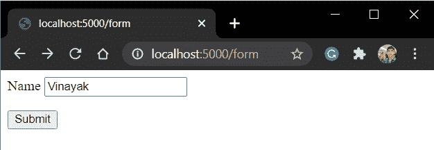
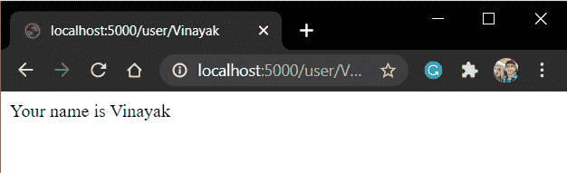

# Flask 重定向–使用 Python Flask 设置 URL 重定向

> 原文：<https://www.askpython.com/python-modules/flask/flask-redirect-url>

在本教程中，我们将学习 flask 重定向以及如何在我们的应用程序中使用它。

## **为什么我们需要设置重定向？**

在开始实现之前，让我们首先知道重定向实际上是什么！

所以顾名思义， **redirect** 函数在被调用时，基本上是将网页重定向到另一个 URL。

它是 web 应用程序的重要组成部分，也提高了应用程序的效率。

*   举个 **Twitter 的例子；**如果你还没有登录，那么当你点击 **Twitter 网址** (www.twitter.com)时，你会首先被重定向到登录页面。这里**重定向功能**发挥了作用。
*   同样，在网上交易中，一旦付款，你会被重定向到确认页面。
*   重定向的另一个好处是它有助于缩短 URL 例如， [https://bit.ly](https://bitly.com/) 。在这里你输入一个短网址，然后被重定向到原来的长网址。

现在我们知道了为什么使用它，让我们进入动手部分。

## **实施烧瓶重定向**

现在，我们将使用 Flask 重定向函数编写一个小应用程序。但是首先，我们将看到**重定向函数的语法。**

### **1。Flask 重定向属性的语法**

重定向的语法:

```py
redirect(location, code, response = None)

```

其中:

*   **位置:**最终网页的目标位置
*   **状态码**:这些是 HTTP 重定向状态码，表示动作的输出。默认为 **302**
*   **响应:**启动响应时使用的响应类别。

我们现在不需要太在意最后一个。其他一些状态代码包括:

| 状态代码 | HTTP 含义 |
| --- | --- |
| **300** | 多选 |
| **301** | 永久移动 |
| **302** | 找到 |
| **303** | 查看其他 |
| **304** | 未修改 |
| **305** | 使用代理 |
| **306** | 内向的; 寡言少语的; 矜持的 |
| **307** | 临时重定向 |

**注意:**在使用之前我们首先需要导入重定向属性。

```py
from flask import redirect

```

### 2.重定向的错误处理

Flask 还有一个针对特殊重定向失败情况的 **abort()** 函数。

**abort()** 函数的语法:

```py
abort(<error_code>)

```

各种错误代码如下:

| 错误代码 | 意义 |
| --- | --- |
| **400** | 错误的请求 |
| **401** | 未经证实的 |
| **403** | 被禁止的 |
| **404** | 未发现 |
| **406** | 不可接受 |
| **415** | 不支持的媒体类型 |
| **429** | 太多请求 |

Error Codes

**注意:**我们也需要首先导入这个属性。

```py
from flask import abort

```

### 3.**我们应用程序的代码**

现在考虑下面的示例代码:

```py
from flask import Flask,render_template,request,redirect

app = Flask(__name__)

@app.route('/form')
def form():
    return render_template('form.html')

@app.route('/verify', methods = ['POST', 'GET'])
def verify():
    if request.method == 'POST':
        name = request.form['name']
        return redirect(f"/user/{name}")

@app.route('/user/<name>')
def user(name):
    return f"Your name is {name}"

app.run(host='localhost', port=5000)

```

这里:

*   **表单**视图只是向用户显示表单模板。
*   当用户提交表单时，表单数据和请求一起被发送到**验证**视图。(看 form.html-动作属性
*   ****验证**视图，从**表单**中取出**姓名**数据，然后将用户重定向到**用户**视图(以及**姓名**数据)。**

**如果你在理解语法上有任何困难，一定要看看我们的 **[对 Flask 文章](https://www.askpython.com/python-modules/flask/create-hello-world-in-flask)** 的介绍。**

****form.html**是:**

```py
<form action="/verify" method = "POST">
    <p>name <input type = "text" name = "name" /></p>
    <p><input type = "submit" value = "Submit" /></p>
</form> 
```

**我们使用一个 Flask 表单从用户那里获取输入，然后将它重定向到一个显示回**名称**的网页。**

**在这里，顺序是:**

*   ****表单功能**显示表单。**
*   **一旦用户提交了他的名字，**验证函数**从表单中取出这个名字，并将他重定向到**用户函数**。**
*   ****用户函数**将名称作为参数，并显示在网页上。**

### ****4。代码的实现****

**现在运行服务器并检查它**

**

Form** 

**点击提交**

**

Redirect** 

**就这样伙计们！！名字出现在那里。**

## ****结论****

**这就是本教程的伙计们！！试着找出如何在你的代码中包含中止功能作为练习。**

**我们将在下一篇文章中看到你们！！在那之前，快乐编码🙂**