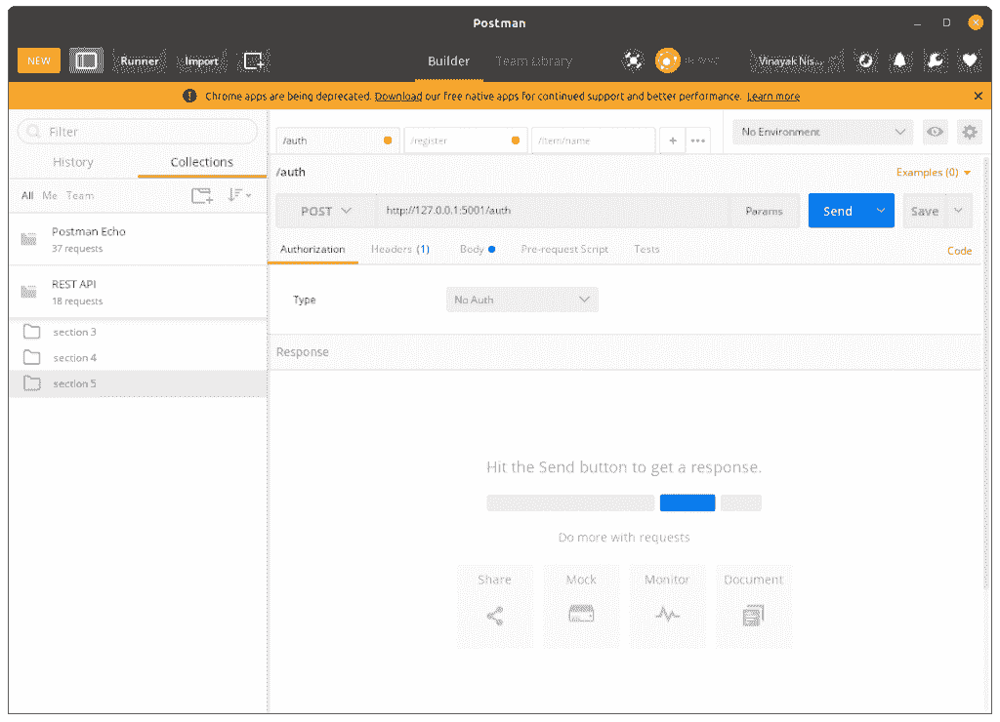

# Flask REST API–为您的 Flask 应用程序设置指南

> 原文：<https://www.askpython.com/python-modules/flask/flask-rest-api>

在本文中，我们将熟悉 API 和 REST API，然后构建我们自己的 Flask REST API 应用程序。

## 什么是 API？

API 或应用程序编程接口提供了与不同应用程序交互的接口。使用 API，我们可以**检索、处理、**和**发送来自其他应用程序的数据****–值**。

例如，考虑一个 Web 应用程序。客户端发送一些数据作为请求，服务器处理这些数据，然后将适当的响应数据发送回客户端。

整个交互过程都是通过 API 完成的。所以让我们再看一下这个例子，看看 API 的作用在哪里。

因此，客户端发送给服务器的是一个包含请求数据的 API。服务器对其进行处理，然后将包含相应响应数据的另一个 API 发送回客户端。

## CRUD 操作符和 HTTP 方法

在使用 API 时，客户端可以通过多种方式向服务器发送请求数据。这些类型被称为 **CRUD** 操作。

每个 CRUD(**Create Retrieve Update Delete**)操作符都有一个与之关联的 HTTP 方法。

现在让我们来看看它们:

*   **GET HTTP Method—**从服务器检索特定信息(用于查看目的)。
*   **POST—**在服务器数据库中发送/创建新信息。
*   **PUT–**编辑/更新数据库中的信息，或者在数据库中没有信息时添加信息。
*   **删除—**从服务器数据库中删除信息。

好了，现在我们知道了这些方法，让我们了解一下什么时候使用它们。考虑下面的例子:

我们有一个学生数据库，包含像姓名、班级、年龄等信息。

*   要**查看**学生列表——使用**获取 HTTP** 的方法
*   给**添加**一个新的学生信息——使用 **POST HTTP** 方法
*   要**编辑**某个学生的某些信息(班级/年龄)——使用 **PUT HTTP** 方法
*   要从数据库中删除学生的信息，请使用 **DELETE HTTP** 方法

## 什么是 REST API？

REST ( *具象状态转移* ) API 类似于标准 API。这里，当我们向服务器发送请求时，不像 API 用数据响应，REST API 用**资源响应。**

### REST API 资源

什么是资源？？

资源是数据，但我们看待它的方式会改变。参考资料类似于[面向对象编程。](https://www.askpython.com/python/oops/object-oriented-programming-python)下面举个例子让我们理解一下:

考虑一个烧瓶视图—“/Book/Book 123”

在这里，同一个视图端点可以执行 4 个操作。

*   获取 **Book/Book123:** 显示关于 **Book123 的信息。**
*   POST **Book/Book123** :创建一本新书“Book123”
*   PUT **Book/Book123** :更新/编辑图书“Book123”的信息
*   删除**图书/图书 123:** 从数据库中删除“图书 123”

由于一个实体有几种功能(OOP 方法)，它可以被认为是一个**图书资源。**

因此，现在客户机和服务器之间的交互不是针对单个端点请求，而是针对资源(针对不同操作的同一个端点)

### REST APIs 的无状态性

REST API 的另一个特性是它的无状态性。这意味着在服务器完成一个动作后，它会忘记它。

我们用一个例子来理解这个。

考虑一下我们上面看到的图书资源。比方说，我使用 POST 方法发送一本书的数据 Stephen Hawkings 的《时间简史》。

服务器会将该信息添加到数据库中，然后忘记该操作。那就是下一次我使用一个 **GET** 请求来检索这本书；服务器将不会有先前 POST 方法操作的任何记忆。

服务器将首先进入数据库并搜索这本书。一旦它找到了这本书，它就会用这些数据来回应。再一次在它完成动作后，它会忘记这件事。

## JSON 在客户机-服务器 API 交互中的应用

**API 使用 JSON 格式**用于**接受**和**返回请求**。

也就是说，客户机将请求数据作为 JSON 文本发送给服务器。类似地，服务器处理数据并将响应作为 JSON 文本再次返回。

因此，一个基于 REST API 的 Web 应用的整个流程如下:

*   用户将请求数据作为 JSON 发送给服务器。
*   服务器首先将 JSON 转换成 python 可读的格式。
*   然后，服务器处理请求并再次创建响应数据作为 JSON
*   然后网页模板将 JSON 响应转换成用户可读的格式，并在网页上显示出来。

因此，API 中客户端(前端)和服务器(后端)之间真正的信息交换是使用 **JSON 文本进行的。**

JSON 格式类似于 Python 字典:

```py
{
    'student1':{
        'name':'XYZ',
        'age' : 21
    }
}

```

## 安装邮递员

Postman 是一个 API 开发的协作平台。Postman 的特性简化了构建 API 的每个步骤，并简化了协作，因此您可以更快地创建更好的 API。

点击这里下载[邮差](https://www.postman.com/api-platform/meet-postman)。安装完成后，它将如下所示:



POSTMAN Window

好了，编码员们！阅读完了，现在让我们开始构建我们的 REST API。

## 构建 Flask REST API 应用程序

在这一节中，我们将使用 **Flask RESTFul** 库构建一个简单的 Book REST API 应用程序。所以让我们开始吧！！

### 1.将 Flask_restful 安装到系统中

要安装 Flask _ RestFull 包，运行 [pip 命令](https://www.askpython.com/python-modules/python-pip):

```py
pip install flask_restful

```

现在已经安装好了，让我们继续数据库部分

### 2.使用 SQLAlchemy 对数据库模型进行编码

这里我们将使用 SQLite 数据库来存储我们的模型。要使用它们，首先安装 **flask_sqlalchemy**

```py
pip install flask_sqlalchemy

```

现在创建一个 **models.py** 文件，并添加以下代码

```py
from flask_sqlalchemy import SQLAlchemy

db = SQLAlchemy()

class BookModel(db.Model):
    __tablename__ = 'books'

    id = db.Column(db.Integer, primary_key=True)
    name = db.Column(db.String(80))
    price = db.Column(db.Integer())
    author = db.Column(db.String(80))

    def __init__(self, name, price, author):
        self.name = name
        self.price = price
        self.author = author 

    def json(self):
        return {"name":self.name, "price":self.price, "author":self.author}

```

这里，BookModel 有一个名称、价格和作者字段。由于 API 在 JSON 中，我们创建了一个对象方法**。json()** 返回一个 JSON book 对象。

我们首先必须实例化一个 DB 实例来创建 DB 模型。如果您对 SQLAlchemy 有任何疑问，请查看我们的 [SQLAlchemy 教程](https://www.askpython.com/python-modules/flask/flask-postgresql)。

既然我们已经有了模型，现在让我们编写主要的 Flask 应用程序。

### 3.编写烧瓶应用程序

对于 Flask REST API，我们需要包含一个额外的 **API(app)** 实例来指示 Flask 这是一个 REST API web app。

```py
from flask import Flask
from flask_restful import Api

app = Flask(__name__)

api = Api(app) #Flask REST Api code 

if __name__ == '__main__':
    app.run(host='localhost', port=5000)

```

接下来，我们需要向 SQLAlchemy 提供 SQLite 信息，并将 DB 实例(form models.py)与这个应用程序文件链接起来。

为此，添加代码:

```py
app.config['SQLALCHEMY_DATABASE_URI'] = 'sqlite:///<db_name>.db'
app.config['SQLALCHEMY_TRACK_MODIFICATIONS'] = False

db.init_app(app)

```

在这里，将 **< db_name >** 替换为您想要的 db 名称。

为了简单起见，SQLALCHEMY_TRACK_MODIFICATIONS 保持 **False** 。

第三行将 DB 实例与应用程序链接起来。我们需要 DB 文件，以便网页用户可以使用它。此外，我们要求在第一个用户请求之前。

因此，为了创建该文件，我们使用函数:

```py
@app.before_first_request
def create_table():
    db.create_all()

```

将它添加到上面给出的代码本身的下面。好了，现在让我们编写 Flask REST API 资源类。

### 4.添加图书列表资源

该资源将完成以下任务:

*   GET 方法:显示数据库中的图书列表
*   发布方法:将新书信息添加到数据库中

所以代码看起来会像这样:

```py
class BooksList(Resource):
    def get(self):
        #get all objects from BookModel
        #return the JSON text of all objects
        pass

    def post(self):
        #convert the JSON data sent by the user to python-format
        #create a new bookModel object and send in the data
        #save to DB
        pass

```

所以代码应该能够完成上面写的任务。现在让我们用实际代码替换注释:

```py
class BooksList(Resource):
    def get(self):
        books = BookModel.query.all()
        return {'Books':list(x.json() for x in books)}

    def post(self):
        data = request.get_json()
        new_book = BookModel(data['name'],data['price'],data['author'])
        db.session.add(new_book)
        db.session.commit()
        return new_book.json(),201

```

在 GET 方法中，

*   使用 **BookModle.query.all()** 获取数据库中的图书
*   将书的 JSON 文本一个一个显示为**列表**

在 POST 方法中，

*   使用 **request.get_json()** 转换 JSON 数据
*   创建新书信息并将其添加到数据库中

就是这样；最后，我们需要提到 BooksList 资源的 URL 端点

```py
api.add_resource(BooksView, '/books')

```

### 5.添加图书资源

现在，我们将创建一个资源，它将:

*   GET 方法:只显示用户请求的特定书籍
*   PUT 方法:编辑特定图书的信息。如果没有，请创建一个
*   删除方法:删除特定的书

这里的代码看起来像这样:

```py
class Book(Resource):
    def get(self,name):
        #get the book with the name given by the user
        #if book exists, return it else return 404 not found 

    def put(self,name):
        #convert the JSON data sent by the user to python-format
        #Search if the book exists
        #if it exists, update it with the data given by the user 
        #if does not exists, create and add the book into DB

    def delete(self,name):
        #Search if the book exists in the DB
        #delete it

```

代码应该能够完成上述所有任务。所以添加代码:

```py
class Book(Resource):
    def get(self,name):
        book = BookModel.query.filter_by(name=name).first()
        if book:
            return book.json()
        return {'message':'book not found'},404

    def put(self,name):
        data = request.get_json()

        book = BookModel.query.filter_by(name=name).first()

        if book:
            book.price = data["price"]
            book.author = data["author"]
        else:
            book = BookModel(name=name,**data)

        db.session.add(book)
        db.session.commit()

        return book.json()

    def delete(self,name):
        book = BookModel.query.filter_by(name=name).first()
        if book:
            db.session.delete(book)
            db.session.commit()
            return {'message':'Deleted'}
        else:
            return {'message': 'book not found'},404

```

在 GET 方法中，

*   **book model . query . filter _ by(name = name)。first()** 返回它从数据库中获得的第一本书。如果找不到任何具有该名称的内容，则返回 None。
*   如果找到，返回书的 JSON 文本。否则返回 404

在 PUT 方法中，

*   使用 **request.get_json()** 转换 JSON 数据
*   搜索书名为的书。
*   如果存在，用新发送的数据替换旧数据
*   或者创建一个新的图书对象
*   将其添加到数据库中

在删除方法中，

*   获取用户给定名称的书籍
*   删除它

就是这样。最后，为这个资源添加 URL 端点

```py
api.add_resource(BookView,'/book/<string:name>')

```

我们完了。！

## Flask Rest API 应用程序的最终代码

因此，下面给出了组合烧瓶的主要应用:

```py
from flask import Flask,request
from flask_restful import Api, Resource, reqparse
from models import db, BookModel

app = Flask(__name__)

app.config['SQLALCHEMY_DATABASE_URI'] = 'sqlite:///data.db'
app.config['SQLALCHEMY_TRACK_MODIFICATIONS'] = False

api = Api(app)
db.init_app(app)

@app.before_first_request
def create_table():
    db.create_all()

class BooksView(Resource):
    '''
    parser = reqparse.RequestParser()
    parser.add_argument('name',
        type=str,
        required=True,
        help = "Can't leave blank"
    )
    parser.add_argument('price',
        type=float,
        required=True,
        help = "Can't leave blank"
    )
    parser.add_argument('author',
        type=str,
        required=True,
        help = "Can't leave blank"
    )'''

    def get(self):
        books = BookModel.query.all()
        return {'Books':list(x.json() for x in books)}

    def post(self):
        data = request.get_json()
        #data = BooksView.parser.parse_args()

        new_book = BookModel(data['name'],data['price'],data['author'])
        db.session.add(new_book)
        db.session.commit()
        return new_book.json(),201

class BookView(Resource):
    '''
    parser = reqparse.RequestParser()
    parser.add_argument('price',
        type=float,
        required=True,
        help = "Can't leave blank"
        )
    parser.add_argument('author',
        type=str,
        required=True,
        help = "Can't leave blank"
        )'''

    def get(self,name):
        book = BookModel.query.filter_by(name=name).first()
        if book:
            return book.json()
        return {'message':'book not found'},404

    def put(self,name):
        data = request.get_json()
        #data = BookView.parser.parse_args()

        book = BookModel.query.filter_by(name=name).first()

        if book:
            book.price = data["price"]
            book.author = data["author"]
        else:
            book = BookModel(name=name,**data)

        db.session.add(book)
        db.session.commit()

        return book.json()

    def delete(self,name):
        book = BookModel.query.filter_by(name=name).first()
        if book:
            db.session.delete(book)
            db.session.commit()
            return {'message':'Deleted'}
        else:
            return {'message': 'book not found'},404

api.add_resource(BooksView, '/books')
api.add_resource(BookView,'/book/<string:name>')

app.debug = True
if __name__ == '__main__':
    app.run(host='localhost', port=5000)

```

**models.py** 文件:

```py
from flask_sqlalchemy import SQLAlchemy

db = SQLAlchemy()

class BookModel(db.Model):
    __tablename__ = 'books'

    id = db.Column(db.Integer, primary_key=True)
    name = db.Column(db.String(80))
    price = db.Column(db.Integer())
    author = db.Column(db.String(80))

    def __init__(self, name, price, author):
        self.name = name
        self.price = price
        self.author = author 

    def json(self):
        return {"name":self.name, "price":self.price, "author":self.author}

```

现在让我们运行我们的服务器，并使用 POSTMAN 检查它们。

## 使用 POSTMAN 实现 Flask REST API 应用程序

运行服务器并转到 POSTMAN。

### 1.图书列表资源:发布方法

使用 POST 方法转到“ **/books** ”端点

在正文中，选择**raw–JSON**并在正文中添加 JSON 数据

```py
{
	"name":"book1",
	"price":123,
	"author":"author1"
}

```

点击发送


POST

图书-**图书 1** 被创建

### 2.图书列表资源:发布方法

使用 GET 方法转到“ **books/** ”并点击 send。您将获得数据库中的图书列表


GET

因为我们只有 **book1** ，所以它在列表中只显示 1 个对象。

### 3.图书资源:获取方法

现在使用 GET 进入“/books/ **book1** ”并点击 send


GET

看，它显示了第一本书的信息

### 4.图书资源:PUT 方法

使用 PUT 方法转到“/books/ **book1** ”，并在正文中添加以下 JSON。

```py
{
	"price": 100,
	"author":"author123"
}

```

由于名称已经通过 URL 请求发送，我们需要发送价格和作者 JSON。

点击发送


PUT

价格和作者价值观都变了！！也尝试使用 GET 方法来检查它们。

### 5.书籍资源:删除方法

使用删除方法转到“/books/ **book1**


DELETE

看到就删！

## 结论

就这样伙计们！希望你对 Flask REST API 框架有了足够的了解。为了更好地理解，请亲自尝试以上代码。

下次见！！