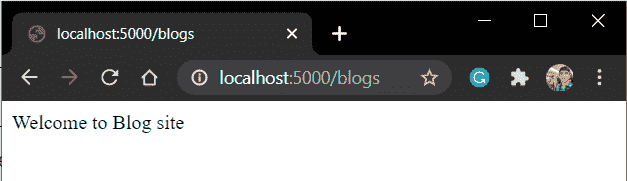
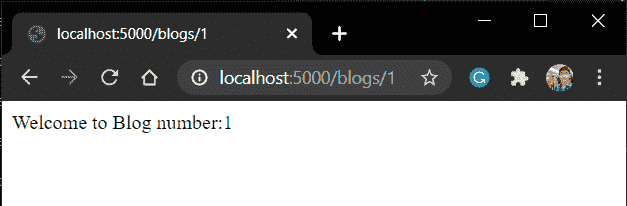

# Flask Route–如何在 Flask 中执行 URL 路由？

> 原文：<https://www.askpython.com/python-modules/flask/flask-route>

本文将处理 Flask route 以在 Flask 中执行 URL 路由，然后在我们的 [flask 应用程序](https://www.askpython.com/python-modules/flask/create-hello-world-in-flask)中实现它。所以让我们开始吧！！

## **什么是 URL 路由？**

URL 路由用于将特定功能(带有网页内容)链接到其网页 URL。

当我们点击一个端点时，网页将显示其内容，这是使用路由链接到 URL 端点的函数的输出。

我们可以通过以下方式进行 URL 路由:

## **如何将 URL 路由到函数**

让我们学习设置烧瓶路线的不同方法。

### **1。使用 app.route()**

这里使用的语法如下:

```py
@app.route('<endpoint>')

```

因此，URL 为–**“localhost:5000/page”**的 Flask 应用程序网页示例如下所示:

```py
from flask import Flask

app = Flask(__name__)

@app.route('/blogs')
def blogs():
    return 'Welcome to Blog site'

app.run(host='localhost', port=5000)

```

**注意:**函数名应该与**端点**名相同。

运行应用程序:

```py
python filename.py

```



Blogs

我们也可以有一个带有可变端点的 URL。此类 URL 用于其功能接受来自用户的参数的网页。

考虑功能:

```py
from flask import Flask

app = Flask(__name__)

@app.route('/blogs/<int:id>')
def blogs(id):
    return f"Welcome to Blog number:{id}"

app.run(host='localhost', port=5000)

```

**注意:**这里非变量端点(**博客**)将是函数名，端点变量( **id** )将是函数的参数。

现在，你可能已经猜到了，基于可变端点，网页将显示不同的输出。



Blog id

### **2。使用 add_url_route()** 属性

当我们需要在不使用 decorators 的情况下在外部路由一个函数时，通常使用这个函数。语法:

```py
app.add_url_route('<url_rule(endpoint_structure)>','<endpoint_name>',<view_function>')

```

因此，请考虑下面的文件:

```py
from flask import Flask

app = Flask(__name__)

def blogs():
    return f"Welcome to Blog Site"

app.add_url_rule('/blogs','blogs', blogs)

app.run(host='localhost', port=5000)

```

这里的输出将和以前一样。


Blogs

**类似地，变量 endpoint 的语法是:**

```py
app.add_url_rule('<url_rule_with_variable>','<endpoint_name>',<view_function>)

```

变量端点文件语法如下:

```py
from flask import Flask

app = Flask(__name__)

def blogs(id):
    return f"Welcome to Blog number:{id}"

app.add_url_rule('/blogs/<int:id>','blogs',blogs)

app.run(host='localhost', port=5000)

```

运行应用程序并注意输出:


Blog 1

这里的输出也和以前一样。

## **结论**

本教程到此为止，各位！为了更好地理解，请亲自尝试上面给出的例子。

下一篇文章再见！到那时，快乐的编码！！