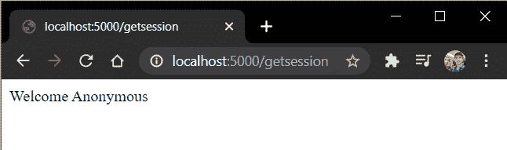

# Flask Sessions–在 Flask 中设置用户会话

> 原文：<https://www.askpython.com/python-modules/flask/flask-sessions>

在本教程中，我们将处理 Flask 会话，并在 Flask Web 应用程序中使用它们。所以让我们开始吧。

## **Flask 中的会话是什么？**

会话的功能类似于 [Flask cookies](https://www.askpython.com/python-modules/flask/flask-cookies) ，除了它们存储在服务器上。

会话基本上是用户登录到服务器的持续时间。在整个会话期间跟踪的数据存储在服务器中。

每个会话都有一个**会话 ID** (用秘密密钥加密)。会话使用唯一的 id 来检索存储的值。每当创建会话时，包含唯一会话 id 的 cookie 就会存储在用户的计算机上。并随每个对服务器的请求一起返回。

当用户再次访问该站点时，他返回包含会话 ID 的 Cookie。然后，服务器读取会话 ID 并检索相应的会话数据。

## 为什么使用会话？

在客户端保存数据(以 cookie 的形式)通常不是一个好主意。其他一些威胁包括:

1.  黑客可以发送一个假的 cookie，并以另一个用户的身份登录来攻击网站。
2.  存储敏感数据，如用户密码等。在 cookies 中是不安全的。
3.  我们只能在 cookies 中存储有限的数据，因为大多数浏览器不允许超过 4kb 的数据。

因此，为了解决这个问题，我们将所有关键用户信息on**保存在服务器本身，并将会话 ID/密钥存储在客户端的计算机上(作为 Cookie)**

## **动手操作设置烧瓶课程**

好了，现在让我们深入到编码部分。在 Flask 中，一个名为**会话对象**的[字典对象](https://www.askpython.com/python/dictionary/python-dictionary-dict-tutorial)用于跟踪会话数据。

语法非常简单:

```py
session['<title>'] = value

```

这就是你设置会话的方式。现在要删除会话信息，我们使用**session . pop(<title>)**函数

```py
session.pop('<title>', None)  

```

让我们考虑一个例子:

```py
@app.route('/setsession')
def setsession():
    session['Username'] = 'Admin'
    return f"The session has been Set"

@app.route('/getsession')
def getsession():
    if 'Username' in session:
        Username = session['Username']
        return f"Welcome {Username}"
    else:
        return "Welcome Anonymous"

@app.route('/popsession')
def popsession():
    session.pop('Username',None)
    return "Session Deleted"

```

这里，

*   **setsession()** 视图将会话用户名设置为
*   如果设置了用户名会话，那么 **getsession()** 视图将显示**欢迎管理员**，否则将简单地返回**欢迎匿名**
*   最后， **popsession()** 视图将从服务器中删除用户名会话。

因此，最终代码将是:

```py
fom flask import Flask, session

app = Flask(__name__)
app.secret_key = "xyz"

@app.route('/setsession')
def setsession():
    session['Username'] = 'Admin'
    return f"The session has been Set"

@app.route('/getsession')
def getsession():
    if 'Username' in session:
        Username = session['Username']
        return f"Welcome {Username}"
    else:
        return "Welcome Anonymous"

@app.route('/popsession')
def popsession():
    session.pop('Username',None)
    return "Session Deleted"

app.run(host='localhost', port=5000)

```

必须提到 **secret_key** ，因为会话使用秘密密钥进行加密。

## 代码的**实现**

就是这样！现在让我们运行服务器并转到" **/setsession** "


Set Session

现在，当我们转到“**/get session**”URL 时，我们必须看到 Welcome Admin。所以让我们试试


Get Session

很好，现在我们将弹出/销毁会话，然后重新访问 **getsession** URL


Pop Session

现在转到" **/getsession** "



Get Session Anonymous

完美！

## **就这样！**

这都是关于烧瓶会议。我们希望你已经学会了设置你的第一次烧瓶会议所需要知道的一切。如果你有任何问题，请在评论中告诉我们。编码快乐！