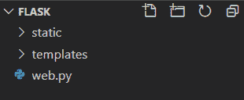

# Flask 静态文件 Python Flask 中静态文件的实现

> 原文：<https://www.askpython.com/python-modules/flask/flask-static-files>

你好，程序员们！这篇文章是关于 Flask 静态文件及其实现的。所以让我们开始吧！

## **对 Flask 中静态文件的需求**

你会发现几乎所有的网站都由照片、背景颜色和许多其他美化元素组成。


Airbnb webstite Example

网站的这种美学本质是通过使用静态文件实现的，静态文件由图像、CSS 文件和 JS 脚本组成。

我们将这些静态文件保存在一个名为 **static** 的独立文件夹中，该文件夹位于我们的主 Flask 应用程序旁边。



Static

现在我们已经有了一些关于静态文件的知识，让我们看看如何实现它们。

## **动手操作烧瓶静态文件**

我们现在将使用 Flask 在我们的网页上显示背景静态文件图像。

### 1.编写我们的主要应用程序

考虑下面的 Flask 应用程序代码

```py
from flask import Flask,render_template

app = Flask(__name__)

@app.route('/blog')
def blog():
    return render_template('blog.html')

app.run(host='localhost', port=5000)

```

这里我们使用 **render_template** 函数渲染一个 HTML [模板](https://www.askpython.com/python-modules/flask/flask-templates)。

如果你在理解应用程序语法上有任何困难，请查看我们的[Flask](https://www.askpython.com/python-modules/flask/create-hello-world-in-flask)介绍文章以获得更好的理解。

### 2.编写我们的模板

这里我们使用特殊的 URL 属性来指定静态文件的位置。

```py
") }}>

```

属性的**URL _ 拉出位于**静态**文件夹内的**文件**的**路径**。**

您可以下载下面的演示图片，并将其保存在*静态*文件夹中。


Blog

现在创建一个“**blog.html**”模板文件，并在其中添加以下代码:

```py
<html>
    <body>
        
        <h2>This is a blog website</h2>
    </body>
</html>

```

请查看我们的 [Flask 模板](https://www.askpython.com/python-modules/flask/flask-templates)文章，了解更多关于 Flask 中渲染模板的信息

### **3。代码的实现**

就是这样；让我们现在运行服务器并检查我们的网页


Static Website

完美！！

## **结论**

本教程到此为止，各位！我希望这篇文章能帮助你提高对 Flask 中静态文件的认识。请查看我们的 Flask 模板文章，了解更多关于模板的信息。

下一篇文章再见！到那时，快乐的编码！！