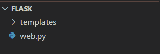
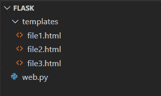
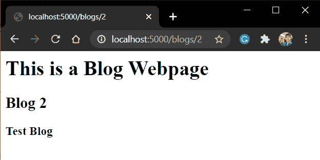

# Flask 模板–在 Python Flask 中设置模板

> 原文：<https://www.askpython.com/python-modules/flask/flask-templates>

嘿伙计们！！欢迎来到我们烧瓶系列的另一个教程。在这篇文章中，我们将了解到 [Flask web 框架](https://www.askpython.com/python-modules/flask)中的模板以及如何使用它们。所以让我们开始吧！

## **什么是模板？**

模板是用来在网站上显示内容的 HTML、CSS、JS 文件。模板美化了网页，让它们看起来更像样。

因此，所有的网站包括前端(由模板组成)和后端(烧瓶框架代码和应用程序)

## Web 模板系统

web 模板系统包括模板引擎、数据源和模板处理器。

在许多情况下，网站还会在其网页上显示数据库中的数据。Web 模板系统就是这样做的。它将来自文件/DB 和 HTML(使用模板语言)的数据组合起来，然后显示在网页上。

**网页模板系统的具体工作如下:**

1.  从数据库中提取所需的数据
2.  使用模板引擎将数据合并到 HTML 文件中(使用模板语言)
3.  模板处理器然后处理它并输出结果模板文件

Flask 使用 **Jinja2** 作为其默认的**模板引擎**。我们将在下一节进一步研究它。

## **神牙模板语言(JTL)**

模板引擎提供了一种模板语言，我们可以用它将数据添加到 HTML 文件中。

Jinja2 是一种现代的、设计者友好的 python 模板语言，模仿 Django 的模板。

我们现在将看到这个模板语言的语法。它包括 4 种类型:

| 类型 | 句法 |
| --- | --- |
| **1)语句标签** | **:** {% if…..else % }–{ % endif % } |
| **2)变量标签** | **{{ }}:** {{ variable }} |
| **3)评论标签** | **{# ...-什么#:# t1 # # comment ... #。到#}** |
| **4)行注释标签** | **#:**#注释行 |

Jinja2 Templating Language

## **在我们的应用程序中添加模板**

Flask 搜索存储在主应用程序文件旁边名为–**templates**的文件夹中的模板。因此，在我们进入下一部分之前，请创建该文件夹。



Templates Folder



Contents of the templates folder

### 1. **Render_template()** 函数

Flask 应用程序使用函数 render_template()呈现模板

语法是:

```py
render_template('<template_file_name.html>', variables = <values> )

```

### 2.**编写我们的烧瓶应用程序**

将代码添加到您的文件 flask 主文件中([参见 flask 简介](https://www.askpython.com/python-modules/flask/create-hello-world-in-flask)

```py
from flask import Flask, render_template

app = Flask(__name__)

@app.route('/blogs/<int:id>')
def blogs(id):
    return render_template('blog.html', number=id)

app.run(host='localhost', port=5000)

```

创建模板**blog.html**:

```py
<html>
    <body>
        <h1>This is a Blog Webpage</h1>
        <h2>Blog {{number}}</h1>
        <h3>Test Blog</h1>
    </body>
</html>

```

**注意**我们如何使用 jinja2 语言的变量标签。

### 3.**运行烧瓶应用程序**

运行服务器，点击网址



Blog 2

瞧啊。

## **结论**

就这些了，伙计们，这篇文章！这都是关于烧瓶模板。为了更好的理解，试着自己做上面的例子。到那时，快乐的编码！！