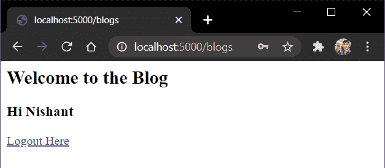

# Flask 用户认证–如何在 Flask 中设置用户登录？

> 原文：<https://www.askpython.com/python-modules/flask/flask-user-authentication>

在本文中，我们将使用 Flask-Login 库和 SQLAlchemy 对 Flask 用户认证进行编码。所以让我们开始吧！

如今，几乎所有的网站都内置了用户认证系统。我们可以直接或通过像谷歌，脸书第三方用户认证设置一个帐户。苹果等。

典型的用户登录页面如下所示:


User Login Page

用户认证是网页的重要部分，因为它保护用户数据，只有特定用户才能访问它。有不同的方法来验证用户:

1.  基于 Cookie 的身份验证
2.  基于令牌的认证
3.  OAuth 认证
4.  OpenId
5.  安全声明标记语言（Security Assertion Markup Language 的缩写）

我们现在将使用 Flask-Login 身份验证进行编码。所以让我们深入到编码部分。

## **动手使用 Flask 用户验证**

**Flask-login** 使用基于 Cookie 的认证。当客户端通过他的凭证登录时，Flask 创建一个包含**用户 ID** 的会话，然后通过 cookie 将**会话 ID** 发送给用户，用户可以使用它在需要时登录和退出。

首先我们需要安装**烧瓶-登录**

```py
pip install flask-login

```

现在已经安装好了，让我们进入编码部分！

## 1.编码 models.py 文件

首先，我们将创建**用户模型**来存储用户凭证。我们将使用 Flask_SQLAlchemy 和 SQLite 数据库来完成这项工作。

这里需要注意的一件重要事情是**我们不能将用户密码**直接保存在数据库中，因为如果某个黑客进入我们的网站，他将能够从数据库中检索所有信息。

所以我们负担不起。但是不要担心，Flask werkzeug 有内置的函数来处理这个问题。

### 1.1 设置密码哈希

解决方案是使用一个**密码散列**。让我们看看什么是散列，因此在终端中进入 python shell 并运行命令

```py
from werkzeug.security import generate_password_hash
a = generate_password_hash('1234')
print(a)

```

我们将得到一个长的随机字符串，如下所示:


Password Hash

因此，即使黑客能够访问它们，他也无法解密。此外，我们还有另一个函数来比较哈希和密码，称为 **check_password_hash** 。

它的工作原理如下:

```py
from werkzeug.security import generate_password_hash, check_password_hash
a = generate_password_hash('1234')
print(a)

chech_password_hash(a,'1234')

```

现在点击回车键，如果匹配将返回**真**，如果不匹配将返回**假**。


Password Hash

### 1.2 向数据库添加哈希密码

同样，如果你没有[烧瓶炼金术](https://www.askpython.com/python-modules/flask/flask-postgresql)，只需使用 [pip 命令](https://www.askpython.com/python-modules/python-pip)安装即可:

```py
pip install flask-sqlalchemy

```

好了，现在 SQLAlchemy 已经就绪，创建一个文件 **models.py** 并添加代码:

```py
from flask_sqlalchemy import SQLAlchemy
from werkzeug.security import generate_password_hash, check_password_hash
from flask_login import UserMixin

db = SQLAlchemy()

class UserModel(UserMixin, db.Model):
    __tablename__ = 'users'

    id = db.Column(db.Integer, primary_key=True)
    email = db.Column(db.String(80), unique=True)
    username = db.Column(db.String(100))
    password_hash = db.Column(db.String())

    def set_password(self,password):
        self.password_hash = generate_password_hash(password)

    def check_password(self,password):
        return check_password_hash(self.password_hash,password)

```

这里:

*   我们正在存储**电子邮件**、**用户名、**和密码散列
*   此外，我们将定义两个类方法——**set _ password**来生成密码散列，以及 **check_password** 来比较它们

我们还使用 flask_login 库中的 UserMixin。UserMixin 有一些内置函数，我们稍后会用到:

*   **is_authenticated:** 如果用户拥有有效凭证，则返回 **True**
*   **is_active:** 如果用户的账户是活动的，则返回 **True** 。Instagram 上所有被禁用的账户将返回**错误。**
*   **is_anonymous:** 为普通用户返回 **False** ，为首次用户/匿名用户返回 **True**
*   **get_id():** 以字符串形式返回用户的唯一标识符。

### 1.3.设置 Flask_login 扩展

此外，我们需要创建并初始化 Flask_login 扩展。我们使用代码:

```py
from flask_login import LoginManager

#...
login = LoginManager()
#...

```

正如我们前面讨论的，Flask 在会话中存储登录用户的用户 ID 。由于 Flask_Login 对数据库一无所知，我们需要创建一个函数来链接这两个数据库。

这是使用**用户加载器**功能完成的。语法是:

```py
from flask_login import LoginManager
login = LoginManager()

@login.user_loader
def load_user(id):
    return UserModel.query.get(int(id))

```

### 1.4.完全码

**models.py** 部分到此为止。让我们只看一下整个代码:

```py
from flask_sqlalchemy import SQLAlchemy
from flask_login import UserMixin
from werkzeug.security import generate_password_hash, check_password_hash
from flask_login import LoginManager

login = LoginManager()
db = SQLAlchemy()

class UserModel(UserMixin, db.Model):
    __tablename__ = 'users'

    id = db.Column(db.Integer, primary_key=True)
    email = db.Column(db.String(80), unique=True)
    username = db.Column(db.String(100))
    password_hash = db.Column(db.String())

    def set_password(self,password):
        self.password_hash = generate_password_hash(password)

    def check_password(self,password):
        return check_password_hash(self.password_hash,password)

@login.user_loader
def load_user(id):
    return UserModel.query.get(int(id))

```

如果你不熟悉 Flask SQLAlchemy，一定要看看我们的文章。

## 2.编写我们的主 Flask 应用程序文件

现在让我们编写主要的 [Flask 应用程序](https://www.askpython.com/python-modules/flask/create-hello-world-in-flask)文件。

```py
from flask import Flask

app =Flask(__name__)

app.run(host='localhost', port=5000)

```

### 2.1 将数据库链接到我们的 Flask 文件

好了，现在我们需要将 SQLite 数据库与 SQLALchemy 连接起来。因此，添加代码:

```py
from flask import Flask

app =Flask(__name__)
app.config['SQLALCHEMY_DATABASE_URI'] = 'sqlite:///<db_name>.db'
app.config['SQLALCHEMY_TRACK_MODIFICATIONS'] = False

app.run(host='localhost', port=5000)

```

只需将 **< db_name >** 替换成你想要的任何名字。此外，我们需要将我们的 SQLAlchemy DB 实例(存在于 **models.py** 文件中)与主应用程序链接起来。为此，添加:

```py
from flask import Flask
from models import db

app =Flask(__name__)
app.config['SQLALCHEMY_DATABASE_URI'] = 'sqlite:///<db_name>.db'
app.config['SQLALCHEMY_TRACK_MODIFICATIONS'] = False

db.init_app(app)
app.run(host='localhost', port=5000)

```

现在，我们必须在第一个用户请求之前添加创建数据库文件的代码。我们的做法如下:

```py
from flask import Flask
from models import db

app =Flask(__name__)
app.config['SQLALCHEMY_DATABASE_URI'] = 'sqlite:///<db_name>.db'
app.config['SQLALCHEMY_TRACK_MODIFICATIONS'] = False

db.init_app(app)
@app.before_first_request
def create_table():
    db.create_all()

app.run(host='localhost', port=5000)

```

现在 DB 部分的一切都结束了。现在让我们转到 Flask_login 部分

### 2.2 向我们的应用添加用户认证

类似于 DB 实例，我们也必须将**登录**实例链接到我们的应用程序。我们通过以下方式实现:

```py
from flask import Flask
from models import login

app =Flask(__name__)

login.init_app(app)

app.run(host='localhost', port=5000)

```

之后，我们告诉 Flask_login 关于页面的情况；未经身份验证的用户将被重定向，这只是登录页面本身。

因此添加代码:

```py
from flask import Flask
from models import login

app =Flask(__name__)

login.init_app(app)
login.login_view = 'login'

app.run(host='localhost', port=5000)

```

提到重定向页面后，我们可以简单地将 **@login_required** 装饰器添加到所有需要认证的网页视图中。

酷！现在唯一剩下的是**登录、注册和注销**视图。但在此之前，让我们编写一个简单的页面，用户可以在认证后看到它

### 2.3 简单视图的编码

因此添加一个简单的视图:

```py
from flask import Flask, render_template
from flask_login import login_required

@app.route('/blogs')
@login_required
def blog():
    return render_template('blog.html')

```

注意我们是如何使用 **@login_required** 装饰器的。blog.html 的**模板将是:**

```py
<h2>Welcome to the Blog</h2>

<h3>Hi {{ current_user.username }}</h3>

<a href="{{ url_for('logout')}}">Logout Here</a>

```

请查看我们的[烧瓶模板](https://www.askpython.com/python-modules/flask/flask-templates)文章，了解更多关于模板的信息。

### 2.3 对登录视图编码

登录视图会很简单。它应该执行以下操作:

*   如果用户已经通过身份验证，重定向到博客页面，否则显示一个 HTML 表单
*   从数据库中检索用户信息
*   比较凭据，如果正确，重定向到博客页面

所以添加代码:

```py
from flask import Flask, request, render_template
from flask_login import current_user, login_user

@app.route('/login', methods = ['POST', 'GET'])
def login():
    if current_user.is_authenticated:
        return redirect('/blogs')

    if request.method == 'POST':
        email = request.form['email']
        user = UserModel.query.filter_by(email = email).first()
        if user is not None and user.check_password(request.form['password']):
            login_user(user)
            return redirect('/blogs')

    return render_template('login.html')

```

和**login.html**模板:

```py
<form action="" method = "POST">
    <p>email <input type = "email" name = "email" /></p>
    <p>password <input type = "password" name = "password" /></p>
    <p> submit <input type = "submit" value = "Submit" /></p>
</form>

<h3>Dont Have an account??</h3>
<h3><a href = "{{url_for('register') }}">Register Here</a></h3>

```

### 2.4 寄存器视图编码

注册视图应该能够执行以下操作:

*   如果用户已经通过身份验证，重定向到博客页面，否则显示一个 HTML 表单
*   将用户数据添加到数据库
*   重定向至登录页面

所以代码将是:

```py
from flask import Flask, request, render_template
from flask_login import current_user

@app.route('/register', methods=['POST', 'GET'])
def register():
    if current_user.is_authenticated:
        return redirect('/blogs')

    if request.method == 'POST':
        email = request.form['email']
        username = request.form['username']
        password = request.form['password']

        if UserModel.query.filter_by(email=email):
            return ('Email already Present')

        user = UserModel(email=email, username=username)
        user.set_password(password)
        db.session.add(user)
        db.session.commit()
        return redirect('/login')
    return render_template('register.html')

```

因此，**register.html**页面将会是:

```py
<form action="" method = "POST">
    <p>email <input type = "email" name = "email" /></p>
    <p>Username <input type = "text" name = "username" /></p>
    <p>password <input type = "password" name = "password" /></p>
    <p> submit <input type = "submit" value = "Submit" /></p>
</form>

<h3>Already Have an Account?</h3><br>
<h3><a href ="{{url_for('login')}}">Login Here</a></h3>

```

### 2.5 对注销视图进行编码

注销视图应该只是让用户注销。因此添加代码:

```py
from flask import Flask, render_template
from Flask_login import logout_user

@app.route('/logout')
def logout():
    logout_user()
    return redirect('/blogs')

```

就是这样！！因此，让我们看一下这一部分的完整代码:

```py
from flask import Flask,render_template,request,redirect
from flask_login import login_required, current_user, login_user, logout_user
from models import UserModel,db,login

app = Flask(__name__)
app.secret_key = 'xyz'

app.config['SQLALCHEMY_DATABASE_URI'] = 'sqlite:///data.db'
app.config['SQLALCHEMY_TRACK_MODIFICATIONS'] = False

db.init_app(app)
login.init_app(app)
login.login_view = 'login'

@app.before_first_request
def create_all():
    db.create_all()

@app.route('/blogs')
@login_required
def blog():
    return render_template('blog.html')

@app.route('/login', methods = ['POST', 'GET'])
def login():
    if current_user.is_authenticated:
        return redirect('/blogs')

    if request.method == 'POST':
        email = request.form['email']
        user = UserModel.query.filter_by(email = email).first()
        if user is not None and user.check_password(request.form['password']):
            login_user(user)
            return redirect('/blogs')

    return render_template('login.html')

@app.route('/register', methods=['POST', 'GET'])
def register():
    if current_user.is_authenticated:
        return redirect('/blogs')

    if request.method == 'POST':
        email = request.form['email']
        username = request.form['username']
        password = request.form['password']

        if UserModel.query.filter_by(email=email).first():
            return ('Email already Present')

        user = UserModel(email=email, username=username)
        user.set_password(password)
        db.session.add(user)
        db.session.commit()
        return redirect('/login')
    return render_template('register.html')

@app.route('/logout')
def logout():
    logout_user()
    return redirect('/blogs')

```

**user model . query . filter _ by(email = email)。first()** 将返回它从数据库中获得的第一个用户，或者如果没有找到用户，将返回 **None** 。

## Flask 用户认证应用程序的**实现**

让我们最后测试一下我们的应用程序。运行烧瓶文件:

```py
python filename.py

```

并且尽量去“**/博客**”。你将被重定向到**登录**页面。


Login

点击注册，然后添加您的详细信息。


Register

点击提交，你将回到登录页面。这一次输入您的凭证并登录。您将看到博客页面！！



Blogs

**注意:**使用简单的电子邮件，如 **[【电子邮件保护】](/cdn-cgi/l/email-protection)** 可能会在 Chrome 浏览器中出现如下所示的错误。


Redirect To Blog Successful Login

如您所见，我们已经被重定向到“博客”端点。我在上面的截图中弹出了一条安全信息，因为我使用了一个随机的不存在的非常弱的密码。

你可以用一个更强的密码和一个好的电子邮件地址做同样的尝试，你会直接看到博客页面，而不是在这种情况下的安全警告。

## **结论**

就这样，伙计们！这都是关于 Flask 中的用户认证。一定要看看我们的[烧瓶会议](https://www.askpython.com/python-modules/flask/flask-sessions)和[饼干](https://www.askpython.com/python-modules/flask/flask-cookies)文章，以了解它们是如何工作的。

在下一篇文章中，我们将把我们的应用程序部署到云服务器上。