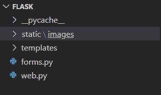
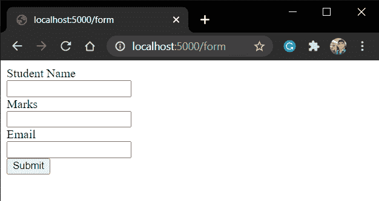
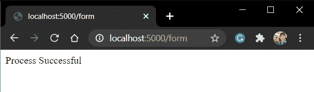

# 烧瓶 WT 表格

> 原文：<https://www.askpython.com/python-modules/flask/flask-wt-forms>

欢迎来到本教程！今天我们将研究 Flask web 框架中的一个表单库，称为 Flask WT Forms。

## **对烧瓶 WT 形式的需求**

虽然 HTML 表单可以使用，但是它们有一些缺点:

*   在客户端 HTML 表单和服务器端 Flask 应用程序之间没有直接链接。也就是说，表单数据与请求对象一起从客户端(用户)发送到服务器端。因此 Flask View 必须重新创建表单元素来处理它们。
*   HTML 表单很难实时动态呈现。
*   HTML 表单不提供验证用户输入的方法。

因此，在我们的应用程序代码中最好使用 Flask WT 表单。

## **建立烧瓶 WT 表单**

理解它的最好方法是我们自己去尝试。在本节中，我们将做到这一点！所以系好安全带，让我们开始吧。

### 1.**将** ing WT 表单安装到您的系统中

要使用 WT 表单，我们必须首先安装它。这里我们使用 [PIP](https://www.askpython.com/python-modules/python-pip) 来安装它。因此，在您的终端中，运行命令

```py
pip install flask-wtf

```

好了，现在我们可以使用它了。

### **2。在 Forms.py 文件中编写一个简单的 WT 表单**

WT 表格应存在于单独的“ **forms.py** ”文件中。因此，在主烧瓶文件旁边创建一个新的 **forms.py** 文件。



File Location

WT 格式的语法如下所示:

```py
from flask_wtf import Form
from wtforms import Field1, Field2, Field3 ......, SubmitField

class FormName(Form):
   Fied1_name = Field1("Display_name")
   Fied2_name = Field2("Display_name")
   Fied3_name = Field3("Display_name")

   submit = SubmitField("Submit")

```

这里，表单类中的字段可以是:

| 表单字段 | 描述 |
| --- | --- |
| **文本字段** | 它类似于 HTML 表单属性中的输入类型–**文本** |
| **布尔字段** | 它类似于 HTML 表单属性中的输入类型–**复选框** |
| **十进制字段** | 它是显示带小数位的数字的文本字段 |
| **整数文件** | 这是显示整数的文本字段 |
| **无线电场** | 它指示单选按钮 HTML 表单元素 |
| **选择字段** | 它指示选择表单元素 |
| **文本区域字段** | 它类似于 HTML 表单属性中的输入类型-文本区域 |
| **密码字段** | 它将密码作为用户输入的表单。 |
| **提交字段** | 它类似于 HTML 表单属性中的输入类型–**Submit** |

Form Fields

我们还可以在表单域中添加验证器。现在让我们在 forms.py 文件中编写一个简单的学生表单:

```py
from flask_wtf import Form
from wtforms import TextField, IntegerField, SubmitField
from wtforms import validators, ValidationError

class StudentForm(Form):
   name = TextField("Student Name", [validators.Required("Please enter your name")])
   marks = IntegerField("Marks", [validators.Required("Please enter your marks")])
   email = TextField("Email",[validators.Required("Please enter your email"),validators.Email("Invalid email address")])

   submit = SubmitField("Submit")

```

如果您的设备中没有安装 **email_validator** ，您可能会得到一个错误。要解决这个问题，只需安装 **email_validator** :

```py
pip install email_validator

```

就这样，现在可以工作了。

### 3.**编码主烧瓶文件**

现在，我们将把表单包含在主文件中。考虑以下代码:

```py
from flask import Flask,render_template, request
from forms import StudentForm

app = Flask(__name__)
app.secret_key = 'form_csrf_token_security_key'

@app.route('/form', methods = ['POST', 'GET'])
def FormView():
    form = StudentForm()

    if request.method =='POST':
        form = StudentForm()
        if form.validate()== True:
            return "Process Successful"
        return render_template('form.html', form = form)

    return render_template('form.html', form = form)

app.run(host='localhost', port=5000)

```

这里:

*   我们把表单称为类对象。当用户第一次打开站点时( **GET** 方法)， **StudentForm()** 将为空。因此我们将得到一个空的表单。
*   当他提交表单( **POST** 方法)时， **StudentForm()** 类对象现在包含了用户数据。如果数据有效，它将返回-"**流程成功。**

这是我们在这里使用的代码逻辑👆。

需要**密钥**来解锁 HTML 表单模板中的 CSRF 安全令牌。

### **4。为表单**创建模板

现在，为了向用户显示表单，我们必须将它包含在 HTML 模板文件中。在 HTML 中包含 WT 格式的语法是:

```py
<form action = "http://localhost:5000/endpoint" method = post>
{{ form.hidden_tag() }}
         {{ form.field_name1.label }}<br>
         {{ form.field_name1 }}
         <br>

         {{ form.field_name2.label }}<br>
         {{ form.field_name2 }}
         <br>

         {{ form.field_name3.label }}<br>
         {{ form.field_name3 }}
         <br>

         {{ form.submit }}
</form>

```

这里，

*   **{{ form.hidden_tag() }}** 是隐藏的 CSRF 令牌字段，它获取主 Flask 应用程序文件中提到的安全密钥。
*   {{ **form.field.Label** }}表示字段名称。
*   {{ **form.field** }}表示字段输入框。

因此，我们学生表单的模板文件“**form.html**”将是:

```py
<form action = "http://localhost:5000/form" method = post>
{{ form.hidden_tag()}}
         {{ form.name.label }}<br>
         {{ form.name }}
         <br>

         {{ form.marks.label }}<br>
         {{ form.marks }}
         <br>

         {{ form.email.label }}<br>
         {{ form.email }}
         <br>

         {{ form.submit }}
</form>

```

请查看我们的[烧瓶模板](https://www.askpython.com/python-modules/flask/flask-templates)文章，了解更多关于模板的信息

### **5。实施**烧瓶应用程序

编码部分就这样了！！现在让我们启动服务器

```py
python filename.py

```

转到“**/表格**



WT Form

输入详细信息，然后点击提交。



Success Page

不错！！

## **结论**

就这样，伙计们！！这都是关于烧瓶 WT 的形式。请查看我们的 [Flask Forms](https://www.askpython.com/python-modules/flask/flask-forms) 文章，了解更多关于 Flask HTML 表单的信息。要了解更多关于 Flask WT 表单的信息，请在这里阅读[文档](https://flask.palletsprojects.com/en/2.0.x/)。

我们将在下一篇文章中看到你们。到那时，快乐的编码！！