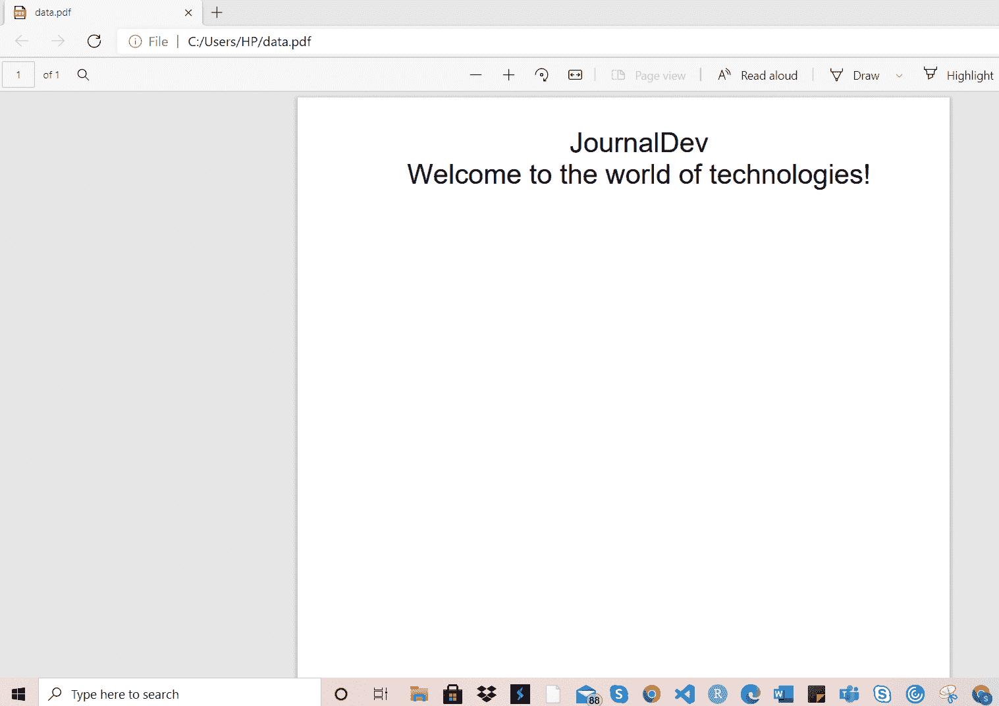

# Python fpdf 模块——如何将数据和文件转换成 pdf？

> 原文：<https://www.askpython.com/python-modules/fpdf-module-convert-to-pdf>

读者朋友们，你们好！在本文中，我们将学习使用 Python 中的 fpdf 模块将文本数据和文件转换成 pdf 格式。

所以，让我们开始吧！

* * *

## 使用 fpdf 模块将数据/文件转换为 pdf

Python 为我们提供了大量的库来执行实时转换，并通过自动化来解决现实生活中的问题。

当涉及到数据传输或将数据转换成特定格式的文件时，Python 确实为我们提供了一些执行这些操作的函数。

使用 Python，我们可以自动完成将数据转换和存储为 PDF 表单的整个过程。使用 Python 中的 fpdf 模块，这是可能的。

当我们想要自动将数据直接传输到 pdf 而不需要任何手动干预时，这种情况很有帮助。您甚至可以将文件发送到系统本地的特定存储位置，甚至可以发送到一些公共、私有云存储上。

今天，在本文中，我们将使用 Python 中的 fpdf 模块执行以下两项任务:

*   **将脚本生成的文本数据存储为 PDF 格式。**
*   **将文本文件转换成 PDF 格式。**

所以，让我们开始吧！

* * *

## 1.将数据存储为 PDF 格式

最初，在本节中，我们尝试将脚本生成的文本数据存储到 PDF 表单的特定位置。

为了达到同样的目的，我们必须从 fpdf 模块中导入 FPDF 类。此外，我们需要在 pdf 中创建一个页面，以便在其上打印数据。这可以使用 add_page()方法来实现。函数的作用是:设置文本的属性，比如文本的字体，字母的大小等等。

创建页面后，我们现在使用 cell()函数来设置分页的宽度和高度，并设置要粘贴到新创建的 pdf 文件中的数据。

最后，我们使用 output()函数将数据打印到所创建的 PDF 文件中的指定位置。

**举例:**

```py
from fpdf import FPDF 
pdf = FPDF() 

pdf.add_page() 

pdf.set_font("Arial", size = 25) 

# create a cell 
pdf.cell(200, 10, txt = "JournalDev", 
		ln = 1, align = 'C') 

pdf.cell(200, 10, txt = "Welcome to the world of technologies!", 
		ln = 2, align = 'C') 

pdf.output("data.pdf") 

```

**输出:**



Text To PDF

* * *

## 2.Python 中文本文件到 PDF 文件的转换

已经将脚本生成的文本文件存储为 PDF 表单，现在让我们使用 fpdf 模块将本地可用的文本文件转换为 PDF 表单。

同样，我们需要使用 file.open()函数以“读取”模式打开文本文件。之后，我们在 for 循环中遍历数据，然后使用 cell()函数将遍历的数据存储到 PDF 表单中。

最后，我们使用 output()函数在指定的位置以指定的名称创建设计好的 PDF。

**举例:**

```py
from fpdf import FPDF 
pdf = FPDF() 

pdf.add_page() 

pdf.set_font("Arial", size = 25) 

# create a cell 
file = open("data.txt", "r") 

# insert the texts in pdf 
for g in file: 
    pdf.cell(200, 10, txt = g, ln = 1, align = 'C') 

pdf.output("PDF.pdf") 

```

**输出:**


Text File To PDF

* * *

## 结论

到此，我们就结束了这个话题。如果你遇到任何问题，欢迎在下面评论。

更多与 Python 编程相关的帖子，敬请关注我们！

在那之前，学习愉快！！🙂