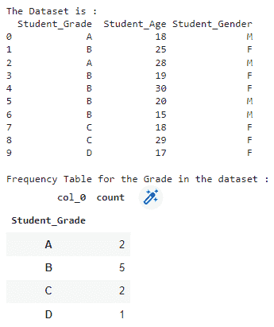
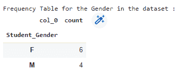
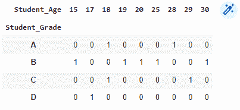
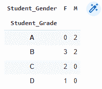

# Python 中频率表的介绍

> 原文：<https://www.askpython.com/python/examples/frequency-tables>

描述几个类别出现频率的表格称为**频率表**。这种特殊的表特别有助于了解数据集中包含的值的分布情况。本教程将带您完成用 Python 创建频率表的过程。我们将在接下来的几节中以不同的方式介绍相同的实现。

***也读作:[计算熊猫数据帧行数的 6 种方法](https://www.askpython.com/python-modules/pandas/count-pandas-dataframe-rows)***

* * *

## 方法 1–借助 value_counts()函数

第一种方法是利用`value_counts()`函数，该函数将返回一个包含所有值列表中唯一值的计数的序列。结果将按照`descending`的顺序排列，这意味着第一个元素是最频繁出现的元素。

```py
import pandas as pd

data = pd.Series([1, 2, 5, 2, 3, 3, 3, 3, 4, 4, 5])

print("The Dataset is : ")
print(data)

print("\nFrequency Table for the data : ")
print(data.value_counts())

```

```py
The Dataset is : 
0     1
1     2
2     5
3     2
4     3
5     3
6     3
7     3
8     4
9     4
10    5
dtype: int64

Frequency Table for the data : 
3    4
2    2
5    2
4    2
1    1

```

* * *

## 方法 2–借助**交叉表**()函数

我们可以用来显示熊猫数据帧频率的另一个函数是 **`crosstab()`** 函数，如下面的代码所示。我们将创建一个数据帧，然后为数据帧的两列创建频率表。

```py
df = pd.DataFrame({'Student_Grade': ['A','B','A','B','B', 'B', 'B', 'C', 'C', 'D'],
                   'Student_Age': [18, 25, 28, 19, 30, 20, 15, 18, 29, 17],
                   'Student_Gender': ['M','F', 'M', 'F', 'F', 'M', 'M', 'F', 'F', 'F']})

print("The Dataset is : ")
print(df)

print("\nFrequency Table for the Grade in the dataset : ")
pd.crosstab(index=df['Student_Grade'], columns='count')

```



Crosstab Output Screenshot

```py
print("\nFrequency Table for the Gender in the dataset : ")
pd.crosstab(index=df['Student_Gender'], columns='count')

```



Crosstab Output Screenshot 2

* * *

## 高级频率表(双向表)

我们还可以创建一个**双向频率表**来显示我们在上一节中使用的数据集中两个不同列的频率。下面的代码显示了两列 Age 和 Grade 的双向频率表。

```py
pd.crosstab(index=df['Student_Grade'], columns=df['Student_Age'])

```



Two Way Freq Table Output 1

我们还将在性别和年级两栏之间开发一个双向频率表。看看下面的代码。

```py
pd.crosstab(index=df['Student_Grade'], columns=df['Student_Gender'])

```



Two Way Freq Table Output 2

* * *

感谢您的阅读！我希望你理解了教程😃

我建议您也阅读以下教程:

1.  [Python 中的计算精度—分类误差度量](https://www.askpython.com/python/examples/calculating-precision)
2.  [Python 中的卡方检验——您需要知道的一切！！](https://www.askpython.com/python/examples/chi-square-test)
3.  [泛 NumPy 三角函数认识](https://www.askpython.com/python/numpy-trigonometric-functions)

* * *