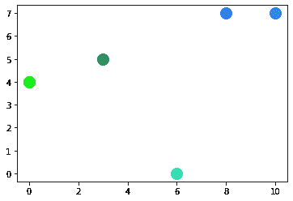

# 在 Python 中生成随机颜色的方法

> 原文：<https://www.askpython.com/python/examples/generate-random-colors>

嘿伙计们！在本教程中，我们将看看如何在 Python 中生成随机颜色。我们将创建两种不同形式的颜色。像 [Numpy](https://www.askpython.com/python/examples/nan-in-numpy-and-pandas) 、 [Matplotlib](https://www.askpython.com/python-modules/matplotlib/python-matplotlib) 、 [turtle](https://www.askpython.com/python-modules/python-turtle) 这样的 Python 模块都可以用来产生颜色。

* * *

## 使用 random()函数生成随机颜色

```py
import random
for i in range(3):
  r = random.randint(0,255)
  g = random.randint(0,255)
  b = random.randint(0,255)
  rgb = [r,g,b]
  print('A Random color is :',rgb)

```

首先，在 Python 中导入 random 函数来获得随机颜色。变量 r 代表红色，g 代表绿色，b 代表蓝色。我们已经知道 RGB 格式包含一个从 0 到 255 的整数值。

因此，我们将范围设置为 0 到 255。它将使用范围内的任何值。 **random.randint()** 是确定范围的方法。

```py
A Random color is : [222, 169, 158]
A Random color is : [66, 19, 84]
A Random color is : [157, 146, 62]

```

* * *

## 使用 Numpy 模块生成随机颜色

```py
import numpy as np
for i in range(3):
  random_color=list(np.random.choice(range(255),size=3))
  print("A Random color is: ",random_color)

```

然后在可变随机颜色中为颜色指定一个值和大小。因为我们是以列表的形式开始的，所以颜色会出现在列表中—接下来，打印随机颜色。

```py
A Random color is: [241, 4, 161]
A Random color is: [96, 48, 224]
A Random color is: [228, 20, 55]

```

* * *

## 使用 Matplotlib 库生成随机颜色

```py
import matplotlib.pyplot as plt
import random
no_of_colors=5
color=["#"+''.join([random.choice('0123456789ABCDEF') for i in range(6)])
       for j in range(no_of_colors)]
print(color)
for j in range(no_of_colors):
    plt.scatter(random.randint(0,10),random.randint(0,10),c=color[j],s=200)
plt.show()

```

在名为“颜色数量”的变量中，指定一个值。然后使用 join()方法将#和颜色代码连接起来。颜色代码总是以#开头。若要迭代，请将用于循环。颜色代码现已生成。

因为我们是以列表的形式开始的，所以颜色会出现在列表中—接下来，打印随机颜色。



Random Colors Using Matplotlib Output

* * *

## 结论

恭喜你！您刚刚学习了如何以不同的方式生成随机颜色。希望你喜欢它！😇

喜欢这个教程吗？无论如何，我建议你看一下下面提到的教程:

1.  [使用直方图可视化图像中的颜色–Python OpenCV](https://www.askpython.com/python/visualizing-colors-in-images)
2.  [Python colorsys 模块](https://www.askpython.com/python-modules/colorsys-module)

感谢您抽出时间！希望你学到了新的东西！！😄