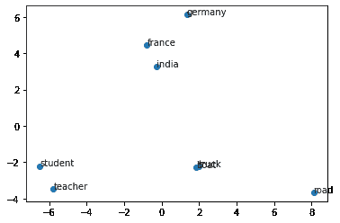

# gensim word 2 vec–完整指南

> 原文：<https://www.askpython.com/python-modules/gensim-word2vec>

Word2Vec 是一种算法，它将单词转换为向量，从而将相似的单词分组到向量空间中。它广泛应用于许多领域，如文档检索、机器翻译系统、自动补全和预测等。在本教程中，我们将学习如何使用 Gensim 库训练 Word2Vec 模型，以及加载将单词转换为向量的预训练。

## Word2Vec

Word2Vec 是谷歌设计的一种算法，它使用神经网络来创建单词嵌入，使得具有相似词义的嵌入往往指向相似的方向。例如，在向量空间中，像爱、关心等词的嵌入与像打架、战斗等词的嵌入相比，将指向相似的方向。这种模型还可以检测给定单词的同义词，并为部分句子建议一些附加单词。

## Gensim Word2Vec

Gensim 是一个开源的 Python 库，可用于主题建模、文档索引以及消除与大型语料库的相似性。Gensim 的算法相对于语料库的大小是独立于内存的。它也被设计用来扩展其他向量空间算法。

Gensim 在`Word2Vec`类中提供了 Word2Vec 算法的实现以及其他一些自然语言处理的功能。让我们看看如何使用 Gensim 创建 Word2Vec 模型。

### 使用 Gensim 开发一个 Word2Vec 模型

Gensim Word2Vec 类采用的一些有用参数:

*   句子:它是模型被训练来创建单词嵌入的数据。在大型语料库的情况下，它可以是标记/单词列表的列表，或者来自网络/磁盘的数据流。在我们的例子中，我们将使用出现在[](https://www.askpython.com/python-modules/tokenization-in-python-using-nltk)**中的棕色语料库。**
*   **size:它表示对于词汇表中的每个单词，您希望向量的维数是多长。其默认值为 100。**
*   **窗口:当前单词与其相邻单词之间的最大距离。如果您的相邻单词大于宽度，那么，一些相邻单词将不会被认为与当前单词相关。其默认值为 5。**
*   **min_count:它表示单词在词汇表中出现的最小频率值。其默认值为 5。**
*   **iter:它表示数据集上迭代/历元的数量。其默认值为 5。**

### **在 Python 中使用 Word2Vec 的示例**

```py
import string
import nltk
from nltk.corpus import brown
from gensim.models import Word2Vec
from sklearn.decomposition import PCA
from matplotlib import pyplot

nltk.download("brown")

# Preprocessing data to lowercase all words and remove single punctuation words
document = brown.sents()
data = []
for sent in document:
  new_sent = []
  for word in sent:
    new_word = word.lower()
    if new_word[0] not in string.punctuation:
      new_sent.append(new_word)
  if len(new_sent) > 0:
    data.append(new_sent)

# Creating Word2Vec
model = Word2Vec(
    sentences = data,
    size = 50,
    window = 10,
    iter = 20,
)

# Vector for word love
print("Vector for love:")
print(model.wv["love"])
print()

# Finding most similar words
print("3 words similar to car")
words = model.most_similar("car", topn=3)
for word in words:
  print(word)
print()

#Visualizing data
words = ["france", "germany", "india", "truck", "boat", "road", "teacher", "student"]

X = model.wv[words]
pca = PCA(n_components=2)
result = pca.fit_transform(X)

pyplot.scatter(result[:, 0], result[:, 1])
for i, word in enumerate(words):
	pyplot.annotate(word, xy=(result[i, 0], result[i, 1]))
pyplot.show() 
```

****输出:****

```py
Some Output[nltk_data] Downloading package brown to /root/nltk_data...
[nltk_data]   Unzipping corpora/brown.zip.
Vector for love:
[ 2.576164   -0.2537464  -2.5507743   3.1892483  -1.8316503   2.6448352
 -0.06407754  0.5304831   0.04439827  0.45178193 -0.4788834  -1.2661372
  1.0238386   0.3144989  -2.3910248   2.303471   -2.861455   -1.988338
 -0.36665946 -0.32186085  0.17170368 -2.0292065  -0.9724318  -0.5792801
 -2.809848    2.4033384  -1.0886359   1.1814215  -0.9120702  -1.1175308
  1.1127514  -2.287549   -1.6190344   0.28058434 -3.0212548   1.9233572
  0.13773602  1.5269752  -1.8643662  -1.5568101  -0.33570558  1.4902842
  0.24851061 -1.6321756   0.02789219 -2.1180007  -1.5782264  -0.9047415
  1.7374605   2.1492126 ]

3 words similar to car
('boat', 0.7544293403625488)
('truck', 0.7183066606521606)
('block', 0.6936473250389099) 
```

**

Word2Vec Visualization** 

**在上面的可视化中，我们可以看到单词 student 和 teacher 指向一个方向，像印度、德国和法国这样的国家指向另一个方向，而像 road、boat 和 truck 这样的单词指向另一个方向。这表明我们的 Word2Vec 模型已经学习了可以根据词义区分单词的嵌入。**

### **使用 Gensimd 加载预训练模型**

**正如我们在下面看到的，Gensim 还带有几个已经预先训练好的模型。**

```py
import gensim
import gensim.downloader

for model_name in list(gensim.downloader.info()['models'].keys()):
  print(model_name) 
```

```py
fasttext-wiki-news-subwords-300
conceptnet-numberbatch-17-06-300
word2vec-ruscorpora-300
word2vec-google-news-300
glove-wiki-gigaword-50
glove-wiki-gigaword-100
glove-wiki-gigaword-200
glove-wiki-gigaword-300
glove-twitter-25
glove-twitter-50
glove-twitter-100
glove-twitter-200
__testing_word2vec-matrix-synopsis 
```

**让我们加载`word2vec-google-news-300`模型并执行不同的任务，例如查找首都和国家之间的关系、获取相似的单词以及计算余弦相似度。**

```py
import gensim
import gensim.downloader

google_news_vectors = gensim.downloader.load('word2vec-google-news-300')

# Finding Capital of Britain given Capital of France: (Paris - France) + Britain = 
print("Finding Capital of Britain: (Paris - France) + Britain")
capital = google_news_vectors.most_similar(["Paris", "Britain"], ["France"], topn=1)
print(capital)
print()

# Finding Capital of India given Capital of Germany: (Berlin - Germany) + India = 
print("Finding Capital of India: (Berlin - Germany) + India")
capital = google_news_vectors.most_similar(["Berlin", "India"], ["Germany"], topn=1)
print(capital)
print()

# Finding words similar to BMW
print("5 similar words to BMW:")
words = google_news_vectors.most_similar("BMW", topn=5)
for word in words:
  print(word)
print()

# Finding words similar to Beautiful
print("3 similar words to beautiful:")
words = google_news_vectors.most_similar("beautiful", topn=3)
for word in words:
  print(word)
print()

# Finding cosine similarity between fight and battle
cosine = google_news_vectors.similarity("fight", "battle")
print("Cosine similarity between fight and battle:", cosine)
print()

# Finding cosine similarity between fight and love
cosine = google_news_vectors.similarity("fight", "love")
print("Cosine similarity between fight and love:", cosine) 
```

****输出**:**

```py
[==================================================] 100.0% 1662.8/1662.8MB downloaded
Finding Capital of Britain: (Paris - France) + Britain
[('London', 0.7541897892951965)]

Finding Capital of India: (Berlin - Germany) + India
[('Delhi', 0.72683185338974)]

5 similar words to BMW:
('Audi', 0.7932199239730835)
('Mercedes_Benz', 0.7683467864990234)
('Porsche', 0.727219820022583)
('Mercedes', 0.7078384757041931)
('Volkswagen', 0.695941150188446)

3 similar words to beautiful:
('gorgeous', 0.8353004455566406)
('lovely', 0.810693621635437)
('stunningly_beautiful', 0.7329413890838623)

Cosine similarity between fight and battle: 0.7021284

Cosine similarity between fight and love: 0.13506128 
```

## **结论**

**恭喜你！现在您已经知道了 Word2Vec 以及如何创建自己的模型来将单词转换成[向量](https://www.askpython.com/python-modules/numpy/vectorization-numpy)。Word2Vec 广泛应用于许多领域，如文档相似性和检索、机器翻译等。现在您也可以在您的项目中使用它。**

**感谢阅读！**