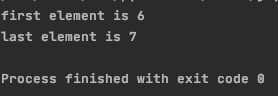
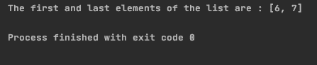
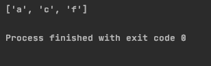

# 如何获取一个 Python 列表的第一个和最后一个元素？

> 原文：<https://www.askpython.com/python/list/get-first-last-elements-python-list>

序列数据是最常见的可用数据形式。一个 [Python 列表](https://www.askpython.com/python/list/python-list)是 Python 中存储序列数据最常用的方式。

## 读取 Python 列表的第一个和最后一个元素

列表中的元素从零开始编号。在本教程中，我们将学习访问列表中第一个和最后一个元素的不同方法。

让我们从初始化一个列表开始。

### 1.初始化 Python 列表

要在 Python 中初始化列表，请使用:

```py
a = [6, 5, 9, 7]

```

这将用我们提到的四个元素初始化一个新的列表**a**。

### 2.访问列表元素

您可以通过使用列表名称和索引号来访问列表中的元素。要打印第一个元素，请使用:

```py
print(a[0])

```

要打印最后一个元素，请使用:

```py
print(a[-1])

```

使用 **-1** 作为索引给我们列表中的**最后一个元素**。

### Python 代码获取列表的第一个和最后一个元素

完整的代码如下:

```py
a = [6, 5, 9, 7]
print("first element is" ,a[0])
print("last element is", a[-1])

```

**输出**



## 使用切片来检索第一个和最后一个元素

要使用[切片](https://www.askpython.com/python/array/array-slicing-in-python)访问列表的第一个和最后一个元素，请使用以下代码行:

```py
ans = a[::len(a)-1]

```

这将把第一个和最后一个元素存储到 **ans** 变量中。

### 分割 Python 列表的代码

```py
a = [6, 5, 9, 7]
ans = a[::len(a)-1]
print ("The first and last elements of the list are : " + str(ans))

```



Output

## 获取列表中每个元组的第一个元素

这个案例与上面的例子有一点不同。这里我们有一个[元组](https://www.askpython.com/python/tuple/python-tuple)作为列表的一个元素。元组列表如下所示:

```py
[("a", "b", "c"), ("c", "d", "e"), ("f","g","h")]

```

我们必须得到每个元组的第一个元素。

多亏了 Python，我们可以通过使用[列表理解](https://www.askpython.com/python/list/python-list-comprehension)只用一行代码就做到这一点。

```py
first_tuple_elements = [a_tuple[0] for a_tuple in tuple_list]

```

这将创建元组的所有第一个元素的列表。要获得所有元组的最后一个元素，请用-1 替换 0。

```py
first_tuple_elements = [a_tuple[-1] for a_tuple in tuple_list]

```

这将创建一个包含元组中最后一个柠檬的列表。

### 检索列表中元组的第一个和最后一个元素

完整的代码如下:

```py
tuple_list = [("a", "b", "c"),("c", "d", "e"), ("f","g","h")]
first_tuple_elements = [a_tuple[0] for a_tuple in tuple_list]
print(first_tuple_elements)

```



要从所有元组中获取最后的元素:

```py
tuple_list = [("a", "b", "c"),("c", "d", "e"), ("f","g","h")]
first_tuple_elements = [a_tuple[-1] for a_tuple in tuple_list]
print(first_tuple_elements)

```

## 结论

本教程是关于在 Python 中获取列表的第一个和最后一个元素。