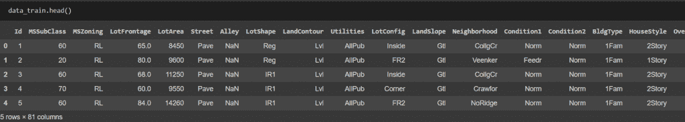
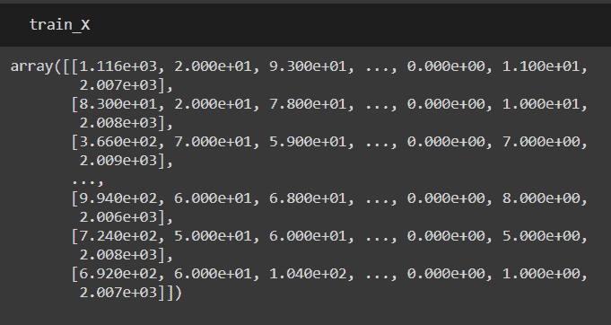
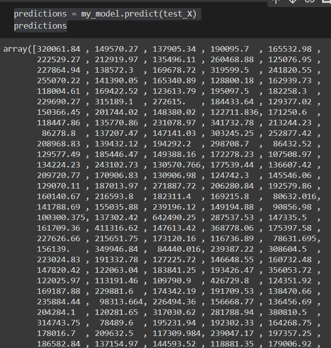

# 使用 Python XGBoost 进行梯度增强

> 原文：<https://www.askpython.com/python/examples/gradient-boosting>

我过去参加过很多 Kaggle 比赛，在过去的 3-4 年里，所有的顶级获奖作品都使用了某种形式的渐变效果。所以，今天我们就来仔细看看。

## 什么是梯度增强？

**集成学习**:为了获得比单独从任何组成学习算法中提取的预测效率更高的预测效率，集成方法使用多种学习算法。

个体模型中存在偏差或方差是很常见的，这就是为什么我们需要学习集成学习。

**装袋**和**助推**是两种最常见的合奏技术。

*   **装袋**:大量模型平行训练。每个模型由数据的随机子集训练。
*   **助推**:顺序示教大量附加模型。从先前模型所犯的错误中，每个特定的模型都会学习。

虽然你之前已经学过**装袋**技术(比如[随机森林](https://www.askpython.com/python/examples/random-forest-regression))，但是让我们来看看什么是助推。

一类[机器学习算法](https://www.askpython.com/python/examples/knn-in-python)，将几个弱学习模型合并在一起，产生一个强预测模型，称为**梯度推进分类器**。

当进行梯度提升时，通常使用决策树。由于梯度推进模型在对复杂数据集进行分类方面的有效性，它们正变得越来越常见，并且最近已经被用于在 [Kaggle](https://www.kaggle.com/) 数据科学中赢得几场比赛！

**[Scikit-Learn](https://www.askpython.com/python/examples/split-data-training-and-testing-set)** ，Python 机器学习库，支持各种梯度提升分类器实现，包括 XGBoost、light Gradient Boosting、catBoosting 等。

## XGBoost 是什么？

XGBoost 是处理标准表格数据的领先模型(与图像和视频等更奇特的数据类型相反，这些数据类型存储在 [Pandas DataFrames](https://www.askpython.com/python-modules/pandas/dataframes-in-python) 中)。很多 Kaggle 比赛都是以 XGBoost 车型为主。

与随机森林等策略相比，XGBoost 模型需要更多的专业知识和模型调整来实现最佳精度。

而且超级简单。

## 房价数据集上梯度推进的实现

我正在使用一个来自 Kaggle.com 的非常受欢迎的数据集，叫做房价预测(HPP)数据集。

这个竞赛用 79 个解释变量描述了(几乎)爱荷华州埃姆斯住宅的方方面面，挑战你预测每栋房子的最终价格。

我们开始吧！

### 1.导入所需的包

让我们导入我们的重要包:

```py
import pandas as pd
from sklearn.model_selection import train_test_split
from sklearn.impute import SimpleImputer
from xgboost import XGBRegressor

```

估算器用于使用平均值、众数或任何其他选择的方法来“估算”(替换)数据集中的 NaN 值。

### 2.设置数据

让我们导入我们的培训数据:

```py
data_train = pd.read_csv('train.csv')
data_train.dropna(axis=0, subset=['SalePrice'], inplace=True)
data_train.head(1)

```

我们删除了那些在 **SalePrice** 中有 NaN 的行，因为这是我们最重要的度量。



Dataset House Price Prediction With Gradient Boosting

我们将指定销售价格作为标签(即 AX = y 格式):

```py
y = data_train.SalePrice
X = data_train.drop(['SalePrice'], axis=1).select_dtypes(exclude=['object'])

```

我们[使用 sklearn 的 train_test_split 函数，以 3:1 的比例将数据分为训练和测试数据](https://www.askpython.com/python/examples/split-data-training-and-testing-set):

```py
train_X, test_X, train_y, test_y = train_test_split(X.values, y.values, test_size=0.25)

```



Train Data House Price Prediction

让我们[估算数据集中的 NaN 值](https://www.askpython.com/python/examples/impute-missing-data-values):

```py
my_imputer = SimpleImputer()
train_X = my_imputer.fit_transform(train_X)
test_X = my_imputer.transform(test_X)

```

我们现在已经完成了预处理。很明显，我们可以调整数据集的每一列，[发现异常值](https://www.askpython.com/python/examples/detection-removal-outliers-in-python)，调整等等。但那是你的作业！

### 3.创建模型

让我们创建我们的模型:

```py
my_model = XGBRegressor()

my_model.fit(train_X, train_y, verbose=True)

```

正如您在输出中看到的，这些都是我们可以指定来调整模型的参数:

```py
XGBRegressor(base_score=0.5, booster='gbtree', colsample_bylevel=1, colsample_bynode=1, colsample_bytree=1, gamma=0, importance_type='gain', learning_rate=0.1, max_delta_step=0, max_depth=3, min_child_weight=1, missing=None, n_estimators=100, n_jobs=1, nthread=None, objective='reg:linear', random_state=0, reg_alpha=0, reg_lambda=1, scale_pos_weight=1, seed=None, silent=None, subsample=1, verbosity=1)

```

我们现在可以做出预测了:

```py
predictions = my_model.predict(test_X)
predictions

```

这给了我们:



Predicted Outputs House Prices In Iowa, Kaggle

我们还可以找到我们的[回归误差](https://www.askpython.com/python/examples/mape-mean-absolute-percentage-error)，它对我们来说大约是 17000。：

```py
from sklearn.metrics import mean_absolute_error
print("Mean Absolute Error : " + str(mean_absolute_error(predictions, test_y)))

```

## 梯度增强的完整代码实现

如果您错过了任何一步，您可以在这里找到完整的代码和数据集:

[**https://github . com/arkaprabha-Majumdar/house-price-prediction**](https://github.com/arkaprabha-majumdar/house-price-prediction)

## 其他形式–轻型 GBM 和 catBoost

用法与 XGB 完全相同:

```py
from lightgbm import LGBMRegressor
my_model = LGBMRegressor()
my_model.fit(train_X, train_y, verbose=True)

```

和

```py
from catboost import CatBoostRegressor
my_model = CatBoostRegressor()
my_model.fit(train_X, train_y, verbose=True)

```

过程是一样的。

**LightGBM** : Light GBM 基于决策树算法，是一个快速、分布式、高性能的梯度推进系统，用于机器学习中的排序、分类和许多其他任务。

它以叶的方式划分树以获得最佳匹配，而其他提升算法以深度或级别的方式而不是以叶的方式来分解树。

因此，当在轻 GBM 中在同一叶上增加时，逐叶算法可以比逐级算法最小化更多的损耗，从而产生高得多的精度，这是任何电流提升算法都很难实现的。

令人惊讶的是，它也非常快。lightGBM 的训练程序在执行时间上有很大的差异，所以现在更倾向于作为一种"**快速修复**"

**Catboost** :作为一种更好的梯度提升算法，CatBoost 实现了有序提升，但 CatBoost 最大的进步是它如何处理分类信息。因为它需要提供一个数字编码，分类数据引入了许多问题。

Catboost 使用一个目标编码变体，该变体使用可用的历史记录和随机排列来确定目标编码，从而对我们的分类数据进行编码和处理。Catboost 不使用平均值，而是使用可用的上下文，因为实时运行的模型不知道其目标的真实平均值。

有几个基准测试，人们已经完成了上述所有算法。浏览它们:

[https://www . ka ggle . com/n Holloway/catboost-v-xgboost-v-light GBM](https://www.kaggle.com/nholloway/catboost-v-xgboost-v-lightgbm)

但是，总体来说，catBoost 速度慢，效果不太好。尝试做你自己的基准测试，并在评论中告诉我们你更喜欢哪一个。

## 结论

梯度推进是一种强大的数据分类和回归机制，可以加快您学习新机器学习算法的速度。