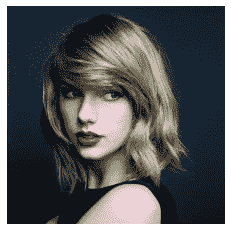
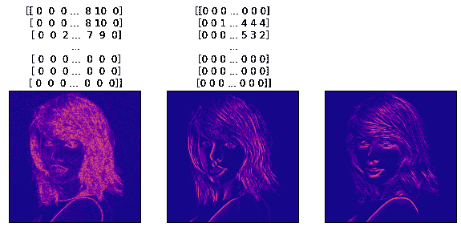

# 使用 Python 查找图像的渐变

> 原文：<https://www.askpython.com/python/examples/gradient-of-an-image>

在本教程中，我们将学习如何用 Python 来计算图片的渐变。完成本课程后，你将能够识别图片在 X、Y 和两个方向的渐变，并利用几个有用的库。

渐变图片只不过是图像颜色在 X、Y 或两个方向上的强度变化。

可以使用图像的 Sobel 和 Laplacian 导数来确定图片的梯度。Sobel 可用于 X 或 Y 方向，或两个方向，但拉普拉斯算子在两个方向都有帮助。

* * *

## 导入所需模块

首先，我们导入 OpenCV cv2 库、Numpy 和 Matplotlib。接下来，我们使用 cv2 的 imread()方法和两个参数来读取图片。

第一个是我们的图片名和扩展名(确保它和图片在同一个文件夹中)，第二个是比例类型，只能是数字形式的 0，1，-1。灰度、颜色和无变化是三种比例类型。

```py
import cv2
import numpy as np
import matplotlib.pyplot as plot
image = cv2.imread("fig.jpg",0)

```



Gradient Of An Image Input

* * *

## 使用 Python 查找图像的渐变

接下来，我们将使用 Python Laplacian()通过给出三个参数来确定图像的 Laplacian 导数。第一个是我们的图像变量，第二个是 cv2 的数据类型 CV 64F，第三个是内核大小。3 表示 ksize(确保始终使用奇数)

ksize 的值增加了边的厚度。ksize 3 将获得最大的结果。接下来，我们将该值转换为 Numpy 的 uint8 类型的无符号 8 位整数。

之后，我们使用 cv2 的 Sobel()通过提供四个参数来计算图片在 x 或 y 方向上的梯度:第一个是图像源，第二个是深度，第三个是 x 导数，第四个是 y 方向上的 y 导数 dy。

```py
lap = cv2.Laplacian(image,cv2.CV_64F,ksize=3) 
lap = np.uint8(np.absolute(lap))

sobelx= cv2.Sobel(image,0, dx=1,dy=0)
sobelx= np.uint8(np.absolute(sobelx))

sobely= cv2.Sobel(image,0, dx=0,dy=1)
sobely = np.uint8(np.absolute(sobely))

```

最后，我们制作两个列表:一个用于标题，另一个用于由拉普拉斯算子、sobelx 和 sobely 创建的图片。

在利用 matplotlib 之后，我们使用 imshow()函数在屏幕上绘图，提供两个参数:一个用于图像源，一个用于背景。yticks()和 xticks()可以与列表(可以是空的)一起使用，以设置 x 和 y 方向的标签。

```py
results = [lap,sobelx,sobely]
images =["Gradient Img","Gradient_X","Gradient_Y"]
plt.figure(figsize=(10,10))
for i in range(3):
    plot.title(results[i])
    plot.subplot(1,3,i+1)
    plot.imshow(results[i],"plasma")
    plot.xticks([])
    plot.yticks([])

plot.show()

```



Gradient Of An Image Output

* * *

## 结论

恭喜你！你刚刚学习了如何获取图像的渐变。希望你喜欢它！😇

喜欢这个教程吗？无论如何，我建议你看一下下面提到的教程:

1.  [渐变助推模型——用 Python 实现](https://www.askpython.com/python/examples/gradient-boosting-model-in-python)
2.  [使用 Python XGBoost 进行梯度增强](https://www.askpython.com/python/examples/gradient-boosting)

感谢您抽出时间！希望你学到了新的东西！！😄

* * *