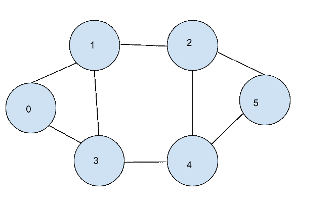

# Python 中的图形操作[有简单的例子]

> 原文：<https://www.askpython.com/python/examples/graph-operations>

在本文中，我们将讨论如何执行不同的图形操作。图是由顶点和边组成的非线性数据结构。它们用于表示城市之间的地图、用户的社交媒体连接以及网页的连接等。

## 处理图形运算

如果你没有研究过图的实现，你可以考虑阅读这篇关于 Python 中图的[实现的文章。现在，没有任何进一步的麻烦，让我们在这里开始不同的图形操作。](https://www.askpython.com/python/examples/graph-in-python)

### 1.给定邻接表时显示图的顶点

考虑下面的图表示例。



Graph Implementation In Python- Askpython

假设我们已经得到了如下图的邻接表表示。

```py
graph = {0: [1, 3], 1: [0, 2, 3], 2: [4, 1, 5], 3: [4, 0, 1], 4: [2, 3, 5], 5: [4, 2]}
print("The adjacency List representing the graph is:")
print(graph)

```

输出:

```py
The adjacency List representing the graph is:
{0: [1, 3], 1: [0, 2, 3], 2: [4, 1, 5], 3: [4, 0, 1], 4: [2, 3, 5], 5: [4, 2]}

```

由于我们知道代表邻接表的[字典](https://www.askpython.com/python/dictionary/python-dictionary-comprehension)的键代表图的顶点，我们可以通过使用字典的 keys()方法提取键来显示图的顶点，如下所示。

```py
graph = {0: [1, 3], 1: [0, 2, 3], 2: [4, 1, 5], 3: [4, 0, 1], 4: [2, 3, 5], 5: [4, 2]}
print("The adjacency List representing the graph is:")
print(graph)
vertices=set(graph.keys())
print("The vertices of the graph are:")
print(vertices)

```

输出:

```py
The adjacency List representing the graph is:
{0: [1, 3], 1: [0, 2, 3], 2: [4, 1, 5], 3: [4, 0, 1], 4: [2, 3, 5], 5: [4, 2]}
The vertices of the graph are:
{0, 1, 2, 3, 4, 5}

```

### 2.邻接表时显示图的边

为了显示图的边，我们将遍历图中的每个顶点(u ),然后通过遍历与每个顶点相关联的相邻顶点的列表来查看与顶点 u 相连的每个顶点(v)。对于每个顶点 u 和 v，我们将在边集中添加一个无序对(u，v)。

如果一个顶点 v 在 u 的邻接表中，u 也将出现在 v 的邻接表中。由于这个原因，邻接表包含每条边两次。显示一个图的边有点复杂，因为我们只需要显示一条边一次。

为了显示边，我们将首先创建一个无序集合{u，v}，表示连接顶点 u 到 v 的边。此后，我们将创建一个列表 E，表示包含每个边{u，v}的边。

由于这个原因，如果{u，v}已经在我们的边列表中，{v，u}可以从集合中排除，因为{v，u}和{u，v}被认为是相同的。

之后，我们将把 E 中的每一对转换成一个表示图的边的元组。这样，我们可以避免重复，并将边表示如下。

```py
graph = {0: [1, 3], 1: [0, 2, 3], 2: [4, 1, 5], 3: [4, 0, 1], 4: [2, 3, 5], 5: [4, 2]}
print("The adjacency List representing the graph is:")
print(graph)
E = list()
for u in graph.keys():
    for v in graph[u]:
        edge = {u, v}
        if edge not in E:
            E.append(edge)
print("The edges of the graph are:")
print(E)

```

输出:

```py
The adjacency List representing the graph is:
{0: [1, 3], 1: [0, 2, 3], 2: [4, 1, 5], 3: [4, 0, 1], 4: [2, 3, 5], 5: [4, 2]}
The edges of the graph are:
[{0, 1}, {0, 3}, {1, 2}, {1, 3}, {2, 4}, {2, 5}, {3, 4}, {4, 5}]

```

### 3.向图表添加一个顶点

为了给图添加一个顶点，我们将简单地添加另一个键和一个空列表作为它的关联邻接表到表示图的字典中，如下所示。

```py
graph = {0: [1, 3], 1: [0, 2, 3], 2: [4, 1, 5], 3: [4, 0, 1], 4: [2, 3, 5], 5: [4, 2]}
print("The adjacency List representing the graph is:")
print(graph)
# adding vertex '6' to graph
graph.update({6: []})
print("The new vertices of the graph are:")
print(set(graph.keys()))

```

输出:

```py
The adjacency List representing the graph is:
{0: [1, 3], 1: [0, 2, 3], 2: [4, 1, 5], 3: [4, 0, 1], 4: [2, 3, 5], 5: [4, 2]}
The new vertices of the graph are:
{0, 1, 2, 3, 4, 5, 6}

```

### 4.给图表添加一条边

要将边(u，v)添加到图中，我们将首先检查边“u”和“v”是否都出现在图中。如果他们中的任何一个不存在，我们将中止该过程。

如果边“u”和“v”都出现在图中，我们将把 u 添加到与 v 相关联的邻接表中，然后我们将把 v 添加到与 u 相关联的邻接表中。

这可以如下进行。

```py
graph = {0: [1, 3], 1: [0, 2, 3], 2: [4, 1, 5], 3: [4, 0, 1], 4: [2, 3, 5], 5: [4, 2],6:[]}
print("The adjacency List representing the graph is:")
print(graph)
# adding edges (5,6) and (4,6) to graph
new_edges = [(5, 6), (4, 6)]
for edge in new_edges:
    u=edge[0]
    v=edge[1]
    graph[u].append(v)
    graph[v].append(u)

#display new edges
E = list()
for u in graph.keys():
    for v in graph[u]:
        edge = {u, v}
        if edge not in E:
            E.append(edge)
print("The new edges of the graph are:")
print(E)

```

输出:

```py
The adjacency List representing the graph is:
{0: [1, 3], 1: [0, 2, 3], 2: [4, 1, 5], 3: [4, 0, 1], 4: [2, 3, 5], 5: [4, 2], 6: []}
The new edges of the graph are:
[{0, 1}, {0, 3}, {1, 2}, {1, 3}, {2, 4}, {2, 5}, {3, 4}, {4, 5}, {4, 6}, {5, 6}]

```

## 结论

在本文中，我们已经看到了如何在图上执行不同的操作，比如向图中添加顶点或边，以及显示图的边和顶点。请继续关注更多内容丰富的文章。

快乐学习！