# 使用 Python Qt 的 GUI 应用程序——初学者指南

> 原文：<https://www.askpython.com/python-modules/gui-applications-using-python-qt>

在本文中，我们将学习如何用 Python Qt 开发 GUI 应用程序。没有一个好的用户界面，你就不能指望有一个为大众服务的工具。因此，掌握为应用程序设计简单界面的艺术可以显著加快开发速度。

* * *

## Python Qt 是什么？

Python Qt 是最流行的图形用户界面开发工具包之一。许多大型科技公司用它来开发桌面应用程序。以下是它的一些主要特性:

1.  **跨平台**:这是一个跨平台的软件，所以应用程序可以在任何操作系统上运行。
2.  **开源:**一个软件开发者可以使用 GitHub 贡献自己的库。许多编程语言支持它的开发。这份名单是:
    1.  **C/C++**
    2.  **Python**
    3.  **响铃**
    4.  **出发**
    5.  **生锈**
    6.  **PHP**
    7.  **Java**
3.  **简单易学:**初级水平即可学习，具备开发 GUI 应用的能力。
4.  **支持工具:**它带有一个 Designer studio，可以帮助创建没有代码的应用程序。

更多详情请访问官方网站:[https://www.qt.io/product/supported-platforms-languages](https://www.qt.io/product/supported-platforms-languages)

## PyQt5 是什么？

PyQt5 是 Qt designer studio for Python 编程语言的扩展。它是 Python 中著名的 GUI 开发 API 之一，包括 Tkinter、Kivy、CherryPy 等。最重要的是，我们可以使用代码和设计工作室开发应用程序，帮助放置小工具而无需编码。参观项目现场:[https://pypi.org/project/PyQt5/](https://pypi.org/project/PyQt5/)

### 安装说明

您需要为您的系统考虑以下规格:

1.  **Python: 3.6.x 或以上**
2.  **操作系统:Windows/MAC/Linux**
3.  **IDE/Teext 编辑器:Visual Studio 代码，Vim，PyCharm 等。**
4.  环境(*可选*):蟒蛇

打开您的命令提示符或终端，键入下面的 [pip 命令](https://www.askpython.com/python-modules/python-pip)。

```py
pip install PyQt5

```

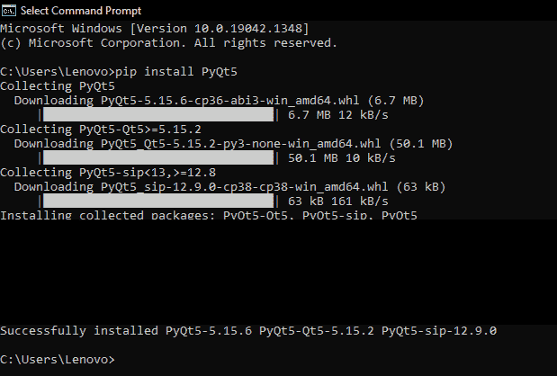

Installing PyQt5

* * *

## 使用 Python Qt 构建简单的 GUI 应用程序

让我们开始使用之前讨论过的 PyQt5 实现一个简单的 GUI 应用程序。

### 1.**创建基本窗口**

```py
# importing the qtWidgets class from the PyQt5 class

from PyQt5 import QtWidgets as qtw

# creating a class of the main wndow and inheriting it from the QtWidgets QWidgrt class
class MainWindow(qtw.QWidget):
    def __init__(self):
        super().__init__() 

        self.setWindowTitle('Hello GUI')
        self.show() # a method that displays everything on the screen 

# instance of the QtWidget window      
app = qtw.QApplication([]) 

# instance of the MainWindow() class 
main = MainWindow()

# starting the application
app.exec_()

```

**输出:**

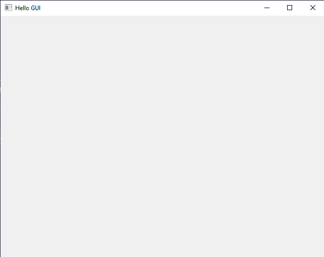

First Display Screen With PyQt5

代码本身的解释将详细定义每一个元素。任何 Qt app 都有基本的六个要素。

1.  主窗口类:这个类包含了所有的窗口小部件、按钮、文本、显示屏和其他子窗口小部件。我们可以说它是所有子对象的父窗口。
2.  这个类是我们在主窗口类中使用的所有**部件**的集合。对于任何应用程序开发，它必须在主类内部继承。
3.  **self.setWindowTitle():** 这个方法给我们的 app 窗口赋予标题。
4.  **self.show():** 整个应用从执行到放置和管理的一切都在这个函数的指挥之下。请记住，如果我们不在 MainWindow 类中调用它，那么系统将不会显示，它只会继续在后台运行。
5.  **QApplication 的实例:**要运行任何 Qt 程序，创建类的对象是非常必要的。QWidget 模块的 QApplication 实例命名为-**app**。
6.  MainWindow 的实例: MainWindow 的实例是给我们的应用程序植入新的功能。我们需要几次，但这是强制性的。
7.  **执行功能:**执行我们 app 的执行。我们将在最后一行代码中调用这个函数。

PyQt5 库中还有几个小部件，它们对于快速 GUI 编程是必不可少的。

1.  **框布局:**输出消息框，用于显示任何事件的消息。
2.  **标签:**为了定义 GUI 应用程序中每个东西的功能，我们使用标签。它们可以帮助用户更容易地与应用程序进行交互。
3.  **按钮:**Qt 提供了很多类型的按钮，如按钮、单选按钮等。
4.  **字体:**字体是各种类型的吸引人的字母。字体的主要目的是制作一个有吸引力的用户界面，并提供良好的用户体验。它们是用来装饰课文的。

**电子显示(LCD)屏幕:**数字显示增加了应用程序的吸引力。LCD 数字主要用于**计算器或公制转换应用。**

* * *

## 安装 Qt Designer Studio

这是一个巨大的库，为我们提供了大量的选项和软件包，使得 GUI 编程变得更加容易。主要好处是它自带内置 **Qt 设计师工作室**。它是一个拖放界面，帮助我们快速开发桌面应用程序。

在以前的版本中，设计器内置了库。但是，由于新的开发，它已经成为 PyQt5 的一个单独的包。因此，要将其添加到系统中，请使用以下命令:

1.  打开**命令提示符**，输入 **pip install PyQt5Designer** 。
2.  要启动它，只需在命令提示符中键入命令–**‘designer’**。界面看起来是这样的。

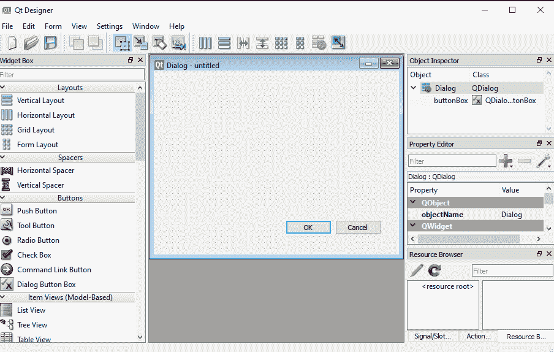

The interface of Qt Designer Studio

这是最简单的操作 GUI 生成器。我们唯一需要做的就是将对象拖放到主窗口中。然后保存这个文件，我们就可以开始编程内部功能了。

**注意:**设计者只能创建 GUI 应用程序的布局。我们需要通过 Python 代码对应用程序进行显式编程。

## 使用 PyQt5 Designer studio 设计 GUI 应用程序

在本节中，我们将创建一个简单的 GUI 应用程序，并使用命令行参数来执行它。这不会是一个可行的方案。这只是一个演示，展示了我们如何创建基本布局，然后将它们更改为脚本。让我们开始吧:

### 1.设置主窗口

通过在命令提示符下键入**designer.exe**打开设计器，然后选择窗格打开。它会询问背景窗口的类型。选择**主窗口**选项，它会为我们创建一个空白界面:

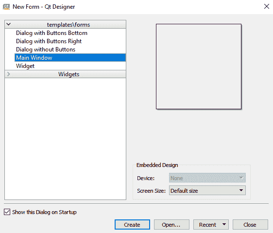

Selection Pane

### **2。widget 选择框之旅**

小部件选择框位于窗口的左侧。从大到小，有各种类型的小部件可供使用。所以，我们就来看看它们:

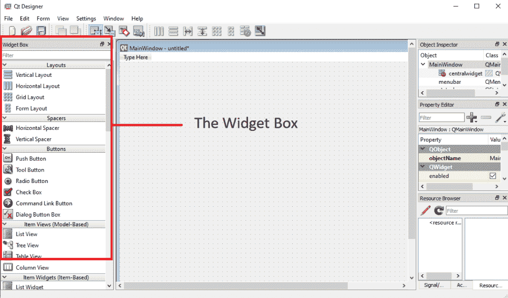

The widget selection box

**以下是全部:**

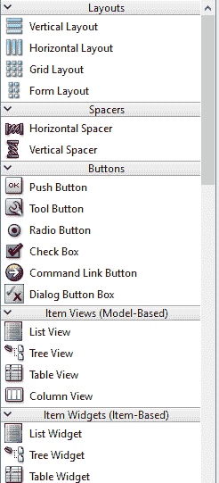

The basic widgets containing layouts, buttons, view styles and other formatting options.

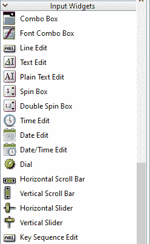

Input widgets

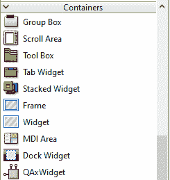

Container

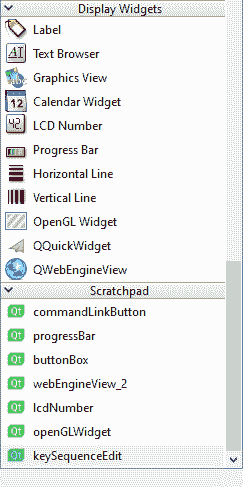

Display widgets and scratchpad

### 3.创建一个简单的按钮应用

按钮是执行单一任务的简单按钮。它可能是登录到一个网站，开始一个进程，启动一个游戏，等等。我们只需要推一把。我们的应用程序的机制很简单。

当我们点击它的时候，它会说**点击了！！！。这是初学者尝试构建的常见应用之一，因为它描述了 GUI 的工作方式。**

1.  打开设计器，选择背景放置器作为主窗口。
2.  在 widget 菜单中选择**按钮**，并将其拖入**主窗口。**

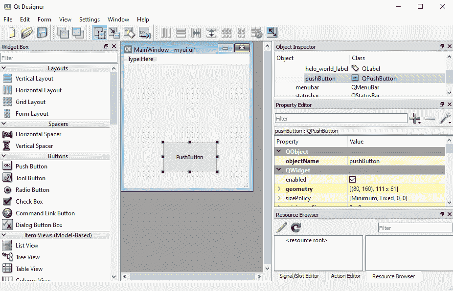

Push Button

3.右侧是“特性”选项板。我们可以通过它改变每个对象的属性。每个对象都必须有一个唯一的名称。所以，我们把这个按钮命名为 **click_me_button** 。之后，我们通过使用每边的端点拉伸按钮来改变按钮的大小。

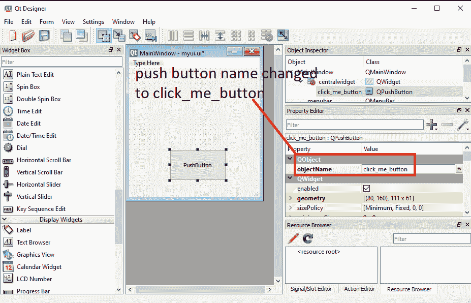

Giving a new name to the button

4.然后，我们放置一个标签，然后我们应用相同的变化。字体很小，因此，我们在属性面板中将字体大小改为 **36** 。人们可以探索字体部分，因为它有大量的选项可以修改。我们将标签的文本改为**你好**，按钮改为**点击我**。总的来说，我们的布局是这样的。

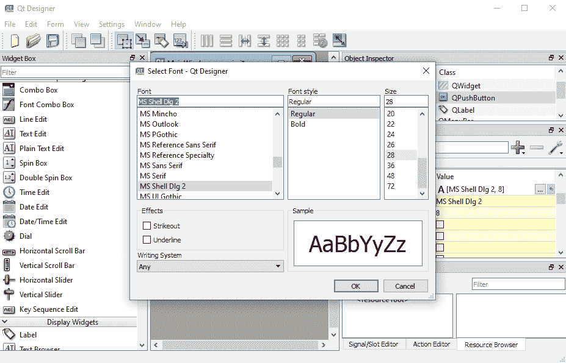

Customized button

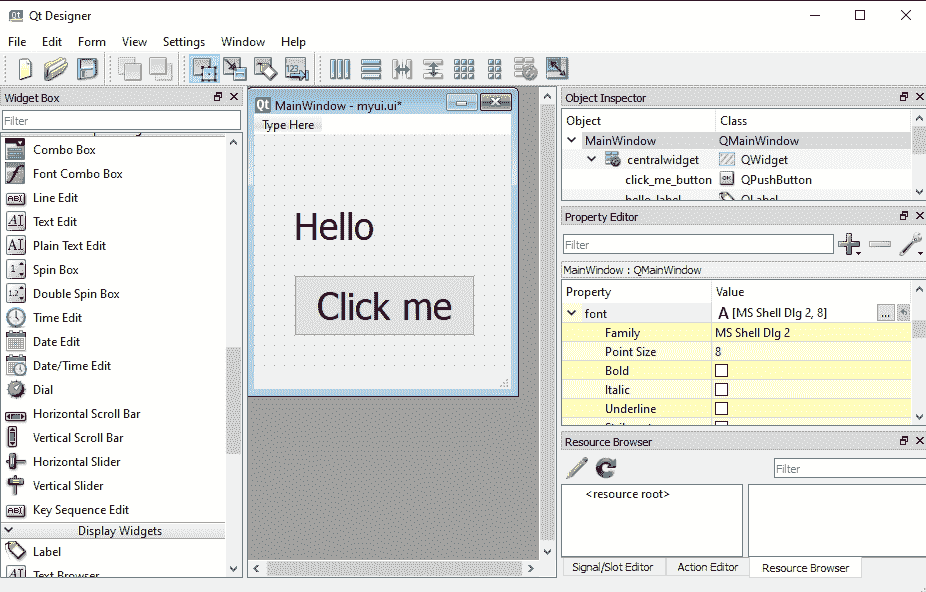

New layout of the app

现在我们有了一个基本的应用程序。只需将其保存在所需的选择目录中。因此，转到左上角的文件选项，点击**保存**或使用键**‘Ctrl+S’**。我们给它起了个名字 **myui.ui** 。但是，它是一个 **<？带有**的 xml >文件。ui"** 扩展。**

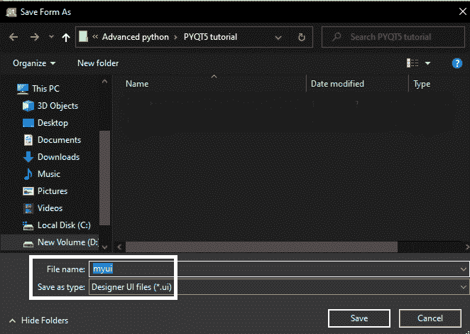

Saving The File

为了执行这个文件，我们需要将它转换成一个 Python 脚本。有一个特殊的转换命令:

```py
pyuic5  -x app_name.ui -o app_name.py

```

转到命令提示符，输入该命令并按 enter 键。我们可以给 python 脚本取任何名称，但是要确保我们之前保存的 UI 文件的名称应该是正确的，否则命令将会失败。

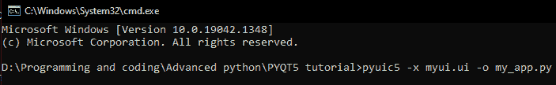

Command Execution

现在，我们的应用程序有了 Python 脚本，即 my_app.py。记得将它放在与**相同的目录中。ui** 文件存在，这使得未来的任务更加容易。**当我们打开脚本时，它包含了自动生成的全部代码。这就像魔术一样。让我们看看:**

**代码(由系统通过“pyuic5”命令自动创建):**

```py
# -*- coding: utf-8 -*-

# Form implementation generated from reading ui file 'myui.ui'
#
# Created by: PyQt5 UI code generator 5.15.6
#
# WARNING: Any manual changes made to this file will be lost when pyuic5 is
# run again.  Do not edit this file unless you know what you are doing.

from PyQt5 import QtCore, QtGui, QtWidgets

class Ui_MainWindow(object):
    def setupUi(self, MainWindow):
        MainWindow.setObjectName("MainWindow")
        MainWindow.resize(253, 264)
        self.centralwidget = QtWidgets.QWidget(MainWindow)
        self.centralwidget.setObjectName("centralwidget")
        self.click_me_button = QtWidgets.QPushButton(self.centralwidget)
        self.click_me_button.setGeometry(QtCore.QRect(0, 130, 251, 91))
        font = QtGui.QFont()
        font.setPointSize(36)
        self.click_me_button.setFont(font)
        self.click_me_button.setObjectName("click_me_button")
        self.helo_world_label = QtWidgets.QLabel(self.centralwidget)
        self.helo_world_label.setGeometry(QtCore.QRect(10, 40, 241, 81))
        font = QtGui.QFont()
        font.setPointSize(36)
        self.helo_world_label.setFont(font)
        self.helo_world_label.setObjectName("hello_world_label")
        MainWindow.setCentralWidget(self.centralwidget)
        self.menubar = QtWidgets.QMenuBar(MainWindow)
        self.menubar.setGeometry(QtCore.QRect(0, 0, 253, 21))
        self.menubar.setObjectName("menubar")
        MainWindow.setMenuBar(self.menubar)
        self.statusbar = QtWidgets.QStatusBar(MainWindow)
        self.statusbar.setObjectName("statusbar")
        MainWindow.setStatusBar(self.statusbar)

        self.retranslateUi(MainWindow)
        QtCore.QMetaObject.connectSlotsByName(MainWindow)

    def retranslateUi(self, MainWindow):
        _translate = QtCore.QCoreApplication.translate
        MainWindow.setWindowTitle(_translate("MainWindow", "MainWindow"))
        self.click_me_button.setText(_translate("MainWindow", "Click Me"))
        self.helo_world_label.setText(_translate("MainWindow", "Hello!"))

if __name__ == "__main__":
    import sys
    app = QtWidgets.QApplication(sys.argv)
    MainWindow = QtWidgets.QMainWindow()
    ui = Ui_MainWindow()
    ui.setupUi(MainWindow)
    MainWindow.show()
    sys.exit(app.exec_())

```

当我们运行这段代码时，我们得到一个基本的用户界面，它什么也不做。

**输出**:

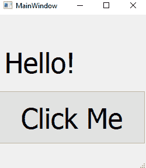

First Qt Application

现在，是时候给按钮添加一些动作了。

当我们点击那个按钮时，标签会显示一些东西。为了实现它，我们将定义一个函数为 **press_the_button()** 。当有人点击它时，标签会显示**‘你好世界’**，而不仅仅是**‘你好’**。

**功能代码:**

```py
 # a function that passes a string 'hello world' when we click a button    
    def press_the_button(self):
        self.hello_world_label.setText('Hello world!')

```

让我们将函数作为 lambda 参数添加。

```py
self.click_me_button = QtWidgets.QPushButton(self.centralwidget)

```

使用这个 **[匿名函数](https://www.askpython.com/python/python-lambda-anonymous-function)** 的目的是:在声明之前将一个已经存在的函数调用传递给新的小部件，这样 lambda 可以很好地管理它。实现后看起来是这样的:

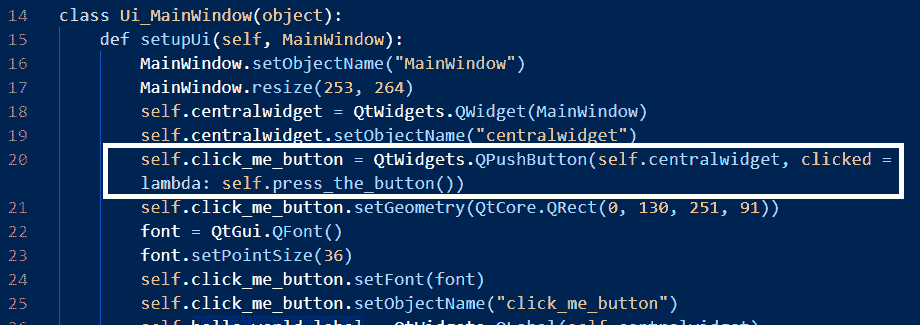

Placing The Function

在这之后，我们保存代码并重新启动应用程序，点击按钮，它显示文本:**‘Hello World’。**

**输出:**

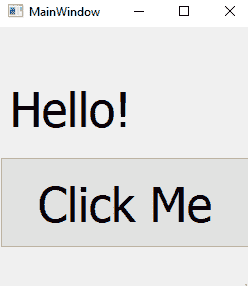

Before Clicking The Button

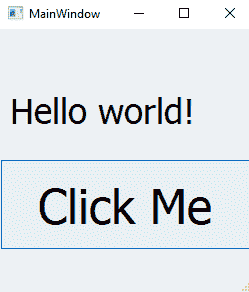

After Clicking The Button

因此，通过这种方式，我们可以使用 PyQt5 和 Python 进行更改并创建出色的 GUI 应用程序。

## 结论

用 Qt 和 Python 开发快速 GUI 应用程序的主题到此结束。这个库非常大，还有许多部分需要理解和实现。因此，我建议读者确保仔细阅读安装过程和后续章节。关于这个话题，还有更多的内容。